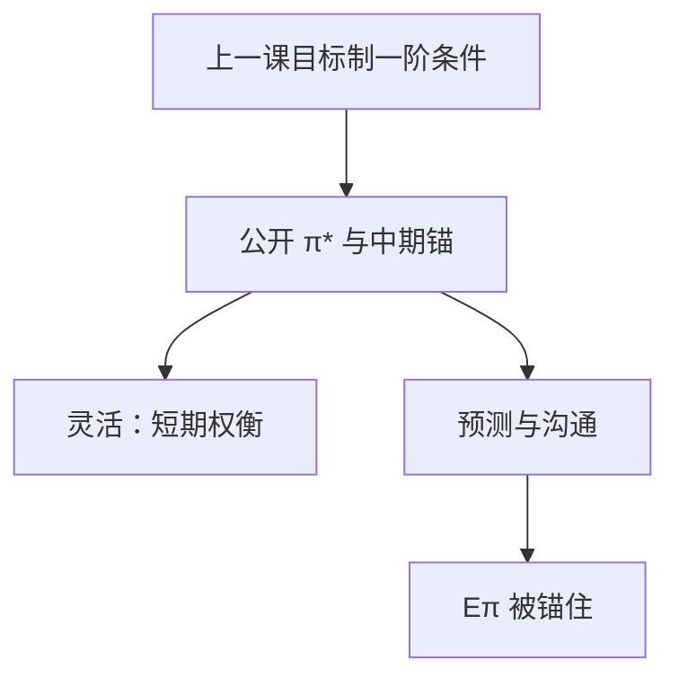

# 通胀目标制

把 $\pi^*$ 写成公开的名义锚，并在中期钉住它；短期仍可权衡缺口——灵活目标制是最优目标规则的制度外壳，不是每季把通胀钉死。

<footer>—— Svensson 的通胀目标制与预测目标；Bernanke 对 IT 作为框架的论述</footer>

[上一课](/econ/optimal-nk-policy)给出二次损失下的目标制一阶条件：承诺把 $\pi$ 与 $\tilde{y}$ 锁在一条规则里。本课的缺口是制度：如何把这条规则说成公众能形成预期的框架。Svensson 把通胀目标制（IT）写成损失函数加预测目标；Bernanke 强调沟通与责任。走廊与准备金利息下一课才问 $i$ 如何在银行体系里实现。

## 问题

最优条件不能当新闻稿。需要一个可观测的锚 $\pi^*$、一个中期地平，以及是否允许短期偏离。严格 IT：每期把预期通胀钉在 $\pi^*$，巧合成立时这就是最优。灵活 IT：损失里仍有缺口，预测路径可以暂时离开 $\pi^*$，但承诺回到它。缺口不是再推 Ramsey，而是：公开 $\pi^*$ 如何把泰勒原理与承诺语言操作化，避免「看情况」的卢卡斯批判。

点目标与区间是沟通技术。理论对象是 $\pi^*$ 与损失权重，不是 1% 带宽是否印在公报上。

## 方法

Svensson：央行最小化与 Woodford 同族的损失，工具是利率路径，中间目标常是通胀预测——预测目标制。公布预测，等于把目标制规则的前瞻部分交给公众检验。Bernanke：IT 是受约束的权变框架——有锚，但不是机械的货币数量规则。与泰勒规则的关系：IT 是目标，泰勒是一种工具规则；可以在 IT 下用泰勒型反应，系数仍要满足确定性。

平均通胀目标、价格水平目标是 IT 的堂兄弟：把过去的偏离记入未来，更接近承诺的历史依赖。下限上它们特别有用——非常规课已经用过。本课在正利率区把 IT 钉成默认名义锚。

### 不是货币数量目标复辟

Friedman 的 $k$ 百分是工具规则盯 $M$。IT 盯的是 $\pi$ 结果， $M$ 内生。数量方程仍给长期 $P$ 的会计；操作上现代央行不靠外生 $M$ 路径。把 IT 写成「不再相信货币」，会取消长期中性。

### 沟通不是把 Ramsey 一阶条件念出来

公众需要的是 $\pi^*$、地平与「暂时偏离如何回来」。把目标制规则的系数逐季公布，并不自动等于承诺：权变也可以拟合出相似的反应。

责任与任期用来补这一点。本课把 IT 当框架，不把某次新闻发布会当识别。

## 机制

公众看见 $\pi^*$ 与反应函数， $\mathbb{E}\pi_{t+1}$ 进入 NKPC 与 IS。成本推动下，灵活 IT 允许暂时超调，但沟通必须把超调说成暂时，否则锚漂。严格 IT 在巧合破裂时牺牲过大缺口，往往不是最优——上一课的 $\lambda_y$ 正是灵活的理由。责任机制（解释偏离、任期）用来缓解权变诱惑：复苏后不肯「还」通胀欠账。

双重使命（通胀与就业）在灵活 IT 里已经在损失中，不必另立第二个数字锚。把就业写成与 $\pi^*$ 对称的长期目标，会与自然率冲突：长期 $u$ 回 $u^*$，不能钉一个任意的就业水平。沟通上同时报缺口，是识别需求与成本冲击，不是放弃 $\pi^*$ 作为名义锚。

开放经济还要声明汇率是否进入损失。CIP 实证仍在 `/quant/irp`。本课不把 IT 写成不可能三角的第四顶点。

「看 infl 预测加息」容易被误读成滞后。预测目标是前瞻的：今天的 $i$ 为了未来的 $\pi$ 路径。滞后的是数据，不是目标。

## 边界

本课不评估某国 IT 的基点成败，不把目标写成政治口号。操作框架（走廊、地板、IOR）下一课才进入资产负债表。ZLB 上 IT 要靠路径承诺才能继续锚住 $\mathbb{E}\pi$，那是非常规课。量化栏没有宏观锚。

目标是 CPI 还是 PCE、是否剔食品能源，是价格指数课留下的篮子问题，会改沟通，不改「要有一个 $\pi^*$」。点目标与区间：区间过宽等于锚软，过窄等于假装没有成本推动。灵活 IT 用损失权重处理这件事，而不是靠把区间印得很宽来假装没有权衡。

后课默认：名义锚默认是灵活通胀目标，$\pi^*$ 公开，短期权衡不取消中期钉住。下一课：政策利率如何在准备金市场上被实施。

## 小结

- 最优课给出目标制条件；IT 是它的公开制度。
- 灵活 IT：中期钉 $\pi^*$，短期允许缺口权衡。
- 预测目标把前瞻部分交给可检验的路径。
- 盯的是 $\pi$，不是外生 $M$；长期中性仍在。
- 出处：Svensson 的通胀目标制与预测目标；Bernanke 对 IT 框架的论述。
