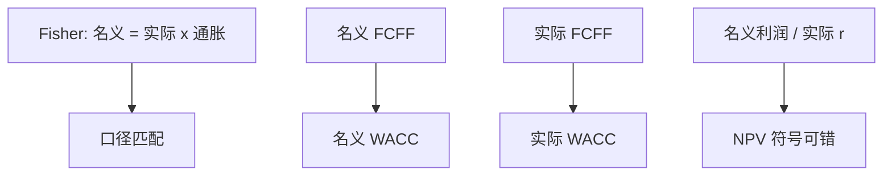

# 通胀与估值

    
名义现金流配名义利率，实际现金流配实际利率；混用一次，增长与营运资本会把净现值的符号改掉。

    <footer>—— Brealey, Myers and Allen, Principles of Corporate Finance；Fisher, The Theory of Interest, 1930 的名义–实际分解</footer>

[上一课](/econ/working-capital)指出名义应收膨胀会额外垫付现金。本课缺口是把通胀写进整张 DCF：Fisher 方程、$g$ 与折旧税盾的名义刚性、以及为何「用实际利率折名义利润」是资本预算里最常见的口径罪。不重写 NWC 科目定义，不把宏观课序的菲利普斯曲线搬进项目。

## 问题

Fisher：$1+r_{\mathrm{nom}}=(1+r_{\mathrm{real}})(1+\pi)$。项目收入与费用若随 $\pi$ 调整，名义 FCFF 含通胀；WACC 若来自名义国债与名义溢价，必须配名义 FCFF。用实际 WACC 去折未扣通胀的报表利润，等于系统性高估 NPV。反向：已经把收入做成实际，却用名义 WACC，会拒绝好项目。缺口不是通胀预测本身（宏观课序在前），而是口径一致，以及折旧与债务合同按名义历史成本时税盾与 NWC 的真实负担。

折旧按历史成本：通胀高时，折旧税盾的真实价值下降，项目真实 NPV 下降。这是税码名义刚性，不是经营变差。存货先进先出在通胀下利润虚高、税提前，同样吃真实现金。

## 方法

选一条路走到底。名义：收入、成本、NWC、终值 $g$ 都含 $\pi$，折现用名义 $r$。实际：所有现金先剥通胀，终值 $g$ 用实际增长，折现用实际 $r$。债务利息是名义合同：APV 的税盾在名义路径上算更自然；硬转实际要先把债务计划换成实际本金，容易错。

工资与价格若不同步（管制、合同滞后），实际利润率在通胀冲击下变化，应进情景，不能只把同一 $\pi$ 乘在所有科目上。宏观课序的名义刚性在企业层面就是这些合同。

终值：$g_{\mathrm{nom}}\approx g_{\mathrm{real}}+\pi$。名义 $g$ 接近名义 GDP 上限。上一课 ROIC 若用名义 NOPAT 对历史成本资本，通胀会抬高表面 ROIC——剩余收益课的会计扭曲在通胀期放大。

## 机制

机制是合同的计价单位。金融市场报出的是名义要求回报；税与折旧按名义历史；工资与价格部分指数化。三者不一致时，即使 Fisher 对无风险成立，项目的真实税后现金流仍依赖 $\pi$。Brealey–Myers 的处方仍是匹配，再把刚性单独放进现金流，而不是「把折现率再加一个通胀风险溢价」来含混处理——除非通胀风险不可分散且进入 $\beta$（那时走 CAPM，不走随意加点）。

与国家风险下一课衔接：高通胀国家的名义 $r$ 高，用本国名义折本国名义现金；若改用美元实际，必须把现金也换成美元预期，并单独处理汇率与可兑换，不能只减一个「国家溢价」却留下本币名义增长。

### 不要用高折现率代替通胀情景

不确定的 $\pi$ 应做情景或期权（价格管制下的关停）。把 WACC 加 3%「覆盖通胀风险」会与名义现金流双重计算，并破坏与可比 beta 的衔接。

Modigliani–Cohn（1979）讨论投资者用名义利率错误折实际盈利、导致通胀期股市低估。那是资产定价错误，不是本课许可证去混用口径。本课对象是项目表。

## 边界

不要在本课估计宏观通胀过程。动态宏观在前，本课只用 Fisher 与税码刚性。下一课国家风险溢价：政治与货币不可兑换如何加在 $r$ 或现金上，且必须与本课的货币口径一致。

后课默认：名义配名义、实际配实际；折旧与 NWC 的名义刚性进现金流。禁止用实际 $r$ 折名义利润。

## 小结

- Fisher 分解要求现金流与折现率同一计价单位。
- 折旧、存货、债务合同按名义历史，通胀改变真实税盾与垫付。
- 高折现率不是通胀情景的替代；国家风险下一课必须带着货币口径走。
- 出处：Fisher 1930；Brealey, Myers and Allen。
