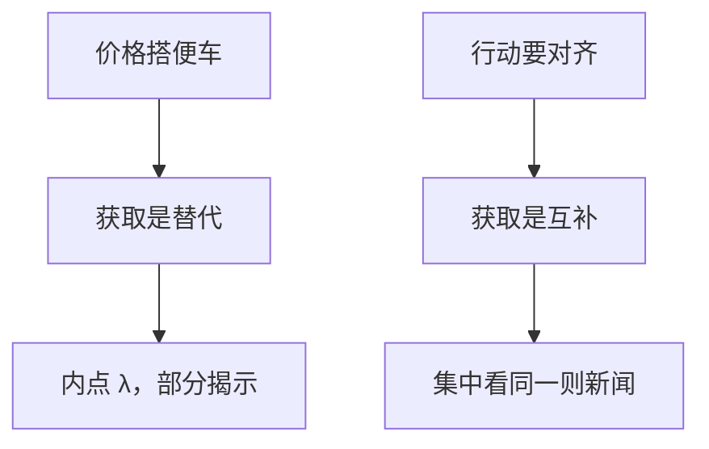

# 信息获取与互补

别人知情使价格更干净，我的信号贬值——替代；别人知情使协调更值钱，我的信号升值——互补。

<footer>—— 据 Grossman–Stiglitz 1980 的替代；Veldkamp, Information Choice in Macroeconomics and Finance, 2011 对互补的整理</footer>

[上一课](/econ/ree-revelation)把信号当成已经持有的禀赋，只问价格映射是否分开状态。本课缺口是把信号变回**选择**：精度、买哪一组信号、是否进入某市场。GS 已经给出替代的一面。缺口是另一面：何时获取是策略互补，以至均衡可以多、可以集中、可以「大家都去看同一则新闻」。

## 问题

在 GS–Hellwig 的定价问题里，别人买信号会加深揭示、压低信息租金，我的最优反应是少买——策略替代，内点通常唯一。若目标不只是「对 $\theta$ 赌对」，还包括「与别人的行动对齐」（投资互补、流动性共同、美人类定价），则别人知情会抬高**公共**信号的价值，我更想获得能预测别人的信息。Veldkamp 把后一类叫信息选择里的互补。

缺口不是再解一次 $\lambda$ 的无差异，而是标明：替代来自搭便车于价格，互补来自协调动机。后课美人竞赛把协调写成高阶信念；本课先停在获取的博弈型。

Barlevy–Veronesi、Veldkamp–Wolfers、Hellwig–Veldkamp 等把「看什么」写成离散选择。互补时容易出现：所有人看同一公共信号，私有信号被忽略。

## 方法

把期望效用对信息结构求导（或比较有信号与无信号的事前效用）。定价交易：价值随「我相对价格的信息优势」升，而优势随别人精度降——替代。协调博弈：价值随「我与平均行动的协方差」升，公共信号同时移动我和别人——互补。同一经济里两股力量可以同时在：交易动机要私有、独特的信号；协调动机要公共、人人能对上的信号。

多资产版本接 Admati：获取会内生地集中在已经比较干净、或已经有很多人看的市场上——因为那些价格既是交易信号也是协调装置。这与「去信息贫乏的市场挖金」的直觉可以相反。

不要把「买数据」写成限价簿上的速度竞赛。速度与队列是协议层；本课的成本 $c$ 是信号结构的价格，瓦尔拉斯世界里没有时间优先。

## 机制

替代的机制是泄漏：我的采集改善了公共统计量 $p$，别人免费享用。互补的机制是战略互补本身：凯恩斯所谓猜别人猜什么，信息的价值在于预测平均猜测。若再让信息供给有固定成本（一家报社、一家评级），互补会把需求打到角点——要么市场撑得起一家中介，要么没有。后课信息中介接这条。

存在与揭示课的完全揭示，在替代世界里被 $c\gt 0$ 禁止；在互补世界里，公共信号可以被过度使用，私有信号供给不足——揭示对 $\theta$ 未必更深，对「别人怎么动」却可以更准。

Morris–Shin 后课会证明：即便公共信号对 $\theta$ 的精度一般，协调动机会让人给它超过贝叶斯权重的权重。获取阶段若预见到这一点，会过度投资于公共信息。

## 边界

不要把互补自动写成泡沫：集中看同一信号可以是有效协调，也可以是放大噪声。泡沫与高阶信念是下一课的对象。也不要把替代写成「所以不该有分析师」——社会最优采集通常仍为正，只是竞争性 $\lambda$ 偏低。

本课不估计注意力分配回归。有限注意力上一课程已经从处理端写过；本课是理性选择信息结构。两者都产生「只看一部分」，微观基础不同。

后课默认：定价搭便车给出获取的替代；协调给出互补。均衡可以内点也可以集中于公共信号。下一课把协调写成美人竞赛与高阶信念。

## 小结

- GS 式定价：别人知情降低我的租金，获取是策略替代。
- 协调动机：别人知情提高公共信号价值，获取可以互补。
- 互补使信息集中、中介出现，不自动等于泡沫。
- 出处：Grossman and Stiglitz, *AER* 1980；Veldkamp, *Information Choice*, 2011。
