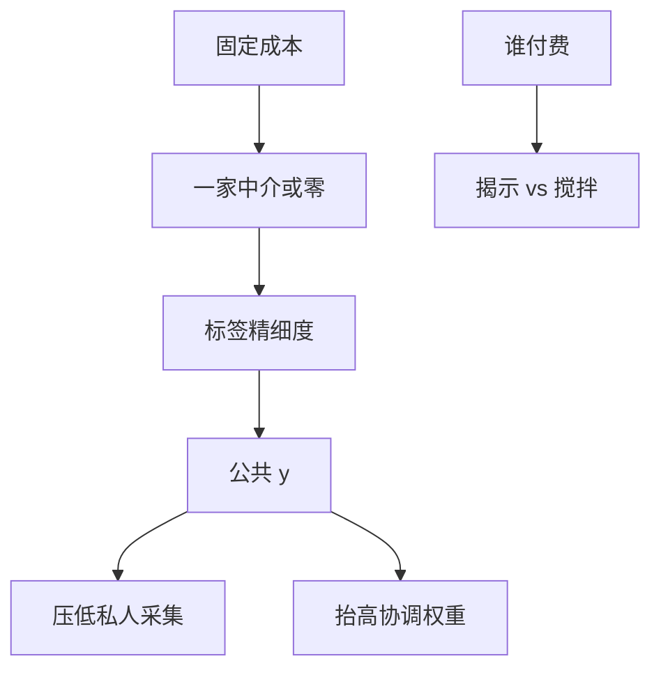

# 信息中介

中介卖的是可被许多人同时使用的信号；激励问题是：评级要像验证过的披露，还是像被发行人买来的公共噪声。

<footer>—— 据 Lizzeri, Information Revelation and Certification Intermediaries, RAND Journal of Economics, 1999；对照评级与认证理论</footer>

[上一课](/econ/disclosure-theory)的开口人是持有 $\theta$ 的卖方自己。本课缺口是外包：一个第三方生产公共 $y$，卖给买方或向发行人收费。不重推揭开的逆向归纳，不把中介写成某家机构的沿革。

## 问题

获取课已经说过：公共信号有固定成本时，要么撑起一家生产者，要么没有。认证中介承诺把类型映射成标签。Lizzeri（1999）指出：垄断中介未必充分揭示——它可能把中间类型搅在一起，以抽取认证费，只分开两端。竞争与声誉把标签往更揭示的方向推，但发行人付费（issuer-pays）会把中介的目标从「买方的精度」扭向「发行人的发行价格」。

缺口是把 $y$ 的生产写成产业，而不是假定天上掉下一则 Morris–Shin 公告。分析师、评级、审计，在本栏都是同一类对象：把私有采集变成公共标签。它们改变 Hellwig 价格里的公共成分，也改变 Glosten–Milgrom 价差里的知情比例。

Ramakrishnan–Thakor、Millon–Thakor 把银行与审计当信息生产者。本课不写银行资本监管；货币银行主干已经有中介的流动性保险，这里只留认证。

## 方法

中介选择一个信息结构（标签的精细度）和一个收费方。买方付费：接近销售信号的垄断，揭示通常过度或不足取决于能否禁止转卖——信息一旦说出就有公共性，收费难。发行人付费：中介卖的是「好标签」，揭开逻辑部分恢复（差的不来认证），但搅拌与评级购物进入。声誉：未来的认证费依赖今天标签与事后 $\theta$ 的对齐，约束搅拌，在一次性博弈里消失。

接到 REE：更精细的公共 $y$ 加深价格揭示，压低私人采集（GS 替代），同时加强协调（Morris–Shin 权重）。中介的社会价值因此不是「信息越多越好」，而是这三股力的净额。

不要把分析师覆盖的截面回归、评级迁移矩阵写进来。那些是测量。本课只钉：标签是被生产出来的公共信号，激励决定它像披露还是像噪声。

## 机制

机制是信息的非竞争性与收费冲突。同一则 $y$ 可被所有交易者使用，私人供给不足，中介是一种俱乐部或垄断供给。发行人付费让被评对象变成客户，揭开的「好类型想分开」变成「好类型想买更高标签」，中介若能搅拌则抽租。竞争降低抽租，也可能竞次（为拿业务而抬标签）。声誉把动态租金押在准确性上，是约束而不是消除。

与柠檬对照：中介若可验证，市场从 Akerlof 搬向 Grossman 揭开；中介若只是有偏的 $y$，市场多了一则公共噪声，美人竞赛会放大它。

强制披露与强制评级是替代：前者把阈值推低，后者把中介的需求曲线外移。两者都改变公共与私有的分界，都不自动给出完全揭示。

## 边界

本课不是微观结构里的「信息卖家把信号卖给高频」。速度与独占数据是协议层的产权。下一课把本单元收束：信息均衡给出价格应当反映什么、流动性成本从何来；这些数字如何出现在屏幕上，仍交给簿。资产定价后半课程要从无套利写起，需要这块接口，以免把 $\lambda$ 误当成 SDF。

后课默认：信息中介生产公共标签；收费方与竞争决定揭示还是搅拌。$y$ 同时进入采集替代与协调权重。

## 小结

- 固定成本使公共信号由中介生产；垄断不必充分揭示。
- 发行人付费引入搅拌与购物；声誉是动态约束。
- 中介的 $y$ 改变 REE 揭示、价差与美人竞赛权重。
- 出处：Lizzeri, *RAND* 1999；对照认证与评级的激励文献。
