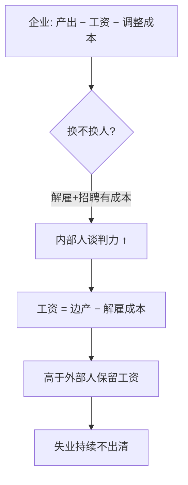
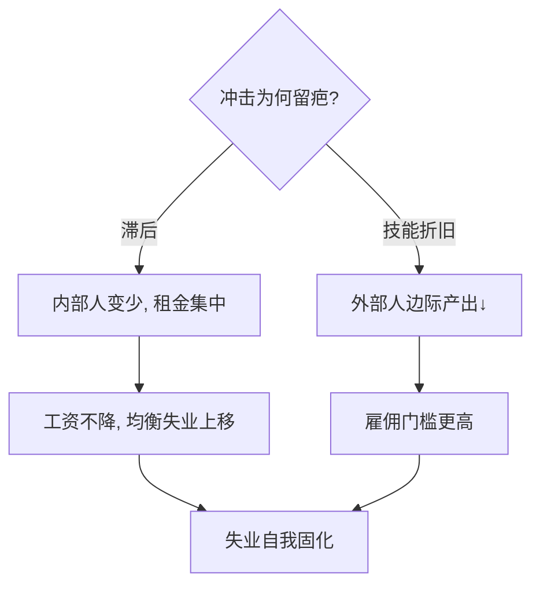

# 内部人-外部人理论

在职工人手握谈判筹码，失业者站在门外喊不出价：劳动市场的刚工资，一半来自门内人的市场力。

<footer>—— 据 Lindbeck–Snower 内部人-外部人模型 (1988)；Blanchard–Summers 滞后效应 (1986)</footer>

[家庭生产模型](/econ/household-production)讲时间在市场内外的套利，本课讲劳动市场内部的门槛：谁在门内（insider）、谁在门外（outsider）。缺口是解释两个刚性事实——工资为何不降出清、衰退为何留下永久疤痕。本课不做工会集体谈判的细部。

## 问题

新古典劳动市场：失业压低工资，工资下降吸收失业。但欧洲 1980 年代失业率从 3% 升到 10% 后十年不回头，工资却没有明显下调。缺口：**在职工人的谈判力**——解雇有成本（培训、遣散、团队默契流失），使内部人能把工资抬到市场出清之上而不被门外失业者压价。

术语翻译：内部人（insider）= 在岗职工，掌握不可完全转移的专用技能与默契；外部人（outsider）= 失业者或临时工；滞后（hysteresis）= 冲击消失后失业率仍不回落——历史凝固成结构。

数字实例：解雇成本设为每人 2 万。企业接受「内部人工资 = 边际产出 − 2 万」仍不换人——工资被托在出清水平之上。若衰退中 10% 劳动力长期失业，技能折旧使外部人有效边际产出再降，门槛更高，失业自我固化。

## 方法

模型骨架：企业利润 = 产出 − 工资 − 调整成本（解雇成本 + 招聘培训成本）；内部人与企业谈判工资，外部人只提供威胁点。谈判解落在「边际产出 − 解雇成本」处，高于外部人保留工资。政策含义直接：解雇成本越高，内部人租金越大，失业均衡越顽固；最小工资只是这道墙的一种砌法。

直觉类比：门内人像持有「会员卡」的乘客——公交司机不能中途赶客（解雇成本），车满了新乘客（失业者）只能站门外；票价新旧不一，司机不降价，因为降价也换不来整车的新客。

## 机制

两个放大机制把冲击变疤痕。**滞后机制**（Blanchard–Summers）：衰退中部分内部人被永久逐出，剩下的内部人数量减少、谈判力反而增强（更少人分蛋糕），工资不降反稳——失业率的「均衡值」被冲击本身改写。**技能折旧机制**：长期失业使外部人边际产出退化，企业更不愿雇佣，形成「无工作经历 → 更难找工作」的自我实现。检验证据：西班牙 1984 年临时合同改革造出双层市场——临时工占三成但转化率低，失业对产出冲击的敏感度翻倍。

常见误区：把内部人-外部人工资差全归于工会——解雇成本、专用技能、招募筛选本身就是市场力来源，无工会的日本大企业内部市场同样呈现内外价差；另一误区是高解雇成本保护就业——它保护的是**在岗者**，代价是外部人进入更难、总体就业更弱（欧洲双层市场的教训）。

## 边界

模型在解雇成本高、集体谈判强的经济体解释力最强；美国式的灵活市场里，效率工资与隐性合同承担了类似角色——内部人租金小但「 segmentation 」仍在（好工作与坏工作的分界）。政策工具箱在此框架内排序：双轨合同（意大利 Jobs Act 2015 的渐进保护）、培训补贴把外部人「洗白」成内部人、失业保险与激活服务的组合。与[生育的经济学](/econ/fertility-econ)的接口：劳动力市场双层化直接压低年轻人入职与成家决策——门外的先门都不进。

直觉类比：双层劳动市场像机场两道安检——内部人有快速通道且行李免检（解雇保护），外部人每件行李都开箱（试用、短期合同）；通道越严，愿意排队的人越少，机场（经济）整体吞吐反而下降。

## 小结

- 解雇与培训成本给内部人市场力，工资被托在出清水平之上。
- 滞后 + 技能折旧把衰退失业凝成结构失业。
- 政策权衡：保护在岗者 vs 降低进入门槛，双层化是常见副作用。
- 出处：Lindbeck–Snower「The Insider-Outsider Theory」1988；Blanchard–Summers 1986；Bentolila–Saint-Paul 西班牙双层市场研究。
