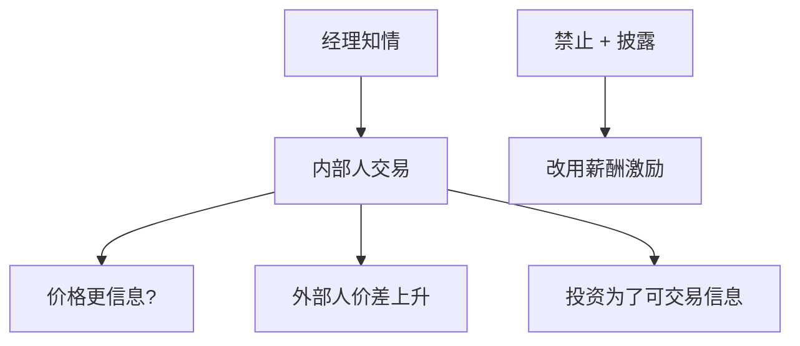

# 内部人交易理论

    
内部人按私人信息交易，使价格更快吸收信息，也把流动性供给者置于信息劣势；效率与分配的权衡，不是一句「禁止就公平」能结束。

    <footer>—— Manne, Insider Trading and the Stock Market, 1966；Leland, Insider Trading: Should It Be Prohibited, Journal of Political Economy 1992；Fishman and Hagerty, Journal of Finance 1992</footer>

[上一课](/econ/law-and-finance)把法律写成保护参数。内部人交易规则是证券法的一块。本课缺口是理论：允许经理交易是否改善价格信息、是否扭曲投资与薪酬。不重写 LLSV 指数，不把限价簿上的知情交易模型写成量化栏微观结构主线——只取对公司合同的含义。

## 问题

Manne：内部人交易是对经理信息生产的补偿，价格更准。反驳：流动性交易者受损，买卖价差上升，外部股权更贵（接 LLSV 参与约束）；经理可能操纵信息披露时点来交易，投资选择变成「制造可交易波动」。Leland（1992）：一般均衡里，内部人交易提高价格信息、可能改善投资，但也转移风险、可能降低对外融资意愿。Fishman–Hagerty：内部人挤出外部分析师的信息生产。缺口是把「信息进入价格」接到治理，而不是重画 Kyle 曲线——[Kyle 在均衡中](/econ/kyle-in-equilibrium)已有价格影响语言，本课不进入限价簿协议。

效率：价格是否更接近 $v$。分配：谁从信息租金获利。流动性：外部人是否还愿意做对手方。三句话必须分开。

## 方法

允许交易：薪酬可以更低现金、更高信息租金，但董事会更难用股价做合同——股价含经理自己的交易噪声与激励扭曲。禁止并强制披露：信息改走新闻，经理用薪酬与持股激励，内部人租金下降，价差可能下降。现实是部分禁止（基于重大非公开信息）加披露（Form 4），不是角点。

对公司金融：内部人买卖是信号（与股利信号近亲），也是代理（抢外部股东）。优序的发股窗口若配内部人减持，柠檬更重。择时课的「经理认为高估」与内部人出售观测相关，但合法计划交易使识别变难。

与双层：控股股东内部人交易加楔子，掏空可以走交易而不走股利。保护参数决定执法概率，从而决定租金期望值。

## 机制

机制是信息租金与市场参与。价格发现是公共品，内部人提供一部分、挤出另一部分。投资扭曲：项目若产生不可交易的长期价值，经理更少做；若产生可提前交易的消息，过多做。这与多任务薪酬同构，度量换成价格路径。

宏观与披露管制：强制披露把信息公共化，减少内部人租金，也减少「用交易补偿经理」的通道，董事会必须把激励写回合同。

### 不是微观结构课

知情交易如何改变簿上价差，量化栏写。本栏停在：参与约束、薪酬替代、投资扭曲、与发股柠檬的互动。不要把做市商库存当成本文。

Manne 1966 是论辩起点。Leland *JPE* 1992 提供一般均衡权衡。规范结论随福利权重而变，本课不立法。

## 边界

不要把本课写成内幕法条。下一课公司对冲：经理用衍生品降低可交易风险与职业风险，可能与股东要的风险不一致——对冲是另一套「谁的风险」。现金持有则是流动性与代理。

后课默认：内部人交易在价格信息与流动性/投资扭曲之间权衡；禁止把激励赶回薪酬合同。本栏不重写限价簿。

## 小结

- 内部人交易可加快价格发现，也提高外部人成本、扭曲投资与披露时点。
- 与薪酬、发股柠檬、楔子下的掏空相连。
- 效率、分配、流动性三句分开；法律是 LLSV 保护的一块。
- 出处：Manne 1966；Leland, *JPE* 1992；Fishman and Hagerty, *JF* 1992。
