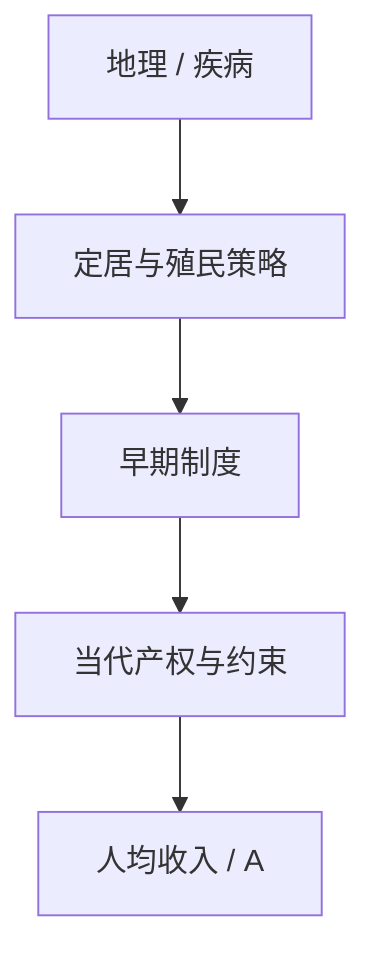

# 制度与增长

地理与文化可以进入历史，但进入人均收入的主通道，是一套能否约束掠夺、保护投资的制度。

<footer>—— Acemoglu, Johnson and Robinson, The Colonial Origins of Comparative Development, AER 2001</footer>

[上一课](/econ/directed-technical-change)已经让研发有方向：相对利润引导技术朝哪种要素偏。利润要能被占有，才谈得上引导。本课的缺口是：产权、约束执政者、进入壁垒——制度——如何成为增长核算里那块巨大 $A$ 的深层原因。Acemoglu、Johnson 与 Robinson（AJR）用殖民起源做识别；统一增长下一课才问马尔萨斯约束何时松开。

## 问题

发展核算把跨国 $Y/L$ 的大头留给剩余 $A$；错配课说 $A$ 含楔子；有偏技术说 $A$ 有方向。都还没回答：为什么有的国家长期保住投资激励，有的把剩余收成租金。AJR 的缺口是把**制度**当成比较发展的根本原因，而不是再估一条索洛回归。地理决定论把气候与疾病写成直接生产力；AJR 允许地理进入，但主路径是历史形成的制度。

「制度」在此指约束与激励的规则：征收风险、合同执行、政治参与。不是文化口号，也不是当期的监管条文清单。

## 方法

殖民样本：欧洲人定居的地方带去产权与约束；开采殖民地留下榨取制度。定居者死亡率作为工具变量，代理历史上能否定居，从而代理早期制度，再接到当代制度与收入。第一阶段不是「疾病直接让人穷」，而是疾病影响定居模式。Hall–Jones 已把制度写进 $A$ 的叙事；AJR 提供的是因果设计，不是又一次水平分解。

有偏技术在制度差的地方会被导向寻租或镇压，而不是技能互补的生产性研发。上一课的相对利润，暗含利润不被征收。本课把这一句写进增长主干。

### 工具不是地理决定论

死亡率 IV 依赖排除限制：历史上的疾病通过制度而非通过当代健康或气候进入收入。争议围绕这一点，本课不假装没有。识别失败不等于「制度无关」；它只说这一条殖民通道的因果权重被高估。

### 殖民样本不是全部发展中国家

IV 设计用的是曾经被殖民的截面。从未被殖民的国家、社会主义转型，要另找识别，不能把死亡率工具直接外推。

本课要的是制度作为根本原因的结构，不是一张对所有国都成立的弹性表。增长回归的政策模拟仍受卢卡斯批判约束。

## 机制

榨取制度提高征收风险，压低投资与研发的私人回报，发展核算里就表现为低 $A$ 与低 $K$。包容制度降低这道楔子，并允许进入——错配缩小，有偏创新朝生产性要素走。政治均衡可以锁定：既得利益阻止改制度，于是穷与制度差互相维持。这与索洛 $s$ 外生不同：储蓄率本身被安全的产权托住。

反向因果是显然的：富国更能买好制度。IV 与历史叙事要处理的就是这句。本课不把某一殖民地的点估计写成普适弹性。马尔萨斯世界里，制度改善可能先变成人口，而不是人均 $y$——下一课的缺口。

有偏技术在包容制度下更可能朝可占有的生产性技能偏；在榨取制度下，同样的研发预算可以朝征税技术、镇压或垄断壁垒偏。加总 $g$ 看起来可以差不多，要素溢价与进入完全不同。因此制度不是在 $A$ 外面另加一个哑变量，而是改写上一课相对利润那一项里「利润归谁」。

法律起源、奴隶贸易、殖民者身份是平行的历史识别，不是对 AJR 的否定。主干只要：制度进入激励，从而进入 $A$ 与 $K$。

## 边界

本课不重跑 AJR 表，不把制度写成交易价差或 CIP。外汇平价仍在[量化栏](/quant/irp)。也不把「改革口号」当识别：同一套条文，执行与政治约束可以完全不同。增长回归的政策含义仍受卢卡斯批判约束。

地理、文化与制度可以共线。AJR 的策略是让地理主要走历史制度，而不是否认气候进入生产。把本课读成「只有制度、没有地理」，是把识别策略当成本体论。错配课的楔子可以是制度的当期表现；AJR 问的是楔子为何持久——政治均衡锁定，不是生产函数形式。

后课默认：谈到跨国 $A$ 的深层原因，制度是候选的根本原因，不是又一个残差标签。下一课：在制度已经能保护剩余的世界上，人均收入为何长期钉在生存水平，又如何脱离。

## 小结

- 有偏技术需要可占有的利润；制度决定利润是否被征收。
- AJR：殖民定居模式 → 制度 → 当代收入。
- 地理可以进入历史，主通道仍是激励规则。
- IV 排除限制有争议，不等于制度可以从核算里删掉。
- 出处：Acemoglu, Johnson and Robinson, *AER* 2001。
