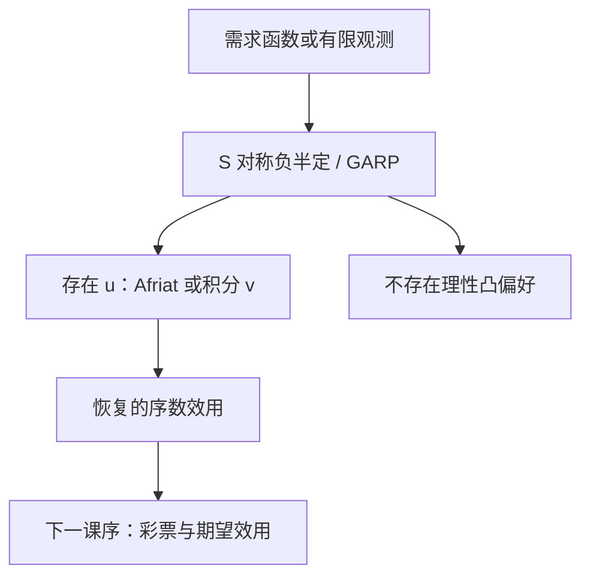

# 可积性与恢复偏好

需求作为价格的函数，何时是某一偏好的马歇尔需求？答案在斯勒茨基矩阵的对称与负半定，以及相应的可积条件。

<footer>—— 据 Hurwicz and Uzawa, On the Integrability of Demand Functions, 1971；Mas-Colell, Whinston and Green 第 3 章整理</footer>

[上一课](/econ/sarp-garp)（SARP 与 GARP）。给出了有限观测上的成对一致性。本课不重讲 WARP 的几何，也不再定义 $R^D$。缺口是：若手里是整个需求函数 $x(p,w)$，而不是几条数据，怎样还原出 $u$？WARP 不够，因为它不对称；斯勒茨基课已经预告对称性是微分形式的可积条件。本课把这条路走完，并收束「确定下的选择」这一课序。

## 问题

给定零次齐次、满足瓦尔拉斯定律的 $x(p,w)$，能否找到连续偏好，使其马歇尔需求正好是 $x$？局部看，这是把向量场 $x(p,w)$ 积回一个值函数 $v(p,w)$，再对偶出 $u$。向量场可积，需要混合偏导相等——正是 $S$ 对称。再加负半定，积出来的 $v$ 才对 $p$ 拟凸，对应凸偏好的支出最小化。

有限数据上的 Afriat 定理是同一问题的离散版：GARP 成立当且仅当存在一组数 $u^t,\lambda^t>0$ 满足

$$
u^s\le u^t+\lambda^t p^t\cdot(x^s-x^t).
$$

这些数构成一个凹的分段线性效用，在观测点上精确生成选择。本课把 Afriat 与 Hurwicz–Uzawa 并在一起：一个是有限观测，一个是光滑需求，恢复的都是偏好，不是新的心理学。

### 恢复的是序数偏好，不是唯一数字

Afriat 数不唯一；光滑情形下 $v$ 也只确定到单调变换。恢复成功意味着「存在某一 $u$」，不是「估计出了真实幸福」。后课期望效用会在彩票上再加公理，那是另一表示，不能把这里的 $u$ 直接拿去对风险取期望。

Antonelli 矩阵是反需求的可积条件，与斯勒茨基对偶。本课用 $S$，因为上一课已经把它从支出函数里读出。

## 方法

光滑路线：由 $x$ 构造 $S_{ij}=\partial x_i/\partial p_j+x_j\partial x_i/\partial w$。检验 $S$ 对称且负半定、$Sp=0$。通过则存在支出函数（积分 $h=\nabla_p e$），再由对偶得到 $u$。失败则不存在局部非餍足的连续凸偏好能生成这个 $x$——模型在函数层面被拒绝。

离散路线：对观测跑 GARP；通过则解 Afriat 不等式，得到一个在样本上精确、在样本外以凹包络延拓的效用。WARP 过而 GARP 不过，说明成对没问题、三条以上的链出了循环，光滑极限里往往对应 $S$ 不对称。

Afriat 数不唯一，光滑 $v$ 也只确定到单调变换。恢复成功意味着「存在某一 $u$」，不是「估计出了真实幸福」。下一课期望效用会在彩票上再加独立性，那是另一表示，不能把这里的 $u$ 直接拿去对风险取期望。

本课不把偏微分方程的特征线推一遍。Hurwicz–Uzawa 的贡献是给出充分条件，使局部可积能延拓到全域需求。主干只需：对称 + 负半定是「需求来自偏好」的可操作判据。

## 机制

可积性把消费者理论收成一个闭环。正向：偏好 → $u$ → $x$ → $S$。反向：数据 → WARP/GARP 或 $S$ → $u$。闭环意味着后课谈税收、价格指数时，可以说「若选择来自偏好，则补偿变化用 $e$ 积分」。若不可积，这些福利数没有偏好基础，只是会计。

与斯勒茨基课的衔接是：那里 $S$ 的性质是定理；这里同一性质是假设，用来反推定理的前提。箭头一反，检验的地位就从「形状描述」变成「模型是否被数据允许」。

可积性不管跨期、不管风险。时间可分、期望效用，都是另加的结构。本课序在确定消费束上结束。

## 边界

恢复出的 $u$ 只在观测覆盖的预算区域内可信。样本外延拓依赖凹性，不是数据。家庭加总、跨期储蓄、劳动供给若被塞进同一个 $x(p,w)$，可积失败可能只是对象切错了，不一定是「人不理性」。

下一课序改对象：备选不再是确定的 $x\in\mathbb{R}_+^n$，而是彩票。确定消费上的 $u$ 不能直接当伯努利函数用。本课不预支独立性公理。可积性也不处理跨期可分：两个日期的需求若被当成同一期的 $x(p,w)$，对称性没有理由成立。那是宏观欧拉方程的对象，不是本课序的尾巴。

后课默认：确定需求与偏好之间可以双向行走；风险要另起表示。

## 小结

- 光滑需求可积当且仅当斯勒茨基矩阵对称且负半定（加正则条件）。
- 有限观测上 GARP 等价于 Afriat 效用的存在。
- 恢复的是序数偏好，数字不唯一。
- 确定下的选择课序在此收束；风险从彩票另起。
- 出处：Hurwicz and Uzawa, 1971；Afriat；Mas-Colell, Whinston and Green 第 3 章。
