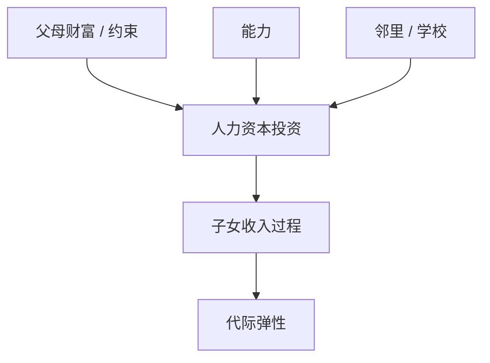

# 代际流动与人力资本

财富可以乘性滚；技能与邻里把收入过程变成跨代马尔可夫，尾与机会不是同一张图。

<footer>—— Becker and Tomes, Human Capital and the Rise and Fall of Families, JLaborE 1986；Chetty, Hendren, Kline and Saez 的美国流动地图</footer>

[上一课](/econ/inequality-r-g)谈财富相对增长的膨胀。收入机会可以在财富份额上升时改善或恶化。本课缺口是**代际**：人力资本投资与邻里如何把 $z$ 的马尔可夫从一代接到下一。不重写 $r\gt g$ 会计。

## 问题

Becker–Tomes：父母最大化子女人力资本加遗产，信贷约束使穷父母投资不足，能力回归均值但约束造成持久。Solon 的代际收入弹性；Chetty 等用税收行政数据画通勤区流动。缺口是给 Aiyagari 的外生 $z$ 过程一个跨代来源，而不是再校准一年一度的劳动收入 viscocity。

Becker and Tomes, *JOLE* 1986。Chetty et al., *QJE* 2014（Equality of Opportunity）。Restuccia–Urrutia、Lee–Seshadri 的定量人力资本宏观。

## 方法

把世代交叠或「王朝」里的教育选择写成贝尔曼：状态含父母财富与子女能力。一般均衡：技能供给改工资升水，从而改教育回报。邻里、学校质量作为外生或作为地方均衡（教育财政）。流动统计：秩–秩斜率、顶层到下层的转移矩阵，不是只有基尼。

与厚尾：创业与收益异质造财富尾；教育造收入过程的持久。政策：公立教育、地区迁移（Chetty–Hendren 的移动实验）改的是 $z$ 的转移，不是一次性 MPC。

## 机制

机制是约束下的投资与均值回归的竞赛。完全信贷时，能力高的孩子总能受教育，流动由能力遗传决定；约束时财富本身成为机会。宏观含义：收入风险不完全是保险问题（后课），也是事前投资问题。HANK 的季度 MPC 不回答「这个通勤区的孩子能否翻身」。

本课不把邻里效应写成流行病学。也不把高考制度写成一般理论。定量宏观用的是教育生产函数与税收数据矩。

## 边界

本课不评价每一项教育政策。不把文化叙事当识别。种族、性别的全部经验文献放不下，只保留装置：约束、生产函数、地方公共品。移民与开放另课。

后课默认：外生收入马尔可夫可以来自代际人力资本；流动统计与财富尾分开报告。下一课：一代之内，劳动收入风险如何被市场与家庭保险。

## 小结

- Becker–Tomes：约束使人力资本投资依赖父母财富。
- 流动用转移矩阵与秩弹性，不只基尼。
- 与 $r\gt g$ 的财富故事时间尺度和机制都不同。
- 出处：Becker and Tomes, *JOLE* 1986；Chetty et al., *QJE* 2014。
