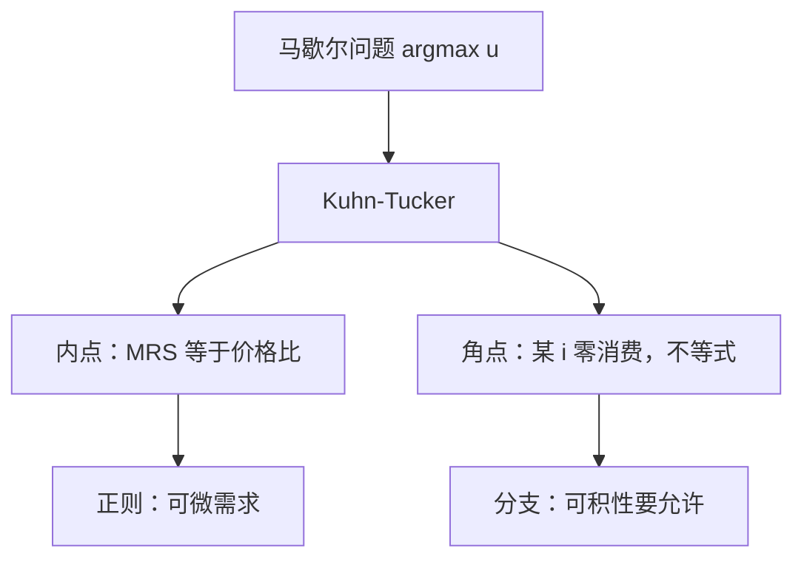

# 内点与角点

一阶条件在内点是等式：边际替代率等于价格比。某商品零消费时，条件改成不等式——它的「每块钱边际效用」不够高。

<footer>—— 据 Varian, Microeconomic Analysis 整理</footer>

上一课[预算集与马歇尔需求](/econ/marshallian-demand)定义了 $B(p,w)$ 与 $x(p,w)$，以及零次齐次、瓦尔拉斯定律。本课不重讲预算几何，也不把 $\arg\max$ 再写一遍。缺口是：Kuhn–Tucker 何时给出内点，何时某商品零消费。上一课把角点留给「后课可积性必须允许的分支」；本课把这一支钉死。

## 问题

内部解且 $u$ 可微时，$\nabla u(x)=\lambda p$，边际替代率等于价格比。这只在 $x\gg 0$ 时合法。消费集有边界 $x_i=0$：完全替代、某物太贵、某物根本不被喜欢，最优可以贴在墙上。仍写等式，会把不是最优的切点当成需求，也会把可积性想成处处光滑的函数。

缺口因此不是再求一次无约束梯度，而是带不等式约束的一阶条件。Kuhn–Tucker：存在 $\lambda\ge 0$ 与 $\mu\ge 0$，使

$$
\nabla u(x)=\lambda p-\mu,\qquad \mu_i x_i=0,\qquad p\cdot x=w.
$$

$x_i\gt 0$ 则 $\mu_i=0$，该坐标回到等式。$x_i=0$ 则 $\partial u/\partial x_i\le\lambda p_i$：这件商品的边际效用不够买。局部非饱和把预算变成等式；非负约束把一部分商品变成不等式。

### 角点不是计算错误

教科书图画切点，好像所有商品都买一点。那是正则图。完全替代在价格比偏离边际替代率时，最优是轴上的端点。这是合法的马歇尔需求，不是求解器没收敛。

Inada 条件 $\lim_{x_i\to 0}\partial u/\partial x_i=\infty$ 强迫内点：贴墙时梯度炸掉。Cobb–Douglas 常用它。它是额外光滑，不是需求定义的一部分。

## 方法

先分清约束。预算等式来自局部非饱和；坐标不等式来自 $X=\mathbb{R}_+^n$。内点：$x\gg 0$，只有 $\lambda$，MRS$_{ij}=p_i/p_j$。角点：把零消费的坐标从等式里拿掉，对它们检查「买一点是否值得」。互补松弛保证不会又买又抱怨梯度不够。

比较静态在角点处分支。价格变动若不足以让该商品进入消费，需求对该价格的导数是零（它已经是零消费）；一旦进入，切到内点公式。可积性、斯勒茨基在折拐处应读成超微分，上一课已经预告。本课只提供分支规则，不把包络再推一遍。

拟线性在计价物为零时也是角点：零收入效应那一刀在这里失效。不要把内点公式套到墙上。

## 机制

角点说的是：相对价格与偏好的「最小愿意买」对不上。完全替代的边际替代率是常数，价格比稍偏，需求就跳到轴上。互补则可能两种一起零或一起正，很少只买一种。严格凸把最优收成单点，但仍可以是边界上的那一个点——严格凸不蕴含内点。

内点是后课写斯勒茨基矩阵、罗伊恒等式的光滑舞台。角点是同一偏好在另一价格区的解。显示偏好与可积性必须同时吃两种观测：有人某期不买某种商品，数据仍可能被凹效用合理化，只要 Afriat 不等式允许该坐标的影子价格。

Kuhn–Tucker 的 $\lambda$ 是财富的边际效用，与后课 $\partial v/\partial w$ 同一对象。角点不消灭 $\lambda$，只消灭一部分 $\mu_i=0$ 的资格。

## 边界

不可微的 $u$（折拐无差异、Leontief）没有古典梯度，一阶条件改成次梯度包含。本课的等式/不等式是可微情形的写法。整数商品把「角点」变成离散选择，Kuhn–Tucker 不再是对的工具。

也不要把所有零消费都读成「不喜欢」。价格太高、预算太紧，同样可以是角点；偏好对它仍单调。检验要用一阶不等式，不能只用「效用函数没写这个 $x_i$」。后课劳动供给里，劳动小时为零是闲暇角点，同一套互补松弛。

后课默认：正则段落默认内点可微；一旦某坐标为零，改用 Kuhn–Tucker 不等式，可积性走对应而不是函数。

## 小结

- 内点：$\nabla u=\lambda p$，边际替代率等于价格比。
- 角点：$x_i=0$ 时该坐标改成不等式，互补松弛。
- Inada 强迫内点，是特例不是定义。
- 严格凸给单值，不给内点。
- 出处：Varian, *Microeconomic Analysis*。
