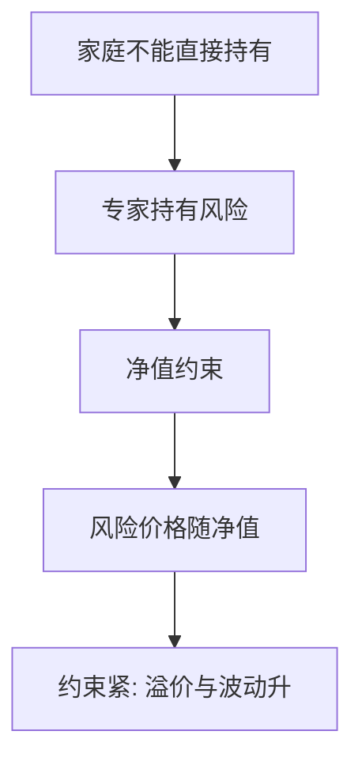

# 中介资产定价 He–Krishnamurthy

家庭不能直接持有某些风险时，定价核跟着专家的净值走：专家资本一稀缺，风险价格就升。

<footer>—— He and Krishnamurthy, Intermediary Asset Pricing, American Economic Review, 2013</footer>

[上一课](/econ/production-based-asset-pricing)在完全无摩擦下让家庭与企业欧拉共用一个 $m$。本课缺口是**谁能持有风险**：一部分资产必须由受资本约束的中介持有，家庭只能买中介的负债。$m$ 变成专家的边际价值，状态变量是中介净值。不重写投资 $q$，不把银行资本监管条文搬进来。

## 问题

Lucas 树假定代表性主体直接持有树。现实里许多风险（信贷、场外衍生品、部分公司债）经过经销商与银行的资产负债表。He 与 Krishnamurthy（2012, 2013）设专家有激励约束：管理的资产不能相对自己的净值无限放大。约束松时，专家接近风险中性边缘，风险价格低；约束紧时，专家的随机折现因子被净值的边际效用拉高，风险资产被甩卖、溢价升、波动升。缺口是把时变溢价的状态从总量 $c$ 换成**中介资本**——消费可以仍平滑，风险价格照样抖。

这与信息课序的 $\lambda$ 不同：那里流动性成本来自不利选择；这里来自风险承担能力的稀缺。可以并存，本课只留资本通道。

He and Krishnamurthy, *AER* 103(2), 2013；更早的 *JFE* 2012 写危机放大。Brunnermeier–Sannikov 是连续时间宏观金融的另一条专家线，后文杠杆周期会碰到 Geanakoplos 的保证金版本。

## 方法

两群人：专家与家庭。家庭不能经营风险技术，只能持有无风险或中介股权/存款。专家最大化，受 skin-in-the-game 一类约束。均衡风险价格 $\eta_t$ 随专家财富份额变：份额低 → $\eta$ 高。资产价格对专家净值的敏感在约束区非线性——小损失可以大甩卖。SDF 语言：$m$ 在约束区跟踪专家的 $u'(w^e)$（或约束乘子），不是跟踪总量 $u'(c)$。

与 [CAPM](/econ/capm-theory)：切点加总假定人人能持有市场。中介定价说市场组合的持有人是专家，beta 应对专家的财富，而不是对家庭消费。实证用经销商杠杆、中介股票回报当代理——测量换栏；本课只陈述均衡映射。

## 机制

机制是风险集中加杠杆约束。损失打在专家净值上，约束逼近，风险承担的影子价格升，为恢复约束他们减持风险，价格再跌，净值再损——放大。家庭想买风险也买不到（制度或激励），不能出来「抄底」把溢价立刻压回去。这与 GS 的采集不足不同：信息可以是对称的，稀缺的是资本。

生产基础的企业若自己受融资约束，企业 $m$ 与专家 $m$ 会连在一起：外部股权贵的时候，投资欧拉用内部影子价格。本课把专家当作加总的外部风险承担者。

约束松弛区可以接近无摩擦核，危机是状态依赖而非常态。时变溢价的 $D/P$ 通道，现在多了一个可命名的 $z$：中介杠杆。

## 边界

不要把本课写成「所以要用银行股当定价因子」的回归执照。代理是否等于专家净值，是联合假说。下一课 Brunnermeier–Pedersen 把稀缺从净值换成**保证金与融资流动性**，市场流动性与融资流动性互馈。本课的约束是股权式净值，下一课是抵押与 haircut。

也不要把中介写成限价簿做市商存货。存货是协议层的库存；净值是一般均衡的财富。切点仍在 [到限价簿](/econ/to-limit-order-book)。

后课默认：部分资产必须由受约束专家持有时，$m$ 跟踪专家净值；约束区风险价格非线性放大。家庭消费平滑不再是核太平的充分理由。

## 小结

- 专家资本约束把 $m$ 从总量消费挪到中介净值。
- 约束紧：甩卖、溢价升、放大。
- 不是不利选择价差，也不是 CAPM 截面表。
- 出处：He and Krishnamurthy, *AER* 2013；对照 *JFE* 2012。
