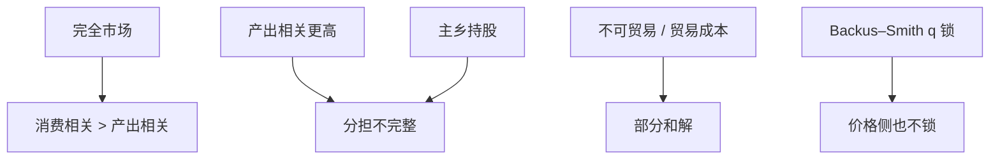

# 国际风险分担

完全市场下国别消费应只跟全球冲击走，相对边际效用跟实际汇率锁在一起；数据里消费更本国、相关更低——分担远不完整。

<footer>—— Backus, Kehoe and Kydland, International Real Business Cycles, JPE 1992；Obstfeld and Rogoff 风险分担；对照 Backus–Smith</footer>

[上一课](/econ/forward-premium-puzzle)写价格侧 UIP 失败。本课换数量：消费是否已保险。主干[Backus–Smith](/econ/backus-smith) 已把 $q$ 与相对消费的锁写过；本课补完整分担的其他检验与 Obstfeld–Rogoff 的开放宏观，不重推那把锁。货币危机下一课换突然的价格与流量断裂。

## 问题

完全市场：各国 $m$ 对齐到同一状态价格（允许 $q$）。于是国别消费增长应高度相关，特异冲击被资产市场吸收。BKK：观测是产出相关高于消费相关——与保险相反（保险应使消费相关高于产出）。Obstfeld：用资产持有与消费欧拉估分担程度，远小于 1。缺口不是再写原罪净值，而是：即便没有危机，日常分担也薄。主乡偏好、不可贸易、市场不完全是候选。

渠道：跨国持股、汇款、援助、借贷。数量上都不够把特异冲击抹平。Gourinchas–Rey 的估值效应是价格渠道的分担，危机时可以反向放大。

## 方法

检验：消费增长对全球 vs 本国产出的回归；跨国消费相关；Backus–Smith 相关（已有课）。资产：本国股权持有比例（French–Poterba 主乡）。模型：不完全市场、贸易成本、不可贸易冲击可以把谜减小，难以同时打中脱节、FH、主乡。本课列机制，不选唯一。

与 Lucas 悖论：穷国不能用资产市场买保险，与资本不流入是同一不完全的两面。与全球失衡：买美债可以是买保险，上流是分担的一种（把风险卖给愿意生产安全资产的国家）。

## 机制

机制是状态价格未对齐。摩擦：主权、执行、信息、不可贸易。结果：各国更多靠国内储蓄平滑（FH 味道），靠 $q$ 调整（但 Backus–Smith 说 $q$ 也没按教科书调）。危机时本应是保险赔付日，资本却流出（突然停止）——保险符号反了，后课危机模型。

与 UIP 谜：价格错与数量错可以同源（$m$ 的国别成分），不必。风险溢价可以很大而持股仍主乡（参与、分割）。

Aid 与汇款在发展中国家是重要渠道，但不进入 BKK 的 OECD 样本主叙事。分层：富国之间已经分担不足，穷国更不足。

## 边界

本课不重做 Backus–Smith 的公式。不把主乡写成非理性唯一解释——对冲人力资本、分散成本、信息都可以理性。下一课货币危机：不完全分担在坏状态下变成跑。不要用本课写组合基金的国际配置手册，也不进限价簿。

后课默认：完全市场的消费保险在数据上失败；主乡、不可贸易、市场不完全是菜单。Backus–Smith 是价格锁，BKK 是数量相关，两课一起用。危机模型下一课把失败写成跑与钉住崩溃。

## 小结

- 完全市场：消费应保险，相关应高于产出；数据相反。
- 主乡持股与薄的跨境保险工具。
- Backus–Smith 的 $q$ 锁是同一失败的价格面。
- 上流买安全资产可以是分担，危机时符号可反。
- 出处：Backus, Kehoe and Kydland, *JPE* 1992；Obstfeld；French and Poterba；Backus and Smith 1993。
