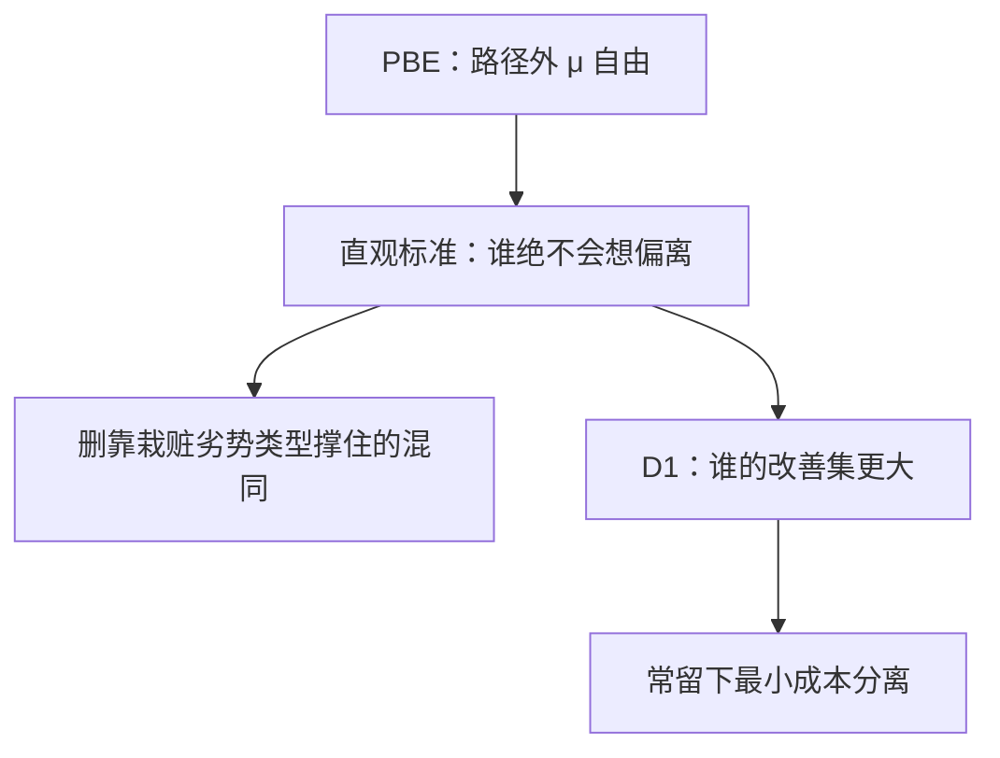

# 直观标准与 D1

若某偏离对一类类型无论对方如何反应都不是更好，而对另一类在某些信念下可以更好，则路径外信念不应再支持前一类。

<footer>—— Cho and Kreps, Signaling Games and Stable Equilibria, Quarterly Journal of Economics, 1987；Banks and Sobel, Econometrica, 1987</footer>

[上一课](/econ/perfect-bayesian)的 PBE 在路径上贝叶斯、在路径外信念自由，混同可靠「把偏离判给最坏类型」撑住。缺口是砍这些信念。Cho–Kreps 直观标准问：谁更有理由发出这个偏离？Banks–Sobel 的 D1 把「更有理由」写成行动集合的包含。本课钉这两刀，不重写序贯理性，也不把菜单筛选当信号。

## 问题

信号博弈：类型 $\theta$ 发 $m$，接收者持 $\mu(\cdot\mid m)$ 后行动。均衡支付 $u^*(\theta)$。对偏离 $m'$，称 $\theta$ 被均衡劣势，若对接收者在 $m'$ 上的**一切**最佳应答，$u(\theta,m',\cdot)\le u^*(\theta)$。直观标准：若存在 $m'$ 与类型 $\theta$，使某些类型对 $m'$ 均衡劣势，而 $\theta$ 在对方某些信念下能严格改善，则任何把 $\mu(\cdot\mid m')$ 放在那些劣势类型上的 PBE 删掉。

[Spence](/econ/spence-signaling) 混同：高类型想用更高 $e'$ 跳出，低类型对任何「被当成高」仍可能不划算。直观标准禁止把 $e'$ 判给低类型，混同垮，留下最小成本分离。这正是上一课点名、本课展开的那一刀。

### 直观不是「接收者随便讲故事」

精炼限制的是零概率节点上的 $\mu$，不改支付、不改路径上的贝叶斯。被删的是恐吓：用一种没人有激励去证实的解释，挡住有激励的人。它仍可能留下多个分离（信号连续时，比最小成本更浪费的分离常再被删）。

D1 更强：对偏离 $m'$，比较使「发 $m'$ 优于均衡」成立的接收者行动集。若 $\theta$ 的集合严格包含 $\theta'$ 的，信念应把零放在 $\theta'$ 上。类型连续时，直觉标准往往不够，教科书改用 D1 挑分离。

## 方法

对象：有限或两类型连续信号的标准信号博弈。算法：先列出候选 PBE（分离、混同），对每个无人发送的 $m'$ 检查直观标准（再检查 D1）。通不过则删。Riley 反应、 divinity（Banks–Sobel）是同一族更细的刀；主干用直观标准加 D1 的含义。

不要对同时行动的策略式用这套语言——没有「路径外信息集」。也不要在柠檬那种「只有价格、知情者不能先烧 $e$」的结构上硬套；那里几乎没有分离用的偏离维度。

## 机制

刀口在激励的不对称。单交叉让「多烧一点信号」对高类型更便宜，因此同一偏离 $m'$，高类型的改善集更大。接收者若按这个不对称来编 $\mu$，就不该把 $m'$ 当成低类型的招。混同所需的恐吓信念恰好踩这条；分离所需的路径信念（看见 $e^*$ 就是高）不踩。于是精炼偏爱分离。

与[子博弈完美](/econ/subgame-perfect)同类：都是问「到达之后还合理吗」。SPE 问行动是否仍最优；直观标准问信念是否还用得上「谁愿意让你到达」。蜈蚣的限度是 CKR 与到达冲突；这里到达是零概率偏离，精炼主动规定到达之后的解释。

### 过强与过弱

两类型、单交叉、竞争性接收者，直观标准通常够用。连续类型、多维信号、接收者也有类型，直观标准可能删不干净或误删「直觉上合理」的混同。Never types（均衡里概率为零的类型）让 D1 的包含比较失去对照。没有单交叉，改善集可以交叉，精炼不给唯一答案。

Cho–Kreps 的「啤酒与鹑蛋」是直观标准的标准教具：均衡要阻止弱者模仿，路径外若把「点啤酒」判给弱者，弱者其实更不想点——该信念不直观。删掉后留下强者点啤酒的分离。

## 边界

直观标准不是定义均衡，是在 PBE 上再筛。序贯均衡用颤抖给 $\mu$ 一个极限来源，与直观标准不可比地「更紧」：一个管扰动，一个管激励比较。应用时写清用了哪一刀。

「稳定」（Kohlberg–Mertens）是更强的策略式精炼，直观标准是它在信号博弈上的可操作推论。本课不把稳定当计算工具。连续信号、类型密度处处为正时，D1 往往直接挑出 Riley 分离：低类型停在完全信息点，高类型刚好让低类型无差异。

信号课序的信念工具到此。下一课换对象：物品拍卖里，规则把支付写死，主要不再靠路径外 $\mu$ 撑均衡，解回到类型依存出价的贝叶斯纳什。

后课默认：信号博弈先写 PBE，混同若靠「把偏离栽给更不想偏离的类型」撑住，则直观标准（或 D1）删掉。

## 小结

- PBE 路径外太松；直观标准按「谁绝不会偏离」砍 $\mu$。
- D1 用改善集的包含比较，连续类型时更常用。
- Spence 混同常被删，最小成本分离常留下。
- 精炼改信念不改支付；没有单交叉则刀不快。
- 出处：Cho and Kreps, *QJE*, 1987；Banks and Sobel, *Econometrica*, 1987。
