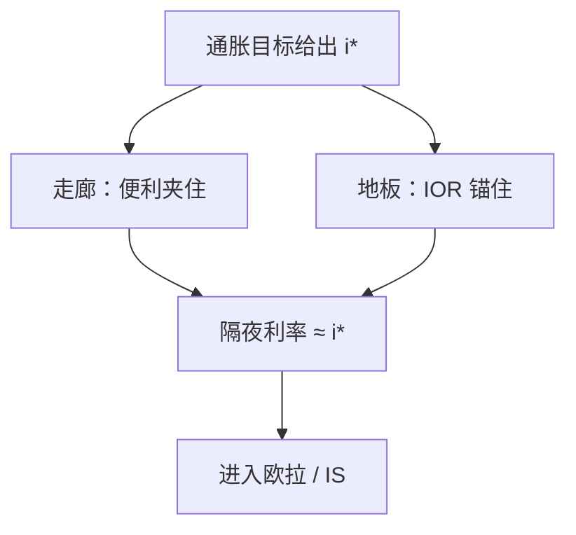

# 准备金利息与走廊

政策利率是走廊里被站立便利与准备金利息夹住的市场利率；地板系统里数量可以很大，锚仍是利息，不是把 $M$ 当工具请回。

<footer>—— 据各国央行操作框架的公开讨论；Bindseil 对实施与走廊的系统整理</footer>

[上一课](/econ/inflation-targeting)把名义锚写成灵活通胀目标，$\pi^*$ 公开。目标要靠一个可操作的隔夜利率去实现。本课的缺口是实施：准备金需求、存贷款便利、准备金利息（IOR）如何把市场利率钉在走廊或地板上。零下限下一课才问这个利率不能再降时怎么办；本课先在正利率区把操作与数量论的长期 $M$ 分清。

## 问题

泰勒规则写出 $i^*$。银行间隔夜利率是准备金市场的价格。稀缺准备金时代，央行用公开市场把供给对准需求曲线的陡峭段，形成走廊：存款便利给下限、贷款便利给上限。充足准备金（地板）时代，供给落在需求平坦段，IOR 成为有效下限，市场利率贴着它，数量可以远大于最低要求。缺口不是再定义 $\pi^*$，而是：同一政策利率，走廊与地板是两套实施， $H$ 的数量含义不同。Bindseil 把实施从「货币数量主义操作」里拆出来：工具是利率，准备金适应。

IOR 是对准备金付息，改变持有准备金的机会成本。它不是铸币税课的通胀税本身，但 $i$ 与 IOR 的利差会影响谁愿意持有 $H$。

## 方法

走廊：上下便利利率包住目标，公开市场微调使隔夜率在包内。地板：IOR 设为政策利率（或极近），超额准备金很多，隔夜率不会系统性低于 IOR（若套利充分）。两种系统都能执行 IT 的 $i$；差别在资产负债表规模与银行的准备金需求是否还约束。数量方程：$P$ 的长期锚仍在，$M$ 在地板上由需求内生得更「松」——$V$ 下降吸收多余 $H$，与下限课同一会计。

CIP 与跨境准备金套利会让离岸美元利率偏离国内走廊。那是市场层平价，实证见[利率平价](/quant/irp)，本课不把交叉货币基差当实施失败的充分统计。

### 地板不是又一次 QE 定义

QE 改变的是久期与信用构成；地板可以只是把原来走廊里的供给推到平坦段，券种不变。把「资产负债表大」写成松紧，会取消 IT 课已经钉住的利率工具。信号仍可能把规模读成路径承诺——非常规课再拆。

### 走廊宽度是实施参数

上下便利拉得太开，市场利率在包内可以漂，IT 的 $i^*$ 执行变差。拉得太近，便利被频繁使用，央行变成主要对手方。

宽度选择是操作，不是 $\pi^*$ 本身。本课不把宽度写成宏观松紧。

## 机制

银行不愿以低于 IOR 的利率拆出（可把钱放在央行），不愿以高于贷款便利的利率拆入。走廊宽、套利摩擦大，市场利率在包内可以漂。地板上摩擦仍可使隔夜率略偏离 IOR，但政策仍用 IOR 当工具，而不是用准备金数量当工具。长期中性：无论走廊还是地板，一旦 $i$ 路径与 $\pi^*$ 定了，$P$ 与名义锚对齐，$H$ 的水平由需求与监管（流动性覆盖等）决定。

从走廊切到地板，往往是危机中把供给推过拐点，事后可以不回去。立场仍由 IOR（或走廊中点）读，不由「准备金多了多少」读。把切换本身当成永久宽松，是把实施存量当成规则。数量论的 $MV=Py$ 在地板上靠 $V$ 吸收多余 $H$；要抬 $P$，仍需 $i$ 路径与锚，而不是准备金账户上的整数。

铸币税：对准备金付息提高了央行的利息成本，缩小利差铸币税。这是财政与央行利润的接头，不是实施框架的目标。本课不估算某年的利润转移。

监管流动性需求会抬升准备金需求曲线，走廊里像「更稀缺」，地板上只是把平坦段垫得更长。不要把 LCR 写成货币政策立场。

## 边界

本课不写某央行某次改走廊宽度的基点，不把支付系统工程当宏观主干。量化栏没有操作台。有效下限下一课：现金的零利息使 IOR 也不能任意为负。开放经济的跨境准备金是外溢，不是本课的走廊几何。

非银行不能直接吃 IOR 时，地板上隔夜率可以低于 IOR，套利链断裂。实施仍声明工具是 IOR 与便利，而不是改回外生 $M$。把「走廊失灵」写成货币政策没有锚，会取消 IT 课的 $\pi^*$。摩擦改变的是 $i$ 向政策利率的贴合，不是名义锚的定义。

后课默认：IT 的 $i$ 由走廊或地板实施；数量适应，工具仍是利率。下一课：这个 $i$ 碰到有效下限，实施框架还在，边际却断了。

## 小结

- IT 给出要钉的 $i^*$；本课给出准备金市场如何钉住它。
- 走廊用便利夹住；地板用 IOR 在充足准备金上锚住。
- 资产负债表规模不是松紧的充分统计。
- CIP 偏离交给 `/quant/irp`，不当实施失败的定义。
- 出处：央行操作框架的公开讨论；Bindseil 对货币政策实施与走廊的整理。
