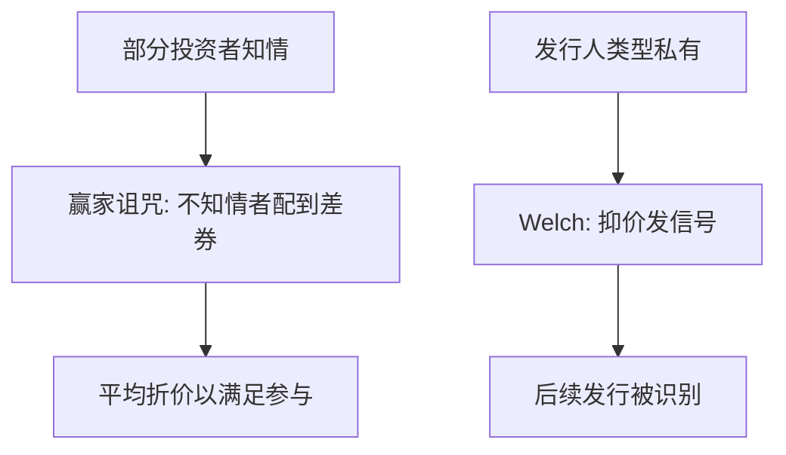

# IPO 抑价作为理论

新股必须平均折价，否则不知情的投资者总是买到知情者不买的那些券。

<footer>—— Rock, Why New Issues are Underpriced, Journal of Financial Economics 1986；对照 Welch, Journal of Finance 1989</footer>

[上一课](/econ/convertible-security)（可转债）。公司金融已经把成熟企业的现金切成派息、留存与债务纪律。本课缺口换成进入公众市场的那一次切片：为什么发行价系统低于首日交易价——作为**均衡理论**，不是作为发行统计。不写抑价均值表，不把长期弱势当成本文。

## 问题

优序说股权信息敏感、柠檬折价重，成熟企业尽量不发。IPO 却必须发，而且常见的不是「按公平价格刚好售罄」，而是故意留下首日收益。若把这读成承销商无能或发行人喜欢送钱，没有经济学。缺口是：在谁知情、谁分配到股份的结构下，折价是参与约束还是信号。

Rock（1986）给出赢家诅咒：知情者只认购被低估的发行，不知情者在被高估的发行里占比过高。不知情者若按平均质量参与，期望收益为负，会退出。要让他们留下，平均发行必须折价。Welch（1989）给出另一条：高类型用抑价发信号，以便后续增发时被识别。两条都是理论；发行日历与抑价百分数留给别处。

抑价指发行价低于首日收盘（或首日交易价）。它不是「IPO 长期回报低」。长期弱势是另一组事实，Loughran 与 Ritter 的对照句在边界，本课不把两套事实焊成一个模型。

## 方法

赢家诅咒。设部分投资者观测到发行的真实价值，部分不观测。配售按申购分配：被低估的券超额申购，不知情者分到的少；被高估的券知情者退出，不知情者分到的多。不知情者的条件期望因此差于无条件期望。发行价必须低到使不知情者的条件期望覆盖参与，于是无条件的平均首日收益为正。

信号。高价值发行人比低价值发行人更愿意承受当期折价，若折价能换来后市较高的再发行价格或较好的市场声誉。分离均衡里，抑价是 Spence 式的有成本行动，对象是类型，不是配售。与[优序](/econ/pecking-order)的方向对照：优序尽量避免发股泄漏；IPO 信号则选择泄漏，因为必须公开上市。

两种理论对「谁获益」预测不同：诅咒补偿的是不知情买家；信号支付的是类型揭示。本课并列，不裁判哪一篇回归赢。簿记建档改变的是配售规则，因而改变诅咒的强度，并不自动把发行价变成二级市场的均衡报价。

## 机制

机制是配售与信息，不是「市场喜欢便宜货」。若股份按意愿分配且信息对称，发行价可以贴近事后交易价，抑价不是必需。信息不对称一旦与固定价格、配给相结合，参与约束就落在信息最少的那一组人身上，折价是让他们留在池子里的费用。拍卖与簿记可以改变分配规则，从而改变诅咒的严重程度；那是机制设计，不是把 Rock 取消。

与半强式 [EMH](/econ/emh) 的接缝：首日收盘把公开发行的信息写入价格，并不否证有效。抑价发生在**发行价**这一非连续交易的定价环节，发行价不是二级市场的均衡报价。强式失败（有人有私人信息）正是诅咒的前提。公司金融与有效市场在这里同用一层信息，不打架。

### 一句对照，不写发行统计

Loughran 与 Ritter 问过：发行人为什么不因为「桌上留钱」而愤怒。那是对抑价**作为事实**的行为与代理补充——经理更关心上市成功与后市，而不是最后一美元的发行收入。本课只用这一句标明：理论解释的是均衡折价为何存在，不解释某年代、某板块的抑价有多高。数字与日历不是本栏对象。

承销商信誉、诉讼风险、流动性补偿，都是文献里的其他候选。主干只保留诅咒与信号两条，以免 IPO 课变成综述清单。

## 边界

不要把首日收益的截面异象、热销市场、长期回报写成定理。那些是量化或实证公司金融；本课停在参与约束与信号。也不要把抑价当成对 MM 的否证：MM 假设公平价格发行；IPO 正是公平价格假设失败的场合。

下一课离开发行折价，问上市之后投票权与现金流权是否还绑在一起：[控制权](/econ/control-rights)。

后课默认：IPO 平均抑价可以是赢家诅咒下的参与约束，或类型信号。不是发行统计课。二级市场把公开信息写入价格，与半强式兼容。

发行价不是限价簿上的均衡报价。不要在这里预支微观结构。

桌上留钱是代理与行为的对照句，不是 Rock 的替代证明。

首日收益是发行价与二级价格的差，不是对半强式的否证。

## 小结

- 股权在优序里信息敏感；IPO 必须发，折价有均衡理由。
- Rock：不知情者的赢家诅咒要求平均抑价。
- Welch：抑价可以是为后续发行支付的信号成本。
- 出处：Rock, *JFE* 1986；Welch, *Journal of Finance* 1989；Loughran and Ritter 一句对照。
