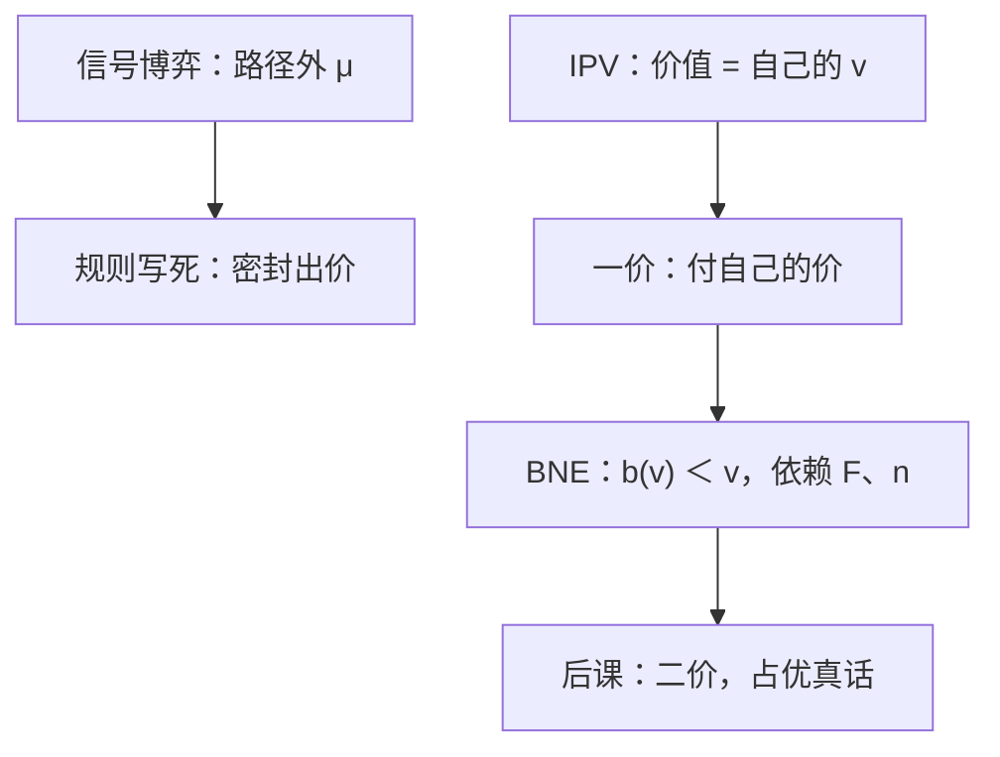

# 独立私人价值与一价

独立私值下，第一价格密封的对称均衡是把出价写成估值的递增函数：赢者付出自己的报价，因而必须遮挡。

<footer>—— 据 Riley and Samuelson, Optimal Auctions, American Economic Review, 1981；Krishna, Auction Theory 整理</footer>

[上一课](/econ/intuitive-criterion)把信号博弈的路径外信念砍到可用。缺口换对象：一件不可分物品，估值是私型，规则是密封一价——最高价得物、付自己的价。不再用教育当信号，用出价。本课钉 IPV 下第一价格的[贝叶斯纳什](/econ/bayesian-nash)，不写显示原理，也不把二价的占优真话提前。

## 问题

$n$ 人，估值 $v_i$ 独立同分布，cdf $F$，密度 $f$，支撑 $[0,\bar v]$。风险中性，物品对每人的价值就是自己的 $v_i$（独立私人价值，IPV）。第一价格密封：同时出价 $b_i$，最高者得物并支付 $b_i$，其余支付零。

对称 BNE 是递增函数 $b(\cdot)$。类型 $v$ 选报 $b$，赢的概率是 $F^{n-1}(b^{-1}(b))$，期望支付为该概率乘 $(v-b)$。一阶条件给出遮挡：

$$
b(v)=v-\frac{\int_{0}^{v}F^{n-1}(t)\,dt}{F^{n-1}(v)}.
$$

均匀 $[0,1]$ 时 $b(v)=\frac{n-1}{n}v$。出价低于估值，因为报价既决定是否赢，也决定赢了付多少。

### 不是完全信息的伯川德

若 $v$ 公开，两人会把价抬到第二高估值附近（或一价下的公开竞价）。IPV 里你不知道别人的 $v$，最优遮挡依赖 $F$ 与 $n$。人数上升，竞争更狠，遮挡变薄。先验一变，均衡函数就变——这是 BNE，不是占优策略。

独立是先验：别人的 $v$ 不更新你对物品的评价。共同价值或关联价值下，赢了本身是坏消息（赢家诅咒），出价还要再削，解概念仍是 BNE，积分核不同。那是后课，本课 IPV 最瘦。

## 方法

对象：对称 IPV、风险中性、无预算约束、单一物品。先猜对称递增纯策略均衡，用包络或直接对 $b$ 求导，边界 $b(\underline{v})=\underline{v}$（或 $0$）。再验证二阶：单交叉保证局部最优即全局。

Riley–Samuelson、Myerson 把同一问题收到直接机制上的虚拟估值；本课停在间接机制「一价密封」的 BNE，不把最优拍卖展开。Krishna 的教科书计算是本课的操作标准。

## 机制

遮挡来自边际权衡。略微提高出价：赢率上升（密度项），但赢了时付款上升（概率项）。最优把 $v-b(v)$ 留成「赢率对付款」的保险。$F$ 越往上厚，高类型竞争越密，高 $v$ 的遮挡比例可以下降——均匀例子里比例恒为 $1/n$。

与信号的差别：一价里接收者不选信念去付工资，规则把支付函数钉死。均衡策略仍是类型依存，但路径外「没人出这个价」的信念不再是撑混同的主工具；对称递增均衡在每条路径上都有人出邻近的价。直观标准那一刀这里用不上。

### 期望支付由赢率函数决定

包络：类型 $v$ 的均衡期望支付等于 $\int^{\,v} G(t)\,dt$，其中 $G$ 是均衡赢率。一价通过 $b(\cdot)$ 实施某个 $G$；二价将实施同一 $G$（对称 IPV 下最高估值者赢）。收入等价是后课的句子，本课只记下：遮挡不等于卖方少卖钱的直觉，因为二价不遮挡却可能期望收入相同。

不对称先验、风险厌恶、预算上限都会打破对称 $b(v)=\frac{n-1}{n}v$。风险厌恶者少遮挡（更怕输）。本课对称风险中性是基准，后课等价定理也站在这一基准上。

## 边界

保留价、进入费改边界条件，不改「付自己的价 $\Rightarrow$ 遮挡」。多物品、组合拍卖超出本课。也不要把密封出价写成限价簿的时间优先；这里没有队列，只有一次同时报价。

后课默认：IPV 一价的对称 BNE 是递增遮挡函数，形状由 $F$ 与 $n$ 决定；占优真话不是这个规则的性质。

## 小结

- IPV：价值私有且独立；一价付自己的报价。
- 对称 BNE 遮挡，$b(v)\lt v$，均匀时为 $\frac{n-1}{n}v$。
- 最优依赖先验，不是占优策略。
- 规则写死支付，不再靠路径外信念撑均衡。
- 出处：Vickrey, 1961（已含一价）；Riley and Samuelson, *AER*, 1981；Krishna, *Auction Theory*。
