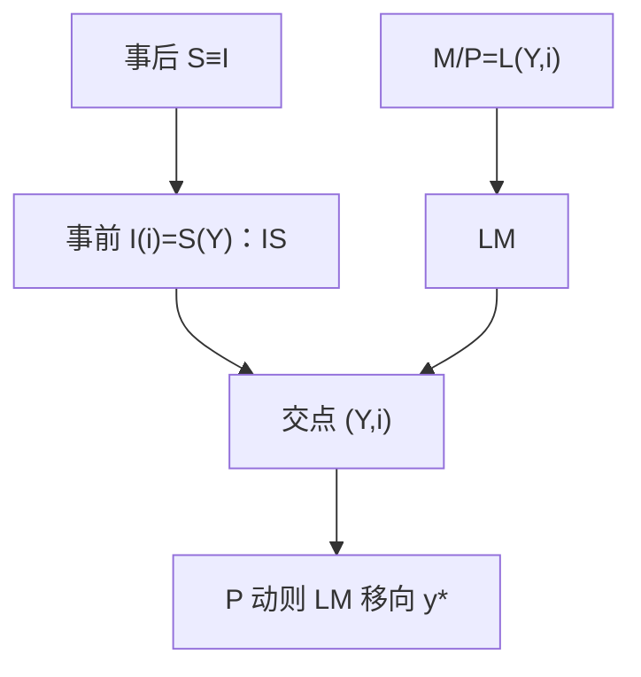

# IS–LM 作为会计

IS 把商品市场的均衡画成一条 $Y$–$i$ 轨迹；它不是对储蓄恒等式的否定，而是把事前计划写成与利率相容的一条线。

<footer>—— Hicks, Mr. Keynes and the Classics, Econometrica 1937</footer>

[上一课](/econ/phillips-expectations)把供给写成附加预期的菲利普斯：缺口动意外通胀。需求从哪来？[储蓄–投资恒等](/econ/saving-investment-id)只保证事后 $S=I$（封闭）。本课的缺口是 Hicks 的那一步：把**计划**的 $I(i)$ 与计划的 $S(Y)$ 相等，再配上货币需求与给定的 $M$，得到短期 $Y$ 与 $i$。后课欧拉会替换掉静态消费函数；本课禁止把 IS 当成跨期最优。

## 问题

事后恒等永远成立，不能决定 $Y$。Keynes 的有效需求要的是计划投资等于计划储蓄。Hicks（1937）把这句话画成 IS：在每个利率上，有一个使商品市场出清的产出。LM 是货币市场：$M/P=L(Y,i)$。两条线的交点是同时出清商品与货币的 $(Y,i)$。价格 $P$ 在本课先当作给定或缓动——粘性的微观基础是新凯恩斯，真实冲击对照是 RBC。

IS 不是「储蓄决定投资」的可贷资金图。利率在 LM 里由货币供求出，也可以被后课的利率规则直接钉住。本课用 Hicks 的原装置，是为了看清会计与均衡差在哪一层。

IS 上每一点都满足计划 $I=S$（或 $Y=C+I+G$）。移到 IS 之外则有非自愿存货，事后恒等靠存货投资去补。LM 之外则有货币的超额供求，靠 $i$ 或 $Y$ 调整。

## 方法

封闭、价格给定。消费 $C=C(Y-T)$，投资 $I=I(i)$，政府 $G$。IS：

$$
Y=C(Y-T)+I(i)+G.
$$

LM：$M/P=L(Y,i)$。$M$ 外生时，$P$ 固定则 $i$ 与 $Y$ 沿 LM 同向。财政扩张移 IS，货币扩张移 LM。产出能否持久高于 $y^*$，要接菲利普斯：若 $P$ 随后上升，LM 左移，回到自然率——这是 Mundell 与 Friedman 都能同意的长期垂直，不是 Hicks 原文的重点。

流动性陷阱：在极低 $i$，货币与债券几乎完全替代，LM 水平，$M$ 扩不动 $i$。这是后课零下限的祖先，Woodford 会改用利率规则语言。

### 为什么叫「作为会计」

IS 把支出恒等里的 $C,I,G$ 写成行为，但仍是流量账户的平衡，不是生产函数。LM 把[货币层次](/econ/money-as-medium)里的 $M$ 写成存量需求。两者都不是增长核算，也不含资本运动定律——索洛在 $y^*$ 上走，IS–LM 谈的是对 $y^*$ 的偏离。

## 机制

$i$ 上升抑制计划投资，要维持商品出清必须更低的 $Y$（储蓄更少）——IS 向下倾斜。$Y$ 上升提高交易性货币需求，给定 $M/P$ 必须更高的 $i$——LM 向上倾斜。交点的比较静态是 Hicks 对《通论》的翻译：同一套符号，既可以读凯恩斯的数量调节，也可以读古典的利率调节，取决于哪条线更陡、价格动得有多快。

长期若 $P$ 灵活且预期正确，交点的 $Y$ 被钉在 $y^*$，货币只定 $P$ 与名义 $i$ 的费雪部分。短替换来自 $P$ 粘住或 $\pi^e$ 滞后，已经在菲利普斯课写过。

流动性陷阱：$i$ 不能再降时 LM 变平，货币扩张不再降 $i$——零下限课再写。古典极端 LM 垂直时财政完全挤出；Keynes 极端 LM 水平时货币无效。这些是斜率特例。Hicks 自己后来对教学图有保留。本栏仍用它，因为 NK 的动态 IS 是它的跨期替换。

Walras 定律意味着债券市场也清。本课不把债券再画一条，以免三重计算。IS 上每一点是商品均衡，不是恒等。

## 边界

静态 $C(Y)$ 切断欧拉方程，利率对消费的跨期替代被藏进含糊的 $I(i)$。开放经济的 IS 要加净出口与汇率，是蒙代尔–弗莱明。本课也不写限价簿上的利率；宏观 $i$ 是政策或债券的一个标量。卢卡斯会问：政策一变，$C_Y$、$L_i$ 还在不在。

后课默认：说到 IS–LM，指的是事前流量与货币存量的同时均衡，不是 SNA 恒等本身。下一课用消费欧拉替换 $C(Y)$。

## 小结

- 事后 $S=I$ 是恒等；IS 是计划量的商品均衡轨迹。
- LM 是给定 $M/P$ 的货币均衡；交点定短期 $(Y,i)$。
- $P$ 灵活时交点回到 $y^*$，与货币中性对齐。
- 斜率特例给出挤出与流动性陷阱。
- 静态消费函数是缺口；欧拉与利率规则是后课。
- 出处：Hicks, Econometrica 1937。
