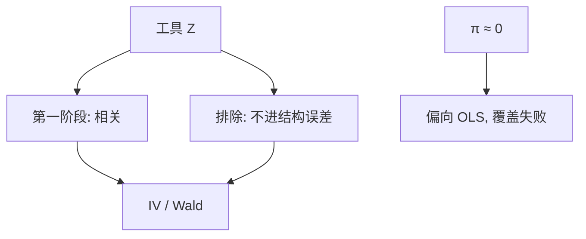

# 工具变量与弱工具

工具必须与内生回归元相关、只通过它进入结果方程；相关太弱时，2SLS 偏向 OLS，置信区间的名义覆盖是假的。

<footer>—— Wright 供给弹性的工具传统；Angrist and Krueger, Does Compulsory School Attendance Affect Schooling and Earnings?, QJE 1991；Staiger and Stock, Econometrica 1997</footer>

[上一课](/econ/ovb-measurement-error)给出 OVB 与衰减，没有给出外生来源。本课缺口是工具变量：用 $Z$ 提供的外生变异识别对 $X$ 的效应，并标明弱工具何时把这套装置毁掉。两阶段最小二乘的过度识别检验下一课再写；本课先钉相关与排除。

## 问题

结构 $Y=\beta X+u$，$\mathrm{Cov}(X,u)\neq 0$。若存在 $Z$ 满足 $\mathrm{Cov}(Z,u)=0$（排除 / 外生）且 $\mathrm{Cov}(Z,X)\neq 0$（相关），则

$$
\beta=\frac{\mathrm{Cov}(Z,Y)}{\mathrm{Cov}(Z,X)}.
$$

Wald 比在 $Z$ 二值时就是这个比。缺口不是再讲教育回报从哪来，而是：排除是不可检验的（恰好识别时），相关是可检验的，弱相关让分母近零，估计量噪声极大且偏向 OLS。

Angrist–Krueger（1991）用出生季度当入学年龄与义务教育的工具：相关来自制度，排除来自「季度不直接进工资」——后一条立刻被质疑（季节、家庭背景）。Bound、Jaeger 与 Baker（1995）指出：第一阶段若弱，即便 $Z$ 有轻微排除偏离，偏误也被放大。Staiger–Stock：经验规则「$F>10$」是弱工具诊断的入口，不是定理。

排除失败：季度通过季节性就业直接进 $Y$。相关失败：义务教育对多数人是松约束。两失败可以同时发生。

## 方法

第一阶段 $X=\pi Z+v$。$\pi\neq 0$ 是秩条件。恰好识别时 IV = 间接最小二乘 = 2SLS。异质效应下恰好识别 IV 估计 LATE——下一课序后段再展开，本课先用常数 $\beta$。弱工具：Anderson–Rubin 对恰好识别稳健；Stock–Yogo 给出最大相对偏误与实际水平的临界值；Kleibergen–Paap 在聚类下替代 Cragg–Donald。

量化栏的[金融 IV](/quant/iv-finance)把同一装置用到公司金融与资产定价回归；本课写识别语言，不重写那些回归表，也不进限价簿。

## 机制

机制是只通过 $X$ 的通道。$Z$ 移动 $X$ 的外生部分，$\mathrm{Cov}(Z,Y)$ 把 $\beta$ 乘在这段移动上。弱工具使这段移动相对于噪声太小，有限样本里第一阶段估计的 $\hat\pi$ 把噪声带进第二阶段——与 OLS 的内生偏误同方向靠拢。许多工具堆上去、每个都弱，问题更重，那是下一课过度识别要管的。

与[卢卡斯批判](/econ/lucas-critique)：工具若是政策规则的一部分，规则一变 $\pi$ 与排除一起变。IV 不是自动结构。

单调性（Imbens–Angrist）在异质下保证 LATE 是编译器的加权；违反则 IV 是符号不定的混合。本课常数 $\beta$ 下还不需要，但弱工具与异质会纠缠。

## 边界

本课不把「找一个与 $X$ 相关的变量」当成研究设计。不报某个义务教育 $F$ 统计量的新数字。排除在恰好识别下不可检验，只能讲机制故事与安慰剂（$Z$ 对未处理结果、对预定期）。下一课 2SLS 在过度识别下给出 Hansen–Sargan，仍检验的是**所有工具联合**与误差不相关，不是单条排除为真。

后课默认：写 IV 先写排除机制与第一阶段强度；$F$ 过低则改用弱工具稳健推断，或承认识别失败。2SLS 与过度识别下一课。

## 小结

- IV 比：$\mathrm{Cov}(Z,Y)/\mathrm{Cov}(Z,X)$；排除加相关。
- 弱工具：2SLS 偏向 OLS，名义 $t$ 不可用。
- 恰好识别时排除不可检验；相关可检验。
- 量化栏金融 IV 是应用，不是另一套定义。
- 出处：Angrist and Krueger, *QJE* 1991；Bound, Jaeger and Baker, *JASA* 1995；Staiger and Stock, *Econometrica* 1997；Stock and Yogo 弱工具临界值。
