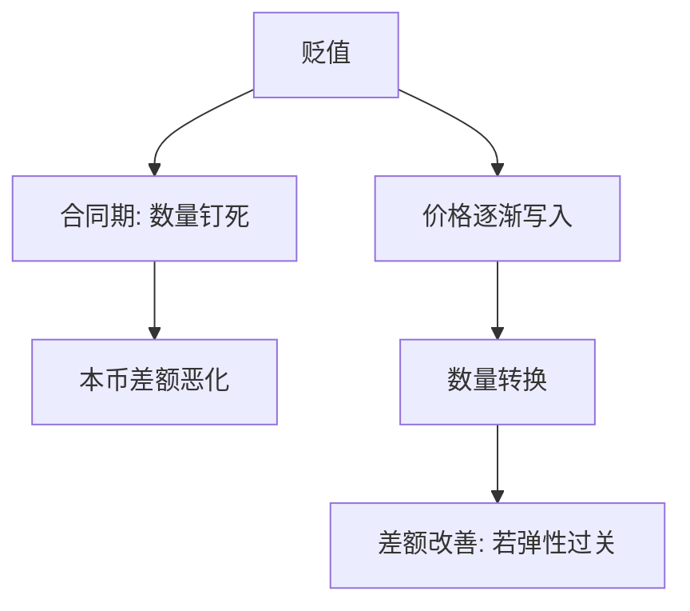

# J 曲线

贬值之后，贸易差额往往先恶化再改善：合同价格与数量一时粘住，计价效应抢在数量转换之前。

<footer>—— Magee, Currency Contracts, Pass-through, and Devaluation, Brookings Papers on Economic Activity, 1973</footer>

[上一课](/econ/marshall-lerner)给出贬值改善 $CA$ 的弹性阈值。阈值是调整完成之后的比较静态。本课缺口是时间：短期数量粘住时，同一 $\Delta e$ 可以先把差额推向恶化，曲线像字母 J。不重推弹性公式，不把某国的月度贸易账画成谜。

## 问题

马歇尔–勒纳若成立，为什么政策上仍常见「贬了，逆差更大」？Magee（1973）把窗口拆成三段：货币合同期、pass-through 期、数量调整期。合同期里，已签的进出口按旧币种、旧数量执行，$E$ 一动只改本币折算。若进口合同以外币计价，贬值立刻抬高本币进口账单，出口本币收入不一定同比例升——差额恶化，与长期弹性无关。

缺口因此不是再选一个阈值，而是：弹性条件在哪一段历史上还没有开始工作。蒙代尔下一课把 $NX(q)$ 画成已经转换完成；本课声明那是终点，不是第一季度。

J 不是偏好形状。它是名义贬值后贸易差额对时间的路径：先下后上。上半支仍要求马歇尔–勒纳一类条件最终成立；否则曲线可以停在恶化段。

## 方法

把 Magee 的三段写成对价格与数量的不同粘性。合同期：数量与合同币种给定，只有折算。pass-through 期：新合同改价，数量仍慢。数量期：需求与供给沿弹性移动，马歇尔–勒纳开始发言。吸收与收入效应可以叠在三条路径上，$CA=S-I$ 始终是恒等。

不要用某一季的逆差扩大否证马歇尔–勒纳：那可能仍在合同期。也不要用五年后的改善证明短窗里数量已经动了。

### 粘的是数量，不是会计

经常账户的记账不粘。粘的是合同、分销库存与生产计划。UIP 仍可以让 $E$ 在资产市场立刻跳；货物的数量按另一套时钟走。这与多恩布什的「资产快、物价慢」同族，对象换成贸易量。

## 机制

机制是错开的名义刚性。已签合同把数量和计价货币锁在贬值之前；新价格传入零售与中间投入需要时间；厂商改出口供应、家庭改进口篮子更慢。于是计价效应（进口更贵）先到，支出转换后到。若 pass-through 不完全，价格激励本身也弱，J 的上半支更晚、更浅。

长期相对 PPP 与中性仍是慢锚。J 曲线不否定锚，只说明过渡路径上 $NX$ 的符号可以与长期导数相反。突然停止若同时砍吸收，差额可以立刻改善——那是 $S-I$ 的吸收通道，不是本课的转换时钟。

计价货币选择会改合同期的符号：若出口以本币计价、进口以外币计价，贬值对合同期最不友好。这是 Magee 的合同算术，不是限价簿上的外汇订单。

## 边界

不要把每一条先下后上的贸易账都叫 J 曲线：还要有一次名义 $E$ 的变动，以及合同/数量粘性这两件家具。也不要在此估计弹性或 pass-through。下一课 [蒙代尔–弗莱明](/econ/mundell-fleming)把 $NX(q)$ 放进 IS，默认用的是转换已经发生或正在发生的那一支。

后课默认：马歇尔–勒纳是终点条件；短窗可以恶化。资产平价的时钟快于货物数量的时钟。

实证弹性、汇率传递系数见货物与宏观实证，不在本栏重跑。外汇执行仍不进限价簿。

吸收同时砍时，差额可以立刻改善，看起来像没有 J。那是 $S-I$ 的流量，不是数量已经转换。要把两条通道分开，才不会用危机年的顺差否证 Magee。

蒙代尔的 $NX(q)$ 用的是转换已经发生或正在发生的那一支。把合同期的恶化画进 IS，会把短局乘数写成错误的符号。

## 小结

- 贬值后贸易差额可先恶化再改善：合同与数量粘住，计价效应先行。
- Magee 把窗口拆成合同、传递、数量三段；马歇尔–勒纳管最后一段。
- 短窗恶化不自动否证长期弹性条件。
- 吸收通道与转换通道必须分开，才不会用危机顺差否证 J。
- 下一课蒙代尔把 $NX(q)$ 放进 IS，用的是转换支而不是合同期。
- 出处：Magee, *BPEA* 1973；弹性阈值见上一课 Marshall、Lerner、Robinson。
