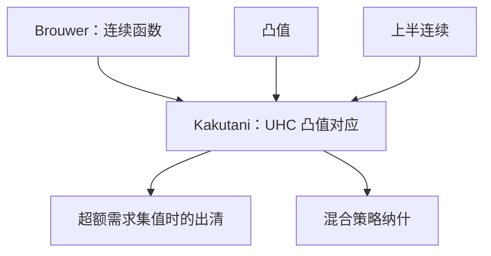

# Kakutani 不动点

对应把一点送到一个集合；在紧凸上，上半连续、非空紧凸值的自对应必有 $x\in\Phi(x)$。

<footer>—— 据 Kakutani, Duke Mathematical Journal, 1941；Debreu, Theory of Value, 1959；Mas-Colell, Whinston and Green 第 17 章整理</footer>

上一课[Brouwer 不动点](/econ/brouwer-fixed-point)管连续函数。马歇尔需求在完全替代时是一段线段，最优反应在无差异时是一个面：对象是对应 $\Phi:C\rightrightarrows C$，不是函数。缺口是把不动点改写成 $x\in\Phi(x)$。上半连续的精确定义下一课才展开；本课先把 Kakutani 的假设当黑箱用起来，并标明后课均衡、混合策略纳什缺的就是这四条。

## 问题

$C\subset\mathbb{R}^n$ 非空紧凸。$\Phi:C\rightrightarrows C$ 满足：(i) 每点 $\Phi(x)$ 非空紧凸；(ii) $\Phi$ 上半连续（闭图在紧值时与之等价）。则存在 $x^*\in C$ 使 $x^*\in\Phi(x^*)$。Brouwer 是 $\Phi(x)=\{f(x)\}$ 的特例：单点集凸且紧，连续函数的图闭。

超额需求若集值，构造 $\Phi(p)$ 为「被 $z(p)$ 改善的价格方向」或直接对需求对应加总，不动点仍是出清。有限正规形式博弈：混合策略单纯形上，对手混合给定时最佳反应是线性规划的最优面，凸紧；期望收益连续给出上半连续。于是[混合策略与存在性](/econ/mixed-strategy)是 Kakutani 的实例。本课不把 Nash 1950 重写一遍。

### 凸值不能省

上半连续且紧值已经能保证图闭，没有凸值仍可没有不动点：想一想把圆分成上下两弧的对应，或两点集 $\{0,1\}$ 上 $\Phi(0)=\{1\}$、$\Phi(1)=\{0\}$。经济学对应：非凸偏好让需求是两端、不含中点，超额需求失去凸值，标准存在性停机。这是[凸偏好](/econ/convex-preference)必须在均衡之前就钉死的原因。Kakutani 不发明凸，它消费凸。

Kakutani 仍是存在性。多重纳什、多重均衡是常态。选择均衡要精炼或稳定性，不在本课。

## 方法

用 Kakutani 前核对定义域紧凸、像落在定义域里、值凸紧非空、上半连续。连续目标在紧凸可行集上的最优对应，在偏好连续凸、预算连续且紧时，满足这些——Berge 极大值定理给非空紧与 UHC，凸偏好给凸值。后课[上半连续对应](/econ/uhc-correspondence)把 UHC 与 Berge 写清楚；本课只要求：没有 UHC，Kakutani 的假设不齐。

近似办法：用连续函数 $f_\varepsilon$ 在 $\varepsilon$-邻域里挑 $\Phi$ 的点（Michael 选择在凸值时可用），对 $f_\varepsilon$ 用 Brouwer，令 $\varepsilon\to 0$ 用闭图收极限。这解释了为何 Kakutani 看起来像「集值 Brouwer」。

## 机制

$x$ 不在 $\Phi(x)$ 里时，凸值让你能用[分离超平面](/econ/separating-hyperplane)把 $x$ 与 $\Phi(x)$ 分开，造出一个连续的「朝像走」的方向。UHC 保证这个方向不会在极限处突然跳开。于是可以造辅助的连续自映射，Brouwer 给出近似不动点，闭图把近似收成真正的 $x\in\Phi(x)$。分离再一次成为存在性的引擎：没有凸，分离失败，辅助映射造不出来。

与压缩的对比依旧：Kakutani 不给唯一、不给 Picard。值函数迭代走压缩；均衡存在走 Kakutani。两者都叫不动点，假设与产物不同，不要混用迭代去「算」一般均衡的 Kakutani 点还指望全局唯一。

无限维要 Glicksberg 一类推广。连续时间或函数价格空间上的均衡有时走那条；有限商品主干停在 Kakutani。

## 边界

本课不给 UHC 的 $\varepsilon$-$\delta$ 定义，不证 Berge，不写 Nash 的全部公理。不要把 Kakutani 用到非凸生产（固定成本）上还声称标准存在性成立——那需要企业数原子、混合或递增成本的修补。下一课把「上半连续」从黑箱变成可检查的定义，并接到需求对应与极大值定理。

后课默认：集值需求、集值最佳反应，存在性靠 Kakutani；缺凸值就回到非凸对照，不硬套本定理。

## 小结

- Kakutani：紧凸上 UHC、非空紧凸值自对应有不动点。
- Brouwer 是单值特例；混合纳什与集值超额需求是正例。
- 凸值来自凸偏好/线性化混合；没有凸，分离辅助失败。
- 存在不是唯一，也不是计算程序。
- 下一课：[上半连续对应](/econ/uhc-correspondence)。
- 出处：Kakutani, *Duke Math. J.* 1941；Debreu, *Theory of Value*；MWG 第 17 章。
