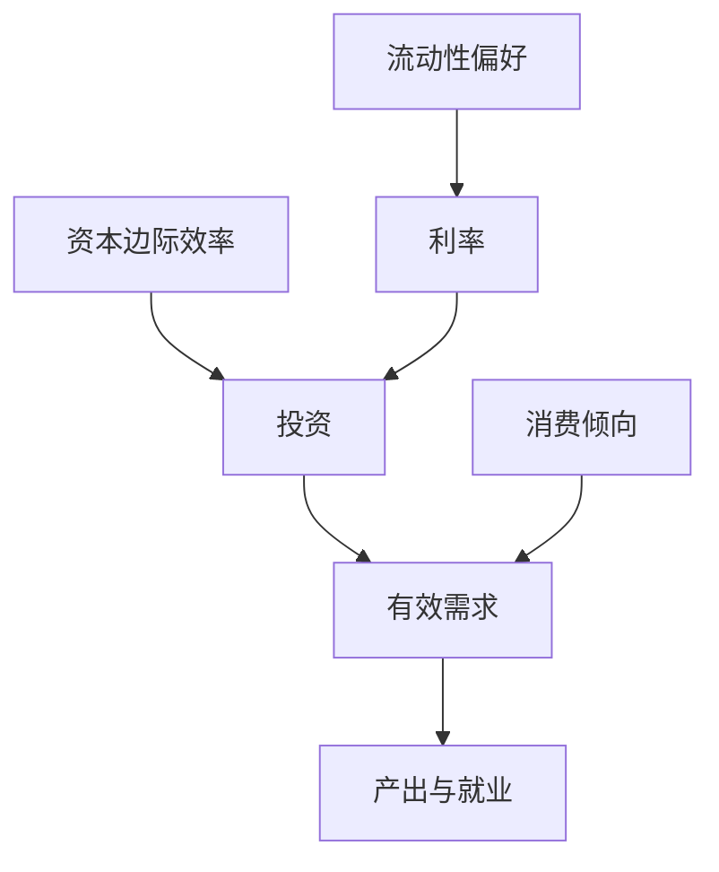

# Keynes《通论》问题设定

古典理论假定充分就业是常态；本书要说明：有效需求不足时，失业可以与均衡并存。

<footer>—— Keynes, The General Theory of Employment, Interest and Money, 1936</footer>

[上一课](/econ/ms-1983-paper)（Myerson–Satterthwaite 原文）。附录对照。本篇不插入主干课序，也不把 Hicks（1937）的 IS–LM 写成凯恩斯本人。[IS–LM 作为会计](/econ/is-lm)、[失业与自然率](/econ/natural-unemployment)已从后起的宏观语言取用。这里对照 **1936 年原书的问题**：劳动市场为何可以停在非充分就业，利率又为何不能单独把储蓄与投资拧平。

## 问题

古典（Keynes 所批评的 Marshall–Pigou 传统）让实际工资出清劳动，让利率出清储蓄与投资。失业是摩擦性或自愿的；节俭会降低利率、提高投资。1930 年代的经验使这条链不可信。《通论》的缺口不是再画一条劳动供给，而是：产出由**有效需求**决定，就业是产出的派生；利率在货币市场上由流动性偏好决定，不保证投资自动吸收充分就业下的储蓄。

原书因此把「一般」对着古典的「特殊」：充分就业只是有效需求刚好够到的特例。附录对照的是这一定位，不是逐章复述乘数算术，也不是后来的粘性价格微观基础。

有效需求：企业家预期能卖出的、与就业决策一致的总需求点。流动性偏好：利率使公众愿意持有现有货币存量。资本边际效率：预期收益折现与资产供给价格的关系，不是物理的资本边际产品。

## 方法

三块积木，原书用散文而不是联立方程组。第一，消费倾向：收入增加时消费增加得更少，留下的缺口必须由投资填。第二，投资由资本边际效率与利率比较决定；MEC 随资本存量与预期摇摆。第三，货币需求含交易与投机动机，利率是放弃流动性的价格。三块联在一起：利率不必把 S 与 I 带到充分就业那一点；产出会下降到使储蓄等于投资。

Hicks 1937 把后两块收成 IS 与 LM 两条曲线，便于比较静态。那是对照读物，不是 1936 的本文。主干 IS–LM 课已经声明自己是会计；本附录禁止倒灌，说「凯恩斯证明了 LM」。

## 机制

机制是预期与存量约束，不是单纯的名义工资刚性——虽然工资章确实讨论货币工资难以下调。即使工资更有弹性，需求收缩仍可通过价格、债务负担与流动性偏好把就业压住。利率的功能被改写：它不是节俭的奖赏，是货币与债券之间的选择。储蓄增加首先减少有效需求，而不是自动变成投资。

这与后来[跨期欧拉](/econ/consumption-euler)的对照：欧拉把消费写成利率的平滑；《通论》的消费倾向几乎不随利率动，利率走投资与货币。两种机制在主干里分属不同课，附录不把 1936 改写成欧拉。

### 问题设定，不是 NK 三方程

主干用 IS–LM 当会计、用欧拉与粘性当跨期。附录只对照 Keynes 认为古典留下的缺口：产量可以由有效需求停在低于充分就业处；利息是流动性的价格。动物精神、长期预期的崩溃，在原文是散文，在后来的 NK 里被再编码。不要用 1936 年为某项当代政策背书，也不要用微观基础「否证」一本问题设定的书。

Keynes, *The General Theory of Employment, Interest and Money*, Macmillan, 1936。希克斯 1937 年 *Econometrica* 是翻译，不是原文。

## 边界

不要用《通论》当 IS–LM 习题集，也不要用它当「财政永远乘数大于一」的许可证——乘数依赖于未充分就业与利率如何反应，后一截在流动性陷阱讨论里才尖锐。一般均衡对照：Debreu 的市场是出清的；Keynes 的问题恰恰是劳动市场可以在非出清处停住，对象已经换了。

下一篇附录对照 Friedman 如何把货币数量写成稳定的需求函数，而不是《通论》的投机陷阱。

有效需求决定产量，不是要素市场出清决定产量。储蓄随收入被动适应，而不是事先决定投资。

利息是放弃流动性的报酬，可以钉在阻碍充分就业投资的水平。流动性陷阱是这一逻辑的极端。

希克斯 1937 年的 IS–LM 是翻译。主干已声明那是会计。附录禁止说「凯恩斯证明了 LM」。

《通论》不是银行挤兑模型，也不是 SDF。不要把一切宏观还原成 Keynes。

## 小结

- 附录对照《通论》：有效需求决定就业；利率由流动性偏好决定。
- 充分就业是特例，不是古典假定的常态。
- IS–LM 是 Hicks 的翻译，不是原文方程。
- 出处：Keynes, *The General Theory*, 1936；对照 Hicks, *Econometrica* 1937。
