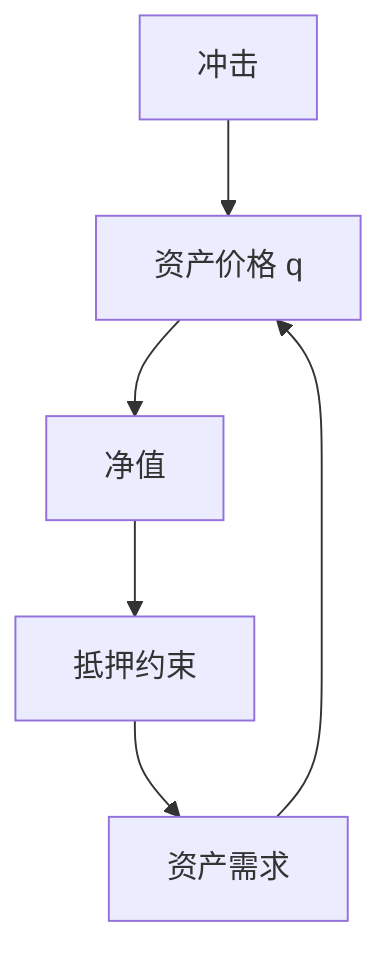
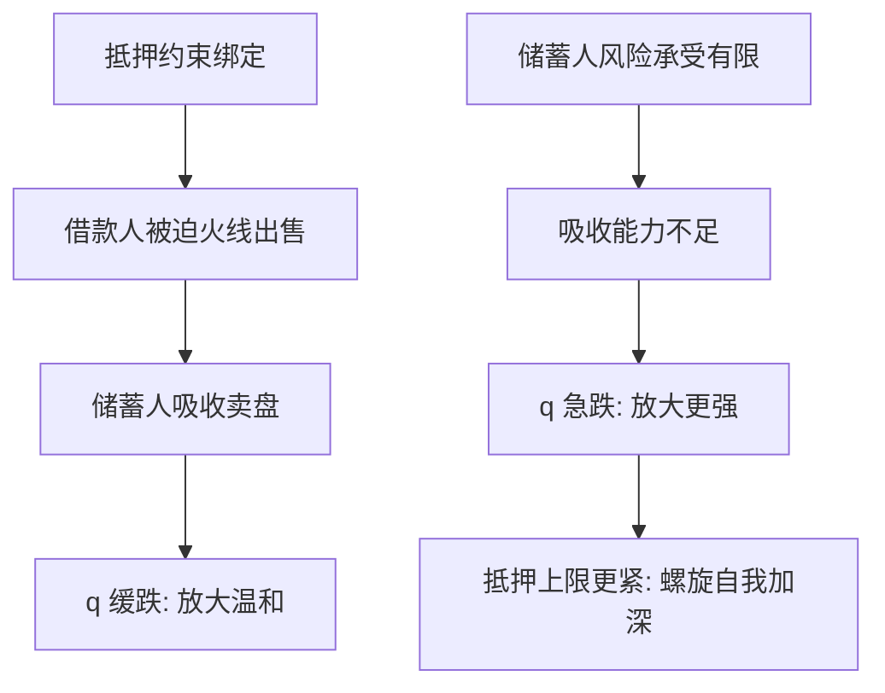

# Kiyotaki–Moore 信贷周期

土地既生产又做抵押；价格下跌收紧约束，强迫出售再压价格——信贷周期是净值的动态，不是外生的贷款意愿残差。

<footer>—— Kiyotaki and Moore, Credit Cycles, JPE 1997</footer>

[上一课](/econ/bounded-rationality-nk)把预期摩擦收到 NK。本单元换约束对象：信贷与净值。家庭杠杆课已有经验；本课缺口是 **KM 的一般均衡抵押**：耐用品价格与借贷上限联立。不重写认知折扣，不写限价簿上的保证金微观结构。

## 问题

完全市场或无约束的 $q$ 理论：净值不限制投资。KM：可执行的债务受土地未来价值约束。冲击使土地价格 $q$ 降，净值降，信贷降，土地需求降，$q$ 再降。持续性强于冲击本身。缺口是给「金融加速器」一条最干净的抵押装置，而不是先上银行。

Kiyotaki and Moore, *JPE* 105(2), 1997, 211–248。Bernanke and Gertler 的净值加速器是姐妹，渠道是外部融资溢价而非硬抵押上限。Kocherlakota 对放大的定量提醒。

抵押约束翻译成大白话：你能借多少，不取决于你「想借多少」，而取决于抵押品明天值多少，即 $b'\le\theta q'k'$。可以想象成银行只肯借「房子估值打个折」的金额——房价一跌，贷款额度立刻缩水，跟你的还款意愿毫无关系。

## 方法

两类人：有生产力的借款人、无生产力的储蓄人。土地供给固定。债务 $b'\le \theta q' k'$。均衡 $q$ 由借款人的土地需求（受约束）与储蓄人的资产需求决定。线性化或完全非线性都可以讲放大。与家庭住房：结构同构，对象换成房。与企业 lumpy：抵押是额外约束，不是固定成本。

政策：放松 $\theta$（宏观审慎的反面）可暂时抬 $q$，埋下更大杠杆——后课审慎。

数字实例：取 $\theta=0.6$、土地估值 100，借款上限是 60；$q$ 跌两成到 80 后，上限立刻掉到 $0.6\times 80=48$。价格只动两成，信贷却收缩 20%，被迫卖地的那 12 正是继续压低 $q$ 的燃料——放大就是这么算出来的。

## 机制

机制是价格进入约束。没有这一点，净值只是分配。有这一点，分配改价格再改约束，循环。火线出售：受约束者是边际买家，他们的强迫供给弹性极大。储蓄人若也有限风险承受，吸收能力有限，放大更强——Brunnermeier–Pedersen 的流动性螺旋是同一逻辑的连续时间与保证金版，本课先钉离散 KM。

一阶 DSGE 若把约束「平均掉」，周期里最紧的时候看不见。偶尔绑定要用非线性。

常见误区：以为把约束「取平均」还能看见周期。抵押约束是偶尔才绑定的——大多数时期松弛、危机时才绷紧，取平均之后约束几乎「消失」。要看见 KM 的放大，必须用允许偶尔绑定的非线性方法，这一步做错了，模型的危机动态就整段不见了。

本课不把 KM 写成交易策略。也不估计股票横截面的抵押因子。

## 边界

本课没有银行（下一课 GK）。没有名义债与通缩（债务通缩课）。定量上纯 KM 的放大可能不够大衰退，需要杠杆初始值、住房、或银行。预期若诊断性过冲，$q$ 的循环更猛，可叠加。

后课默认：抵押约束把资产价格焊进信贷供给。下一课：中介自己也受约束。

## 小结

- KM：抵押品价格与信贷上限正反馈，形成信贷周期。
- 净值成为状态；放大依赖谁是边际买家。
- 银行尚未出现。
- 出处：Kiyotaki and Moore, *JPE* 1997。
