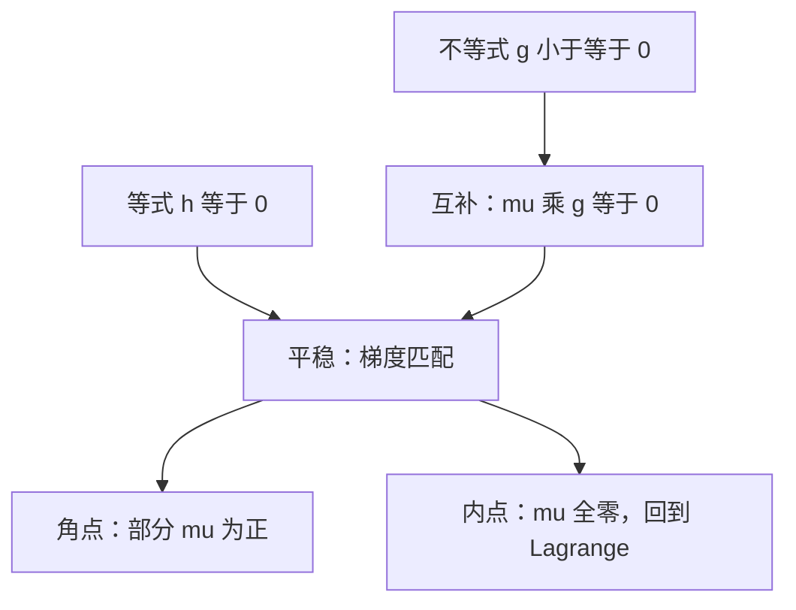

# KKT 条件

不等式把可行方向收成锥；互补松弛说：没顶上的约束，乘子必须为零。

<footer>—— 据 Boyd and Vandenberghe, Convex Optimization, 第 5 章；Mas-Colell, Whinston and Green 数学附录整理</footer>

上一课[拉格朗日乘子](/econ/lagrange-multiplier)处理 $h(x)=0$。消费非负、产能上限、激励相容里的参与约束，都是不等式。缺口是：有的约束在最优处松弛（乘子应为零），有的绷紧（回到等式乘子）。KKT 把两者写在同一组条件里。本课只补这一块，不重写无约束 FONC，也不把数值求解器讲一遍。

## 问题

$\max f(x)$ s.t. $g_i(x)\le 0$、$h_j(x)=0$。在约束品性（如 Slater：凸问题存在严格可行点；或 LICQ）下，最优 $x^*$ 存在乘子 $\mu\ge 0$、$\lambda$ 使

1. 平稳：$\nabla f(x^*)=\sum_i\mu_i\nabla g_i(x^*)+\sum_j\lambda_j\nabla h_j(x^*)$（按最大化、约束 $\le 0$ 的符号书写；最小化则目标梯度变号约定需一致）；
2. 原可行：$g(x^*)\le 0$、$h(x^*)=0$；
3. 对偶可行：$\mu\ge 0$；
4. 互补松弛：$\mu_i g_i(x^*)=0$。

互补松弛是新信息：要么 $g_i(x^*)=0$（约束生效），要么 $\mu_i=0$（影子价格为零）。角点消费 $x_k=0$ 时，该商品的「买更多」方向被挡住，$\partial u/\partial x_k\le\lambda p_k$，差用 $\mu_k$ 补上。后课[内点与角点](/econ/interior-corner)直接用这组互补。

### 互补不是「两个约束各满足一半」

$\mu_i g_i=0$ 不是把约束满足到一半。它是逐坐标的择一：松约束的乘子精确为零，紧约束的乘子自由（只非负）。不要读成「平均意义上互补」。Slackness 失败（$\mu_i\gt 0$ 且 $g_i\lt 0$）在正则问题里不会出现；若数据里看到，多半是约束写反或乘子符号约定乱了。

Slater 对凸问题足够；非凸问题 KKT 可以既不必要也不充分。主干的消费者、成本最小化走凸，一阶当充分用。

## 方法

把有效约束（最优处取等号的那些 $g_i$）收成等式，上一课的 Lagrange 作用在这个有效集合上；无效约束的乘子置零。KKT 是对「哪一批约束有效」的事先未知版本：乘子与松紧一起解。

凸问题（凹目标、凸 $g$、仿射 $h$）在 Slater 下：KKT 必要且充分，强对偶成立，最优值等于对偶问题最优值。这是后课成本函数、利润函数可用对偶变量刻画的许可。非凸激励约束（道德风险里的 IC）常常破坏 Slater 与凸，KKT 变成「先写、再验证」，不是自动充分。

## 机制

可行方向锥是：不进入 $g_i\gt 0$、不离开 $h=0$ 的方向。最优要求目标在这个锥上不能再升，故 $\nabla f$ 落在约束梯度的锥组合里——这仍是[分离超平面](/econ/separating-hyperplane)的法锥版。$\mu_i\ge 0$ 来自不等式的方向性：只能「推向可行一侧」，不能把乘子写成任意实数。

内点解全体 $g_i\lt 0$，于是全体 $\mu_i=0$，KKT 退回无约束或纯等式 Lagrange。所以内点不是另一种理论，是 KKT 的退化。角点是另一退化：若干坐标约束生效。后课画两商品图的切点与轴上端点，就是这两种退化。

互补松弛让包络只对绷紧的约束计数。松掉的资源影子价格为零：再给一单位也绑不到最优值上。

## 边界

本课不讲二次规划算法、有效集法、内点法。也不把 KKT 推广到抽象 Banach 空间的 Lagrange 乘子。互补松弛在离散选择、整数约束上要换成分支，不在主干。下一课问：参数动时，最优**值**怎么变——乘子正是那条导数。

后课默认：带不等式的光滑凸规划，最优写成 KKT；角点用互补松弛读，不把 $\nabla u=\lambda p$ 强加在零消费上。

## 小结

- KKT = 平稳 + 可行 + $\mu\ge 0$ + 互补松弛。
- 松约束乘子为零；紧约束回到 Lagrange。
- 凸加 Slater：必要且充分，并对偶间隙为零。
- 内点与角点都是 KKT 的特例，不是另一套理论。
- 下一课：[包络定理](/econ/envelope-theorem)。
- 出处：Boyd and Vandenberghe 第 5 章；MWG 数学附录。
