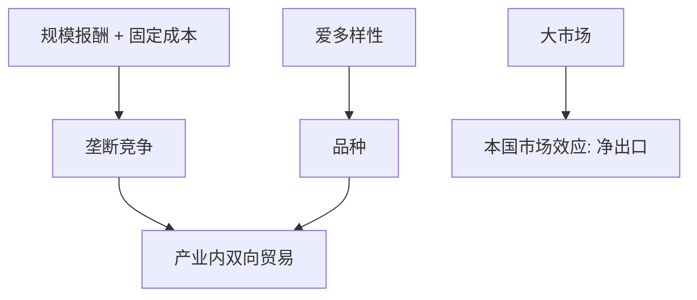

# Krugman 新贸易理论

禀赋与技术都相同，只要规模报酬递增和爱多样性，两国仍会互相出口差异产品；产业内贸易不再是对 HO 的尴尬残差。

<footer>—— Krugman, Increasing Returns, Monopolistic Competition, and International Trade, JIE 1979；Krugman, Scale Economies, Product Differentiation, and the Pattern of Trade, AER 1980</footer>

[上一课](/econ/stolper-samuelson)在 $2\times2$ 里把价格切给要素。本课缺口是：战后增长最快的是**产业内**贸易（德国汽车换法国汽车），HO 解释弱。Krugman 用垄断竞争与规模报酬。Melitz 下一课再把企业异质叠上去；本课先钉对称企业、品种、本国市场效应。

## 问题

Dixit–Stiglitz 偏好：爱多样性，每种品种垄断竞争，固定成本加不变边际成本。封闭时品种数与企业规模由自由进入与市场大小决定。开放（冰山运输成本或零成本）：市场变大，每国消费者可及品种增加，每家企业产量摊薄固定成本。即便两国完全相同，也会双向出口差异产品。缺口不是否认李嘉图与 HO，而是：它们解释产业间；本课解释产业内。贸易增益来自品种与规模，不只来自机会成本差。

1980 年本国市场效应：有运输成本时，需求更大的国家成为该行业净出口国——规模报酬把生产拉向大市场。这是对 HO「只看供给禀赋」的补充。

## 方法

对称企业，一种生产要素（劳动）。均衡：价格加成由替代弹性定，零利润定产量，劳动市场出清定品种数。开放：外国品种进入，本国部分企业退出或每家规模变，福利是实际工资加品种。贸易成本下降的比较静态：更多产业内贸易、更低加成（若垄断竞争强度变）、更多品种。

与计量结构课：这套 CES 需求与[离散选择](/econ/discrete-choice)同源（McFadden / Anderson–de Palma–Thisse）。BLP 是随机系数现场版；Krugman 是对称解析版。本课不估汽车，只给机制。

## 机制

机制是市场扩大摊固定成本，加上消费者对外国品种的评价。没有要素密集差，也可以有贸易。分配：对称模型里劳动是唯一要素，没有 SS 的 $w$ 对 $r$；增益较均匀。一旦把技能或特定要素放回来，产业内贸易仍可与分配冲突并存——不要用 Krugman 取消 SS。

经济地理（Krugman 1991）把同一套 IRS 放进空间集聚，本课只标：贸易成本与 IRS 一起可以产生核心–边缘，不是本课必须解完。

新贸易理论不是「新」在否定比较优势，而是比较优势的来源从禀赋/技术扩到规模与偏好。Helpman–Krugman 把 HO 与产业内写进同一本书。

## 边界

对称企业解释不了「为什么只有一部分企业出口」——下一课 Melitz。引力下一课把双边流量写成规模与距离，可以兼容本课 CES。关税福利：小国在本课有品种增益对关税收入的权衡，最优关税后课再写。不要把 1979/1980 模型当成已经包含异质企业或全球价值链。

后课默认：相同国家之间可以因 IRS 与多样性而产业内贸易；本国市场效应让大需求国净出口该行业。SS 分配在只有一种劳动时淡出，多要素时仍在。Melitz 把选择效应叠在同一套 CES 上。

## 小结

- IRS + 爱多样性 ⇒ 产业内贸易，即使禀赋相同。
- 增益来自品种与规模，不只来自比较成本。
- 本国市场效应：大需求 + 贸易成本 ⇒ 净出口。
- 对称企业：所有企业都出口（零贸易成本时）；异质留给 Melitz。
- 出处：Krugman, *JIE* 1979、*AER* 1980；Dixit–Stiglitz；Helpman and Krugman。
