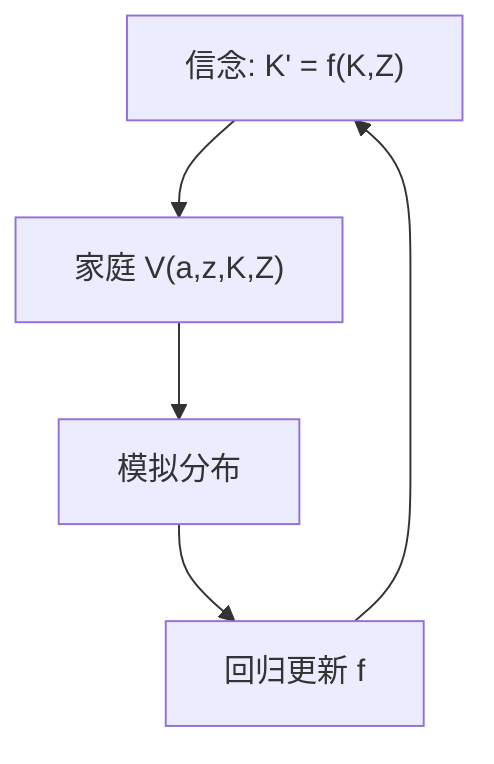

# Krusell–Smith

家庭若只用资本均值（加总量冲击）预报价格，而预报误差几乎为零，无限维分布就可以被有界理性的低维状态代替。

<footer>—— Krusell and Smith, Income and Wealth Heterogeneity in the Macroeconomy, JPE 1998</footer>

[上一课](/econ/bewley-aiyagari)的不变分布在确定性总量里闭合。一旦有总量 $Z_t$，真实状态含整个 $\mu_t$，贝尔曼的自变量无限维。本课缺口是 **Krusell–Smith 近似**：用少数矩当预报充分统计。不重写 Aiyagari 稳态算法。

## 问题

价格 $r_t,w_t$ 依赖资本总量与冲击，而资本总量是 $\mu_t$ 的积分。家庭要预报 $\mu_{t+1}$。KS：假设家庭相信 $\log K'=\alpha(Z)+\beta(Z)\log K$，只条件于今天的 $K$ 与 $Z$，用模拟路径对这条定律做回归，更新信念直到自洽。若 $R^2$ 极高，更高矩几乎不帮预报价格。缺口是给「分布是状态」一条可算的有界感知，而不是声称分布真的是一维。

Krusell and Smith, *JPE* 106(5), 1998, 867–896。后续：Den Haan–Rendahl 等改进模拟；Reiter 的投影把分布线性化。序列空间方法是另一条路。

## 方法

外层：总量定律。内层：个人 $(a,z,K,Z)$ 上的贝尔曼（比 Aiyagari 多两个总量状态）。模拟一大群家庭，得 $\{K_t\}$，再估定律。检查：把分布的其它矩加入预报，看是否改进 $r$ 的预测。劳动供给、资本利用可同样处理。精度高不表示福利或分配效应可由 $K$ 概括——预报价格与概括福利是两件事。

与一阶 HANK：对总量冲击线性化时，分布沿确定性稳态的偏离是无限维线性系统，可用缩减或序列空间解，不必 KS 的非线性模拟。KS 仍是非线性、大冲击的基准故事。

## 机制

机制是价格对分布的依赖几乎是通过均值（在他们的校准里）。原因：资本供给来自几乎不受约束的富人，他们接近线性政策；约束家庭的资产少，不驱动 $K$。因此总量 IRF 可以接近代表性 RBC，而分配 IRF 完全不同。这解释了「加总矩看不出异质」与「政策的分配效应很大」可以并存。

若价格依赖谁持有资产（例如抵押、住房、名义债），均值不够，KS 的 $R^2$ 会掉——后课债务与 HANK 会碰到。

有界感知是求解装置，不是宣布家庭真的不做更高阶推断。太阳黑子与学习是预期单元。

## 边界

本课不把 NK 粘性接上（HANK）。不讨论帕累托尾是否破坏低维预报。算法细节（模拟多少人、如何插值）不是理论。不要把 KS 写成「异质无关」：它说的是**预报价格**时均值够用，不是福利或 MPC。

后课默认：有总量冲击的不完全市场，可用 KS 或线性化分布求解；加总接近代表并不取消分配。下一课：稳态财富的右尾为何比 Aiyagari 更厚。

## 小结

- KS：用 $K$ 与 $Z$ 预报价格，自洽时 $R^2$ 可极高。
- 总量 IRF 可像代表模型，分配效应仍在。
- 价格若依赖更高矩，近似失败。
- 出处：Krusell and Smith, *JPE* 1998。
