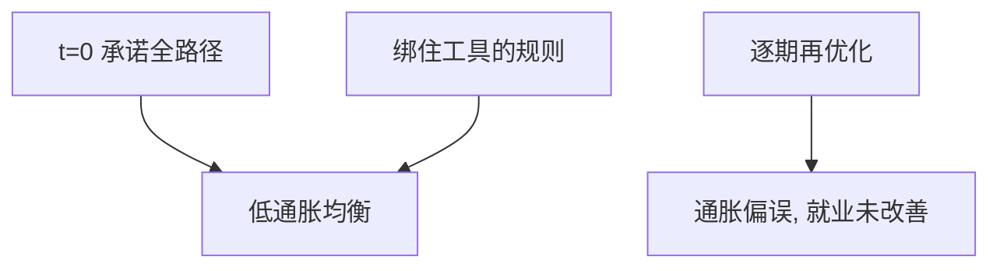

# Kydland–Prescott 规则优于权变

最优控制把未来政策当成给定路径；私人预期该路径之后，计划在事后不再最优。规则可以优于相机抉择。

<footer>—— Kydland and Prescott, Rules Rather than Discretion: The Inconsistency of Optimal Plans, Journal of Political Economy 1977</footer>

[上一课](/econ/friedman-quantity)（Friedman 货币数量重述）。附录对照。主干[时间不一致与承诺](/econ/time-inconsistency)已取通胀偏误与承诺价值。本篇对照 **1977 年原文**：问题不是央行无知或偏好通胀，而是动态规划在私人前瞻时不能按「每期重新最优」来用。不把 1982 年 *Time to Build* 的 RBC 校准写进来——那是另一篇，见主干[真实经济周期对照](/econ/rbc-contrast)。

## 问题

最优控制（当时宏观政策的标准工具）假设政策是对状态的反馈，未来行动对今天的私人决策像天气一样外生。Kydland 与 Prescott 指出：若私人的今天选择依赖对未来政策的信念，而政策知道这一点，那么「宣布一条路径再在未来重新优化」一般时间不一致。洪水保险、专利、资本税、菲利普斯曲线上的通胀，都是同一结构。缺口是：时间一致的相机政策可以系统性差于事先绑住的规则。

通胀例子后来被 Barro–Gordon 写熟，但 1977 年已经用菲利普斯曲线给出：事先想要低通胀以锚定预期，事后想利用给定预期用通胀换就业。权变均衡停在偏高的通胀，就业没有多得。

时间不一致不是「政策朝令夕改」的同义反复。它可以是完全预见下的子博弈结果：每个时点的最优都兑现，只是整体路径差于有承诺的路径。Calvo 1978 同期独立讨论了类似结构。

## 方法

两期或无限期，政策目标含通胀与就业（或资本积累），私人先形成预期或先投资。有承诺：政策在 $t=0$ 选出全路径，受预期一致性约束。无权变约束：从每一期的子问题再解一次。两者一般不再重合。规则是事先把可行集切小（固定增长率、固定税率日程），使事后没有可利用的工具，从而预期停在好的点上。

原文强调：即使政策目标就是社会福利，不一致仍发生。问题不是恶意，是约束。与[卢卡斯批判](/econ/lucas-critique)的对照：卢卡斯说结构参数随政策变；KP 说即使你用对了结构，逐期最优仍可能不是最优计划。两篇都反对「把宏观计量当控制工程」，机制不同。

## 机制

机制是今天的政策工具出现在昨天的约束里。专利若可在发明后废除，发明事前不发生；资本税若可在安装后加征，投资事前萎缩。通胀亦然：预期一旦形成，短期权变的边际变了。规则通过放弃事后灵活性，买回事前的激励。Friedman 1956 的货币需求稳定并不自动给出规则；1977 才把「为什么要绑住」写成一般动态。

### 对照主干时间不一致，不是 RBC

主干[时间不一致](/econ/time-inconsistency)已用承诺问题。附录对照原文：例子含专利、洪水保险、通胀—失业，不只是菲利普斯。规则优于权变，不是因为规则天真，而是因为规则改变预期从而改变约束集。承诺的可以是状态依存规则，只要不被逐期再优化掉。「Time to Build」1982 是另一条线，不要写进这篇 JPE。

Kydland and Prescott, *JPE* 85(3), 1977, 473–491。Rules Rather than Discretion。

## 边界

不要把本文写成「规则永远优于灵活」。承诺的技术、声誉、委托独立央行，都是后文对「如何绑」的补充；原文只比较理想承诺与逐期权变。也不要把泰勒规则当成 1977 的结论——[泰勒](/econ/taylor-rule)是 1990 年代的反馈描述。RBC 的校准宏观是 Prescott 另一条线，附录题目既已写「规则优于权变」，就停在 1977。

下一篇对照 Woodford 如何在新凯恩斯约束下，把利率规则写成可决定价格水平的系统。

时间不一致不是决策者「变心」，是子博弈上的最优偏离了原计划。承诺的可以是状态依存规则，只要规则本身不被逐期拆掉。

Bagehot 把最后贷款人写成事前三句，已经是同一逻辑。本附录不重写窗口操作。

专利与洪水保险说明：离开货币，承诺问题仍在。课堂常只摘通胀，原文不是这样。

1977 年没有校准 RBC 的二阶矩，也没有估计泰勒系数。

## 小结

- 附录对照 Kydland–Prescott 1977：前瞻私人使逐期最优控制时间不一致。
- 规则可以优于权变，即使目标函数相同。
- 不是 1982 年 RBC 论文。
- 出处：Kydland and Prescott, *JPE* 1977。
