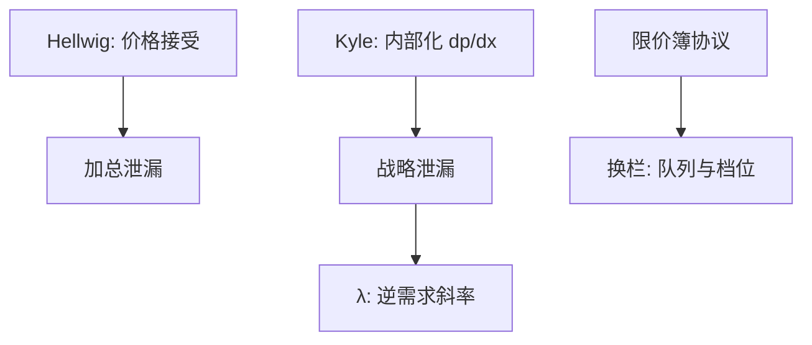

# Kyle 在均衡框架中的位置

知情者若能影响价格，他就不会把信号一次用尽；均衡价格冲击衡量的是战略泄漏，不是竞争性加总。

<footer>—— Kyle, Continuous Auctions and Insider Trading, Econometrica, 1985</footer>

[上一课](/econ/morris-shin-public-info)的人把价格与公告当参数，只在权重上战略。本课缺口是**市场力**：一个知情者选择需求量，$p$ 随他的单子动。Hellwig 的连续统在此失效。不重写限价簿几何，不把 $\lambda$ 写成盘口回归——协议在 [到限价簿](/econ/to-limit-order-book) 之后换栏。

## 问题

竞争性 REE：每人价格接受，信息经由加总泄漏。Kyle（1985）：一名风险中性知情者看见 $\theta$，噪声交易外生，做市商（或竞争型做市端）按订单流的条件期望定价。知情者预见到自己的单子进入总流，因而选择「用多少信号」。线性均衡里 $p=\mu+\lambda y$，$y$ 为总单，$\lambda$ 是价格冲击系数。知情者最优把泄漏摊开，使 $p$ 对 $\theta$ 的回归系数停在一半（静态批量）或沿时间均匀释放（连续拍卖）。

缺口是给这套对象定位：它是战略 REE，不是 Hellwig 的竞争版，也还不是簿上的价格优先。$\lambda$ 在本栏是逆需求斜率，在量化栏才会变成可估计的冲击。本课只保留均衡陈述。

Kyle, *Econometrica* 53(6), 1985。批量版本先钉 $\lambda$；连续时间版本说明泄漏可以是过程。做市端风险中性、有效定价，是为了把不利选择从存货里分开。

## 方法

对照三套均衡。Hellwig：价格接受、部分揭示来自供给噪声。GS：采集比例内生，仍是价格接受。Kyle：知情者人数少到必须内部化 $\partial p/\partial x$。噪声交易在此扮演与 $z$ 类似的角色——没有它，做市端从 $y$ 里完全读出 $\theta$，知情者不敢交易，市场关闭（与 GS 的精神同构，通道换成战略）。

线性猜测再次给出闭式。揭示深度由噪声交易方差与信号精度决定：噪声越多，$\lambda$ 越低，知情者交易越猛，价格里最终仍可有一块 $\theta$。这与「流动性越好、信息进入越快」是同一句话的两面，但流动性在本课是 $\lambda^{-1}$，不是买卖档位。

后课不对称信息与流动性，会把 $\lambda$ 读成不利选择溢价。本课先不要价差分解，也不要存货模型。

## 机制

机制是垄断信息的跨状态套利受到自己价格冲击的约束。多交易一单位，多赚 $\theta-p$，也把 $p$ 推向 $\theta$，吃掉剩余。均衡卡在边际租金等于边际冲击。连续统把冲击洗成零，知情者变回价格接受者，回到 Hellwig。因此 Kyle 不是「更真实的 Hellwig」，是另一端：$N=1$（或有限）对 $N=\infty$。

不要把噪声交易者写成行为金融的 DSSW：这里他们是外生需求，没有效用，只为了让做市端的推断有残差。行为课已经写过噪声交易者风险；本课借用噪声当残差不确定性。

多知情者、风险厌恶知情者、离散出价，会改 $\lambda$ 的公式，不改「战略泄漏」这一刀。Back、Holden–Subrahmanyam 是同一框架的延伸，本课不展开。

## 边界

量化栏会估计价格冲击、买卖价差、订单流毒性。本课禁止把那些回归表写进来，也禁止画簿。$\lambda$ 不是 tick 上的弹性。下一课把战略与竞争两头收成一句理论：不对称信息本身可以定义流动性成本，无需队列。

后课默认：Kyle 是有市场力的 REE；$\lambda$ 是战略逆需求；噪声交易防止市场关闭。竞争性部分揭示是 Hellwig，不是 Kyle 的极限口头禅能替代的——极限要看 $N$ 与噪声如何一起缩放。

## 小结

- 知情者内部化价格冲击时，泄漏是战略选择，不是竞争性加总。
- $\lambda$ 是本栏的逆需求，不是盘口回归。
- 与 GS 同构的是「无噪声则无交易」；通道不同。
- 出处：Kyle, *Econometrica* 1985；对照 Hellwig 1980。
