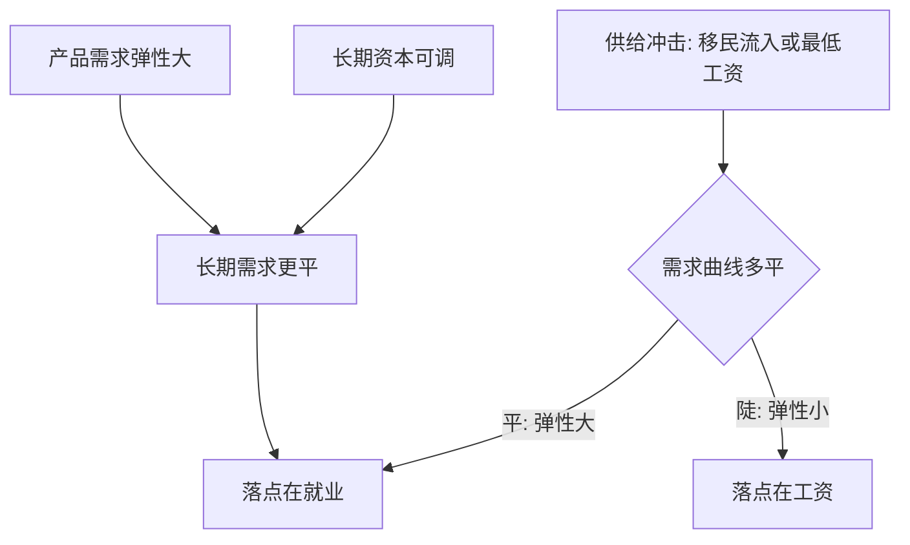

# 劳动需求与边际产出

企业要的不是人，是边际产出的价值；对劳动的需求是从产品需求派生出来的。

<footer>—— 据 Hicks, The Theory of Wages, 1932；Hamermesh, Labor Demand, 1993 整理</footer>

[上一课](/econ/labor-supply-elasticity)把供给侧的斜率钉成两个口径：参与弹性在边缘群体上大、壮年工时弹性小。但工资是价格，一边定了不算数——需求侧从哪来、多陡，决定同样的供给冲击落在工资还是就业上。本课讲劳动需求：边际产出价值怎么定雇佣量，短期与长期的弹性差在哪，以及 Hicks 的派生需求法则怎么把斜率拆成可读的几项。

## 问题

在[完全竞争](/econ/perfect-competition)的产品与要素市场里，利润最大化把雇佣量钉在一阶条件上：多雇一人的成本（工资）等于多雇一人带来的收益。生产函数 $F(K,L)$ 给边际产出，收益侧乘价格：

$$
\mathrm{MRP}_L = p\,F_L(K,L), \qquad p F_L = w .
$$

劳动需求曲线就是这条 MRP 上与均衡相容的一段。缺口不是「需求向下」这句废话，而是斜率：最低工资、移民流入、关税冲击，落点是工资还是就业，全取决于这条曲线有多平。

MRP（边际产值）翻译成大白话：多雇一个人能多卖多少货、折成多少钱。数字实例：$p=10$ 元、多雇一人多产 5 件，$\mathrm{MRP}_L=50$ 元；日工资 40 元就雇，日工资 60 元就不雇。企业沿着这条 50 元线随工资高低决定雇到哪，这就是「劳动需求是派生需求」的日常版。

### 短期与长期是两条曲线

短期资本固定 $K=\bar K$，边际报酬递减把 $\mathrm{MRP}_L$ 沿 $L$ 压下来，弹性只来自这一条通道。长期资本可调，工资下降引发两件事：用劳动替代资本（替代效应，大小由[替代弹性](/econ/elasticity-of-substitution) $\sigma$ 给出），以及成本下降扩大产出、反过来多雇人（规模效应）。

## 方法

短期：$\max_L\, pF(\bar K,L)-wL$，一阶条件 $pF_L=w$。长期用[条件要素需求](/econ/conditional-factor-demand)与[成本最小化](/econ/cost-minimization)的口径：先解成本函数 $C(w,r,y)$，再由产量定要素。长期自身工资弹性可拆成两项：

$$
\varepsilon_{LL} = -\big[(1-s_L)\,\sigma + s_L\,\eta\big],
$$

$s_L$ 是劳动份额，$\eta$ 是产品需求弹性。第一项是替代通道：劳动占比越小、要素越可替换，劳动被换掉的余地越大；第二项是规模通道：劳动占比越大，成本下降传导到产量与雇佣的力量越大。Marshall–Hicks 的派生需求法则都从这两项读出：产品需求弹性大、要素间替代容易、其他要素供给弹性大、劳动占比大，劳动需求就更有弹性。

数字实例：取 $s_L=0.7$、$\sigma=0.5$、$\eta=2$，长期弹性 $\varepsilon_{LL}=-[0.3\times0.5+0.7\times2]=-1.55$：工资降 10%，长期雇佣约增 15.5%。分解看，规模通道贡献 1.4、替代通道只贡献 0.15——不少行业里规模效应才是大头，别只盯着「机器换人」。

## 机制

短期与长期的差在资本通道：短期只能在既定资本下滑动，报酬递减很快把弹性吃掉；长期资本重新配置，替代与规模两条叠加。实证上长期弹性系统性大于短期（Hamermesh 1993 的汇总），法则给的是方向与分解，不是常数。斜率决定冲击落点：需求平（弹性大），最低工资或移民主要动就业；需求陡，主要动工资。同一机制往下走一级：替代不是「同质劳动对资本」——资本与例行任务替代、与抽象任务互补，技能维度的分化留给本单元后面的工资结构课。

常见误区：拿短期弹性去评估最低工资的十年影响。短期资本固定、只能沿 MRP 滑动，弹性小；长期资本重新配置，弹性系统性更大——Hamermesh 的汇总正是这个排序。口径用错，落点判断（工资还是就业）整个会反。

Marshall–Hicks 第四条常被写成「劳动占比越大，需求越有弹性」；它不是无条件成立，还取决于要素间替代弹性与其他要素供给弹性的相对大小，Hicks 原书给了反例条件。把它当公理用，是在小占比行业上算错政策落点的常见来源。

## 边界

MRP 定价要求产品市场完全竞争：垄断下换成边际收益产品，买方垄断下工资由边际支出曲线定、企业沿向上的供给线压价——买方垄断是本课程后面一课的主题，竞争口径的结论会局部失效。调整成本让「长期」很长：雇佣、培训、重组都有固定成本，短期弹性不该被拿来评估十年尺度的政策。最后别用横截面工资差直接读 $\mathrm{MRP}$：工资差里混着技能与工作属性，单一生产率口径读不平。

## 小结

- 竞争基准下劳动需求是 MRP 曲线：$pF_L=w$，需求是派生需求。
- 长期弹性由替代项 $(1-s_L)\sigma$ 与规模项 $s_L\eta$ 相加而成，系统性大于短期。
- Marshall–Hicks 法则是这两项的读法；第四条有条件。
- 弹性决定冲击落点：需求平则动就业，需求陡则动工资。
- 出处：Hicks, The Theory of Wages, 1932；Hamermesh, Labor Demand, 1993。
