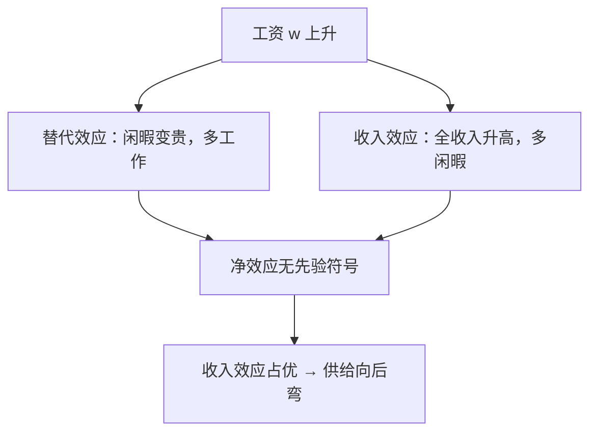

# 闲暇-消费选择与劳动供给

工资不是「工作的报酬」，而是闲暇的价格；劳动供给从时间禀赋的配置问题里长出来。

<footer>—— 据 Robbins, On the Elasticity of Demand for Income in Terms of Effort, Economica, 1930；Becker, A Theory of the Allocation of Time, RESTAT, 1965 整理</footer>

[上一课](/econ/dollar-swap-lines)把互换线收在开放宏观续末：互换线是美联储对同行的国际最后贷款人，浮动不取消美元批发依赖，储备是自我保险、互换是弹性的中央保险。那条线到此收束。本课是「劳动经济学」的第一课。整门课要回答的是劳动市场怎么定价、谁赚得多、价格没出清时人去哪。微观课的[劳动–闲暇](/econ/labor-leisure)已经把预算恒等式与[斯勒茨基分解](/econ/slutsky-equation)钉过；本课不再重推，而是把那个模型重新读成劳动供给本身，钉三件事：无差异曲线与预算约束怎么定工时、工资上涨的两条效应、向后弯的供给曲线从哪来。后课默认已经读完本课。

## 问题

时间买不来，只能分掉。每人有禀赋 $T$ 小时，分成劳动 $h$ 与闲暇 $\ell$，$h+\ell=T$；消费 $c$ 由工资 $w$ 与非劳动收入 $m$ 支付。缺口是：给定偏好与这套预算，劳动供给几个小时、什么条件下向上、什么条件下向回弯。不把这个决定问题立起来，下一课谈「供给弹性」就没有对象。

预算约束把闲暇定价：

$$
c = w(T-\ell) + m = wT + m - w\ell .
$$

右端 $wT+m$ 是全收入：把全部时间按工资折成钱。闲暇的价格正是 $w$——多歇一小时，放弃的是按 $w$ 计价的消费，而不是抽象的「工作机会」。

### 供给曲线是需求曲线的镜像

劳动供给 $h(w,m)=T-\ell(w,m)$ 不是另起的一套「工作理论」，而是闲暇需求的反面。微观课的结论直接搬来：闲暇是正常品还是低档品决定收入效应的方向，替代效应永远把人从闲暇推向劳动。两者相加没有先验符号——这是本课最重要的否定结论。

## 方法

几何上在 $(\ell,c)$ 平面画：预算线从禀赋点 $(T,\,wT+m)$ 向左下走，斜率 $-w$；无差异曲线凸向原点；切点定最优闲暇 $\ell^\ast$。工资上涨让预算线绕禀赋点变陡，总变化用斯勒茨基分解拆开。对闲暇（价格 $w$、带禀赋）有：

$$
\frac{\partial h}{\partial w} = -\frac{\partial \ell^H}{\partial w} \;-\; h\,\frac{\partial \ell}{\partial m}.
$$

替代项 $-\partial \ell^H/\partial w \gt 0$：补偿之后闲暇变贵，少歇多干。收入项 $-h\,\partial\ell/\partial m$ 在闲暇为正常品时为负：全收入升高，买回闲暇。净效应取决于两条的相对大小。

## 机制

收入效应压过替代效应时，$\partial h/\partial w \lt 0$：工资越高反而干得越少，供给曲线在高工资段向后弯。这不是悖论，与吉芬品同构——闲暇是正常品，而且在「消费篮子」里占比极大：每人每天只有有限小时，闲暇几乎是最大的消费品。历史形态与此一致：实际工资长期上涨伴着周工时长期下降。反过来，工资在低位时收入效应弱（全收入的基数小）、替代效应主导，曲线前段向上。一条完整的个人供给曲线因此先是上倾、后段回弯。

全收入口径里，不工作的人也在「花」自己的时间：禀赋点把 $T$ 小时按 $w$ 折成钱，闲暇是买回自己。角点 $\ell=T$（完全不工作）上不存在切点——参与与否比较的是保留工资与市场工资，这正是下一课的门。

## 边界

本课只处理内点的连续选择：假设每小时都可调。现实有制度工时（八小时、全职与兼职）、固定工作成本（通勤、执照），参与决策因此是离散的——下一课的参与边际。模型里也没有税收：所得税楔在 $w$ 与净工资之间，替代与收入效应都要在净价上重算，[所得税与激励](/econ/income-tax-incentives)是那边的口径。更不要把「勤奋」当性格变量塞进偏好：模型里人只偏好消费与闲暇的组合，跨人差异落在无差异曲线的形状上，那正是下一课要估的异质性。

## 小结

- 劳动供给是闲暇需求的镜像：$h=T-\ell$，闲暇的价格是工资。
- 替代效应推劳动上升，收入效应（闲暇正常时）拉回；净效应没有先验符号。
- 向后弯不是悖论，是收入效应占优，与吉芬品同构。
- 本课只处理内点连续选择；参与、税收与工时约束是下一课的缺口。
- 出处：Robbins 1930；Becker 1965；微观课劳动–闲暇与斯勒茨基分解的先行处理。
