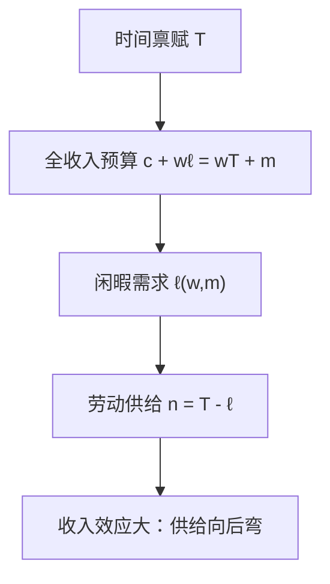

# 劳动–闲暇

把闲暇当成一种商品，工资就是它的价格。劳动供给是时间禀赋减去闲暇需求。

<footer>—— 据 Varian, Microeconomic Analysis 中劳动供给的处理整理</footer>

[上一课](/econ/gorman-polar)（Gorman 加总）。把确定消费上的闭环收束：从 $x$ 可以走回 $u$，GARP 与 $S$ 对称是两条路。本课不重写 Afriat，也不再积斯勒茨基矩阵。缺口是：同一套消费者理论还没把时间算进去。把闲暇当商品，工资是闲暇的价格，劳动供给才是马歇尔需求的一支，而不是另起的「工作经济学」。

## 问题

确定消费的 $x\in\mathbb{R}_+^n$ 没有小时。人却在劳动与闲暇之间选：时间禀赋 $T$，闲暇 $\ell$，劳动 $n=T-\ell$，消费 $c$ 由工资 $w$ 与非劳动收入 $m$ 支付。若仍把劳动当原始「坏东西」另写一套公理，与上一课恢复出来的偏好接不上。缺口是改商品空间，不改理性。

取两商品 $(c,\ell)$，预算

$$
c+w\ell=wT+m.
$$

右端是全收入：把全部时间按工资折成钱，再加非劳动收入。闲暇的价格是 $w$，消费的价格归一。马歇尔闲暇需求 $\ell(w,m)$；劳动供给 $n(w,m)=T-\ell(w,m)$。局部非饱和仍迫使花光全收入。可积性上一课已经保证：若这套需求来自偏好，斯勒茨基在 $(c,\ell)$ 上对称、负半定。

### 工资涨有两件事，与吉芬同一分解

$w$ 升，闲暇相对变贵（替代：少歇、多干），全收入也升（收入：若闲暇正常，多歇、少干）。劳动供给的工资弹性没有先验符号。向后弯的供给曲线是收入效应压过替代效应，不是悖论。

非劳动收入 $m$ 才是闲暇的「财富」。工资同时出现在价格与全收入里，比较静态必须拆开，不能只看 $dn/dw$ 的毛号。

## 方法

把上一课的装置原样搬来。间接效用 $v(w,m)$（价格向量 $(1,w)$，财富 $wT+m$）。Roy 读出 $\ell$ 与 $c$。希克斯闲暇钉住效用，替代效应 $\partial h_\ell/\partial w\le 0$。劳动的替代效应因此非负：补偿过的劳动供给向上。毛效应 $dn/dw$ 仍可负——闲暇劣等极少见，向后弯通常来自闲暇正常且收入项够大。

角点：$n=0$ 是闲暇 $\ell=T$，保留工资高于意愿才进市场。Kuhn–Tucker 与[内点与角点](/econ/interior-corner)同一套：不参与劳动当互补松弛，不是另定义「失业」。本课不把宏观失业理论塞进来。

显示偏好同样适用：观测 $(w^t,m^t,c^t,\ell^t)$ 可以跑 GARP。失败可能是跨期、家庭加总，不一定是「人不理性」——上一课边界已经警告对象切错。

## 机制

劳动供给是闲暇需求的镜像。需求定律管闲暇的补偿项；劳动的「向上倾斜」只在替代压过收入时成立。这与吉芬对称：那里劣等品的马歇尔需求可以向上，这里正常闲暇的马歇尔劳动供给可以向下。两边都是斯勒茨基收入项在翻号，不是偏好坏了。

课税、转移支付改的是 $w$ 与 $m$ 的组合。工资税压低净工资，替代鼓励歇着；若同时用一次总付补回全收入，只剩替代，劳动供给上升。这就是为什么补偿劳动供给弹性进入最优税收，而不是毛弹性。本课只开这个口，不写公共财政。

家庭生产、家务、第二种工资，把 $\ell$ 再切开。本课停在一种闲暇、一种市场劳动，对象仍是两商品消费者。

## 边界

时间不可分、加班约束、制度工时，都会把 $\ell$ 变成离散或有上限。向后弯在个体层可能出现，市场加总后常被参与率的扩展边际盖住。本栏主干仍用连续 $(c,\ell)$，因为要接上已有的 $x(p,w)$。

也不要把本课读成宏观劳动市场出清。这里没有企业劳动需求、没有失业存量；工资是参数，与马歇尔需求里的 $p$ 同一地位。风险、跨期储蓄若塞进同一个静态 $(c,\ell)$，可积失败只说明对象切错。下一课序的彩票与欧拉方程另起。

后课默认：劳动供给是闲暇的马歇尔需求镜像；工资是闲暇价格；向后弯是收入效应，不是新公理。

## 小结

- 闲暇是商品，工资是它的价格；劳动是 $T-\ell$。
- 预算用全收入写；瓦尔拉斯定律仍是花光。
- 补偿劳动供给向上；毛供给可向后弯。
- 参与是闲暇角点，同一套 Kuhn–Tucker。
- 出处：Varian, *Microeconomic Analysis* 的劳动供给章节。
