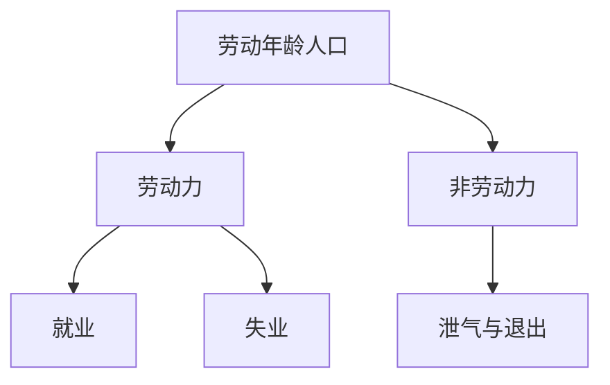

# 劳动参与

失业率的分母是劳动力，不是劳动年龄人口；退出者不进分子，于是「失业下降」可以只是有人不再被算作在找工作。

<footer>—— 据劳动力调查的国际定义（ILO / 各国劳工统计）；对照上一课 Okun 对 $u$ 的使用</footer>

[上一课](/econ/okun-law)用调查失业率把产出缺口接到 $u-u^*$，并预告泄气工人会使 Okun 用 $u$ 低估松弛。本课的缺口不是再估 $\beta$，而是：劳动力统计如何定义就业、失业与**非劳动力**，以及参与率变动如何让 $u$ 与就业人口比分叉。索洛下一课默认充分就业路径上的 $L$，必须知道这个 $L$ 不是「所有成年人」。

## 问题

Okun 与自然率都把 $u$ 当松弛的主度量。$u$ 的分母是劳动力：就业者加失业者。失业者必须没有工作、当前可工作、并在找工作（各国细则略异）。退出寻找的人不进分子也不进分母，于是劳动力缩小、$u$ 可以下降，而就业人数不变。缺口是把这套定义写成账户，而不是重讲 $u^*$ 是否加速通胀。

劳动参与率是劳动力占劳动年龄（或工作年龄）人口之比。就业人口比是就业占同一人口之比。衰退中参与率下降时，就业人口比往往比 $u$ 更老实。本课钉定义；不把人口老化、女性参与的长期趋势写成周期模型。

「泄气工人」：因找不到工作而停止寻找，统计上离开劳动力。复苏时他们回来，劳动力扩张，$u$ 可以暂时升——看起来像恶化，其实是参与修复。

## 方法

记劳动年龄人口为 $N$，就业 $E$，失业 $U$，劳动力 $LF=E+U$。则

$$
u=\frac{U}{LF},\qquad \mathrm{lfpr}=\frac{LF}{N},\qquad \mathrm{epr}=\frac{E}{N}.
$$

恒等联系：$\mathrm{epr}=(1-u)\cdot\mathrm{lfpr}$。因此 $u$ 下降而 $\mathrm{lfpr}$ 下降时，$\mathrm{epr}$ 不必上升。上一课的 $\tilde{u}$ 只覆盖仍在劳动力里的松弛；广泛度量还要看未充分就业、边际附着（想工作但未达失业定义的人）。

自然率 $u^*$ 是劳动力内部的概念；参与率可以另有一个「正常」水平，随人口结构慢变。把周期中的参与下降全部写进 $u^*$ 上升，会把退出当成结构失业。反向把一切参与变动写成周期，又会把老龄化当成需求缺口。

### 定义先于故事

兼职非自愿、临时解雇是否算就业或失业，各国不同。本课不调和所有问卷，只要求：引用 $u$ 时声明调查口径，并同时看参与与就业人口比。Okun 的 $\beta$ 在参与强周期的样本里会漂，这是测量，不是自然率假说本身垮了。

## 机制

厂商砍招聘时，部分寻职者停止寻找，$U$ 与 $LF$ 同时变，$u$ 的变动小于就业的变动。于是产出已经收缩，$u$ 的上升不够大，Okun 用 $u$ 会低估缺口——除非潜在产出或 $\beta$ 跟着改。相反，参与率趋势性上升（如女性进入劳动力市场）会在给定就业创造下抬高 $u$ 或压低工资，那是供给，不是 Okun 斜率的周期故事。

充分就业路径上的 $L$，索洛写成外生增长的劳动力。更准确的说法是：在自然参与与 $u^*$ 上使用的劳动投入。本课不把 $n$ 改写成内生生育，只禁止把调查 $u=0$ 或「人人就业」当成索洛的 $L$。工时是另一层：就业人数不变、平均工时下降，劳动投入已经松弛，$u$ 可以不动。宏观主干仍常报失业率，是因为菲利普斯样本与政策讨论用它；分析松弛时要把工时与参与并列。

U-3 / U-6 一类更广的松弛指标把泄气与非自愿兼职算进去。宏观主干仍常报 U-3，因为历史长、与菲利普斯样本一致；分析周期时不要只看这一个数。

## 边界

参与率不是福利：退出可以是就学、退休、照料，不必是泄气。本课不估计劳动供给弹性，不把家庭内部分工写成宏观主干。也不要把劳动力调查写成限价簿上的订单流。长期参与趋势留给发展与人口，不在本课用周期滤波抹掉。

后课默认：松弛至少看 $u$、参与率与就业人口比；$L$ 是自然参与下的劳动投入。下一课在这条充分就业路径上引入资本积累：索洛模型。人口结构（老龄化）移动参与趋势，那是慢变量，不要用周期滤波当成 $\tilde{u}$。工时与就业人数在衰退中往往先后变动，账户上要分开看。

广泛度量（泄气、非自愿兼职）与 U-3 并列读，不在本课另建一套自然率。

## 小结

- $u$ 的分母是劳动力；退出者不进失业分子。
- 参与率下降可以使 $u$「改善」而就业人口比不升。
- $\mathrm{epr}=(1-u)\cdot\mathrm{lfpr}$，三个比率必须一起读。
- Okun 用 $u$ 会漏掉退出造成的松弛。
- 索洛的 $L$ 默认自然参与与 $u^*$，不是全部人口。
- 出处：劳动力调查的就业/失业/非劳动力定义；Okun 关系在本课只作对照。
