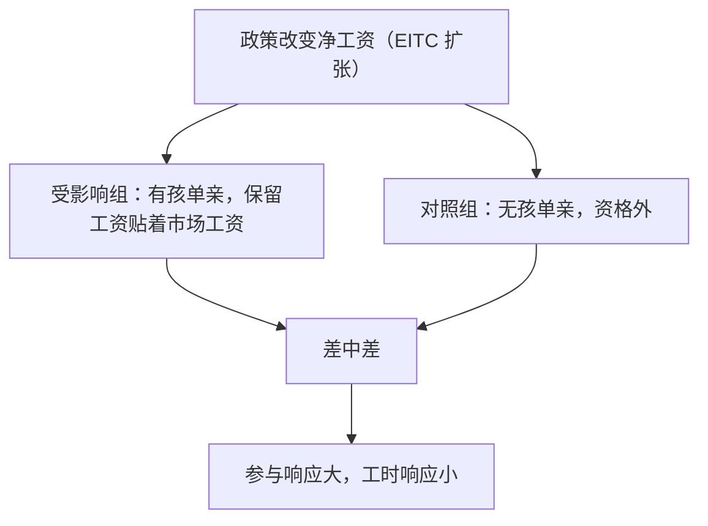
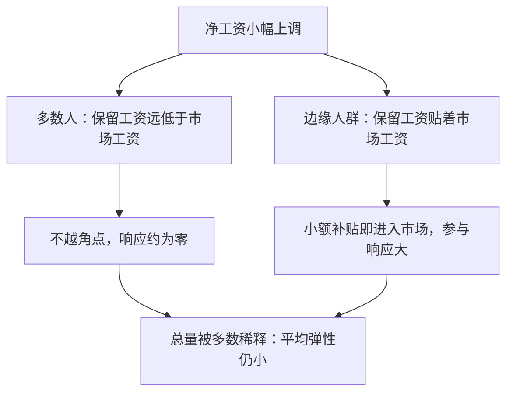

# 劳动供给弹性的估计

总量的弹性小，不等于每个人的弹性小；落在参与边缘上的那群人，响应的是整个政策。

<footer>—— 据 Killingsworth and Heckman, Female Labor Supply: A Survey, Handbook of Labor Economics, 1986；Keane and Rogerson, Micro and Macro Labor Supply Elasticities, JEL, 2012 整理</footer>

[上一课](/econ/labor-leisure-choice)把劳动供给立成闲暇-消费选择的解：全收入预算线、替代与收入两效应、以及收入效应占优时向后弯的曲线。它留下的是定量缺口：曲线的斜率到底多大——「占优」是定性词，税收与政策评估要数字。本课讲弹性怎么估：参与边际与工时边际必须分开，EITC 这类自然实验怎么识别，以及为什么总量弹性小、边缘群体的弹性大。

## 问题

「劳动供给弹性」不是一个数。上一课的模型至少有两个边际：内点的工时（多一小时、少一小时）与角点的参与（进不进市场）。角点上预算线与无差异曲线不相切，工时弹性对不参与者根本没有定义；混在一起估，得到的是两组行为被平均出来的数。政策却分别落在两个边际上：所得税改工时，EITC 这类补贴主要改参与——[所得税与激励](/econ/income-tax-incentives)要的参数与就业政策要的参数不是同一个。

术语翻译：弹性就是「自变量每变 $1\%$，响应变量变百分之几」。净工资涨 $1\%$、工时多 $0.2\%$，弹性就是 $0.2$；若净工资涨 $1\%$、就业参与率多 $2\%$，参与弹性就是 $2$——同一个政策，两个边际各有一个数，混起来报只会制造混乱。

### 混杂：工资与偏好不正交

天真做法是横截面回归 $\ln h = a + \varepsilon \ln w + \cdots$。但工资与偏好相关：本就爱工作的人会去积累技能、进高薪行业，OLS 把偏好看成工资效应，弹性被系统性估错。识别必须找外生的净工资变动。

## 方法

自然实验：找一个只对部分人群改变净工资的政策，用[双重差分](/econ/difference-in-differences)比较受影响组与不受影响组。教科书案例是所得税抵免（EITC）：抵免按收入三段走——起步段补贴（净工资抬高）、平台段、退出段征回（净工资被砍）。Eissa–Liebman 1996 用 1986 年的扩张：有孩单亲母亲受惠、无孩单亲几乎不受影响。差中差的结果：就业率上升集中在参与边际，已就业者的工时几乎没动——响应在角点，不在内点。

## 机制

为什么总量小、边缘大。第一，异质性：壮年男性的保留工资离市场工资很远（无论如何都工作），政策再怎么动都不越角点；单亲母亲的保留工资贴着市场工资，小额补贴就把她推进市场。响应集中在保留工资分布的尖峰附近，总量被远离边缘的大多数稀释。第二，口径：文献里壮年男性工时的非补偿弹性常估在 0.1 上下甚至更小，而政策敏感群体（单亲、老年、青少年）的参与弹性高出几倍——Killingsworth–Heckman 对女性供给的综述正是把这个差写成主要事实。第三，宏观口径不同：跨期的 Frisch 弹性度量「暂时性工资变动」的响应，可以远大于长期静态口径；Keane–Rogerson 2012 把三种口径分开后，微观小弹性与宏观校准的表观冲突大部分消解。

EITC 不是单向「补贴工作」：起步段压低净税负，退出段的征回把边际税率抬高一大截。同一项扩张同时提高参与、又给已就业者上调工时的负激励——把它当成单纯奖励工作会算错方向。

术语翻译：Frisch 弹性度量的是「暂时性」工资变动的响应——今天时薪翻倍、明天恢复原样，你愿不愿意今晚多加班。永久性涨薪则同时启动收入效应（更有钱了想多休闲），响应可能反而更小。宏观模型校准用的常是前者，微观调查估的常是后者，口径对不上就会得出「矛盾」。

数字实例（异质性如何稀释平均）：设 100 人里 90 人保留工资远低于市场工资，政策补贴对他们的参与响应为零；10 个边缘母亲的参与弹性为 $2$。平均弹性是 $(90\times 0 + 10\times 2)/100 = 0.2$——看起来「人人都不敏感」，其实杠杆全压在边缘那 $10\%$ 身上。

## 边界

外推有限：EITC 识别的是单亲母亲这个边缘群体的参与弹性，不能直接搬去算全民税改的工时效应；结构模型可以外推，但要付函数形式与偏好分布的假设。也别把参与弹性当福利参数：响应大说明政策有杠杆，不说明扭曲小——参与的变化带来剩余还是耗散，要看工资与边际产出之间的楔子。最后，估计对象是净工资：名义补贴要换算成边际税率口径再进模型，混淆两者是二手引用里最常见的错。

数字实例（名义补贴 vs 边际税率）：EITC 退出段每多挣 1 美元，补贴约减少 21 美分，等于在所得税之外凭空叠加 21 个百分点的边际税率。只记「拿到 2000 美元补贴」而不换算税率口径，预测工时响应会朝错误的方向——对这一段的人，多干一小时反而更亏。

## 小结

- 「劳动供给弹性」至少两个口径：参与（广延边际）与工时（集约边际），不可混估。
- 工资与偏好相关，横截面回归无效；自然实验加差中差是标准识别。
- EITC 证据：参与响应大，内点工时几乎不动——响应在角点。
- 总量弹性小、边缘群体弹性大：保留工资异质性稀释了平均。
- 出处：Eissa and Liebman, QJE 1996；Killingsworth and Heckman 1986；Keane and Rogerson, JEL 2012。
