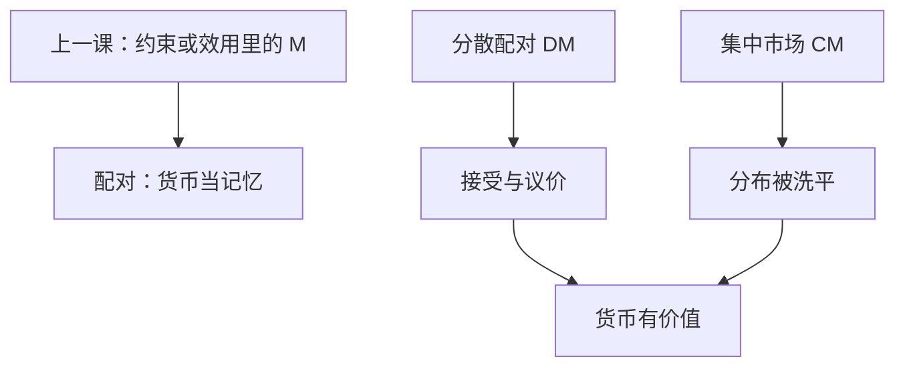

# Lagos–Wright 新货币主义

货币有价值，是因为分散配对里缺少记录与信用；把集中市场定期打开，只是为了让模型能算，不是又把货币塞进效用。

<footer>—— Lagos and Wright, A Unified Framework for Monetary Theory and Policy Analysis, JPE 2005</footer>

[上一课](/econ/cia-miu)用现金先行或货币入效用，让家庭愿意持有不生息的 $M$，并声明搜寻匹配是第三条微观。本课的缺口是把第三条写完：在匿名、配对、缺乏公开记录的交易里，货币作为记忆的替代成为必要。Lagos–Wright（2005）用集中市场（CM）与分散市场（DM）交替，使分布可处理。数量方程下一课才把 $P$ 接到 $y$；本课只换装置。

## 问题

CIA 把「必须先有现金」写进约束，MIU 把 $m$ 写进 $u$。二者都能给出货币需求，但货币为何被接受，仍是假设。Kiyotaki–Wright 一类搜寻已经说明：没有记录时，物物交换的需求双重巧合失败，货币可以作为媒介。缺口是：如何在保留配对摩擦的同时，得到可分析的分布与政策比较。LW 的回答：夜间 CM 里瓦尔拉斯出清、准线性偏好把货币分布重新洗平；日间 DM 里随机配对、议价，货币转手。

「新货币主义」在此指 Lagos–Wright 及其后的配对货币模型，不是货币主义数量论的口号。数量论的会计下一课再写。

## 方法

一期分两个子市场。DM：买卖双方配对，可能用货币交换货物，条件是对方接受；议价决定数量与价格（或条款）。CM：劳动、货物与货币一次性出清，清偿 DM 留下的余额。准线性使 CM 里货币需求与财富线性，次日进入 DM 的人持币量相同——这是技术，为了避开无限维分布。货币均衡：若预期他人接受，自己也持有并接受；预期崩溃则回到物物或自给。

最优持币仍对名义利率敏感：通胀税侵蚀 DM 里的购买力，类似 CIA 的扭曲，但来自配对条款而不是 Clower 不等式。Friedman 规则在许多 LW 校准里仍指向 $i=0$，因为持币的社会成本接近零。本课不宣布最优通胀的点估计。

### 不是把 MIU 换记号

$u(c,m)$ 里 $m$ 的服务是被假定的。LW 的服务来自 DM 里否则无法成交的交易。把 LW 的 CM 效用写成 $u(c)+v(m)$ 再当 MIU 用，会把配对摩擦洗掉。装置声明必须保留 DM。

### 接受是均衡，不是法定

法币被接受，因为别人预期它能在 CM 或下一次 DM 换到货。若预期崩溃，法定支付能力也救不回配对成交——除非惩罚足够硬，那已是另一套强制。

本课保持自愿接受的货币均衡，以便通胀税仍通过条款起作用，而不是通过法律条文。

## 机制

匿名配对切断信用：对方下次不一定遇见你，公开记录又不存在，于是需要可携带的代币。接受是策略：人人预期货币可换到 CM 或下一次 DM 的货，代币就有正价格。通胀提高持币成本，DM 成交量下降——货币不是面纱，通道是配对条件而不是 Sidrauski 的超中性特例。内部货币（银行债务）可以部分替代代币，一旦记录改善；本课保持外生法币，以免提前写成中介。

CIA 的硬约束给出速度上限；LW 的速度来自配对频率与议价条款，通胀通过条款变松，而不是 Clower 不等式突然不绑定。MIU 的 $u_m$ 在 LW 里被 DM 的边际成交量替代：持币的私人收益是多成交或更好条款。把三种装置校准到同一货币需求弹性之后，超中性与福利仍可分叉——装置选择不是无害记号，上一课已经对 CIA/MIU 说过，配对是同一警告的第三条。

开放配对与外汇是另一层。CIP 作为市场层无套利，实证在[量化栏](/quant/irp)，不在本课的 DM 议价里估基差。

CM 的准线性是为了可解，不是声称夜间真的有完美保险。放松它，持币分布进入状态，政策比较立刻变重。

## 边界

本课不校准配对概率，不把 LW 写成支付系统工程。CIA/MIU 在宏观主干里仍常用，因为三方程要的是货币需求弹性，不是配对。后课数量论把 $MV=Py$ 当会计与长期中性；LW 提供「$M$ 为何在 $V$ 里出现」的微观之一。也不要把搜寻劳动（DMP）与搜寻货币焊成同一个匹配函数——对象不同。

信贷记录一旦变好，DM 可以用债务替代代币，货币必要性下降——这是内部货币与中介课的接头，本课故意关掉。把电子支付写成「因此 LW 过时」，忽略了匿名与缺乏承诺仍在的角落。装置要声明记录技术，不能用支付 App 的界面替代配对摩擦。

后课默认：需要货币微观时，除约束与效用外，可以声明配对接受。下一课：无论哪一种微观，长期 $P$ 与 $M$ 如何对齐。

## 小结

- CIA/MIU 假定持币理由；LW 从匿名配对推出货币必要。
- DM 成交、CM 洗分布，是为了可分析，不是把 $m$ 塞回效用。
- 通胀税扭曲 DM 条款；接受是均衡策略。
- CIP 实证不在配对议价里，见 `/quant/irp`。
- 出处：Lagos and Wright, *JPE* 2005；Kiyotaki–Wright 搜寻货币为先声。
