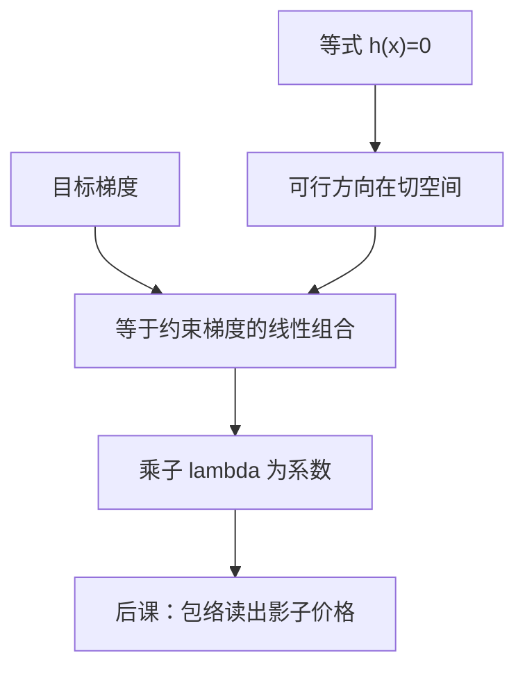

# 拉格朗日乘子

等式约束把可行方向压进切空间；乘子是目标梯度在约束法向的那一笔，使无约束一阶条件在增广函数上恢复。

<footer>—— 据 Mas-Colell, Whinston and Green 数学附录；Boyd and Vandenberghe, Convex Optimization, 第 5 章整理</footer>

上一课[无约束一阶与二阶条件](/econ/unconstrained-fonc)在开集内令梯度为零。消费者花光预算、厂商的生产函数写成等式时，可行域是超曲面，沿约束法向走会立刻不可行。缺口不是再写 $\nabla f=0$，而是：只对切空间里的方向要求一阶为零，法向差额用乘子吸收。不等式与互补松弛留给下一课 KKT。

## 问题

$\max_x f(x)$ s.t. $h(x)=0$，其中 $h:U\to\mathbb{R}^k$，$k\le n$。正则条件（约束梯度 $\nabla h_j(x^*)$ 线性无关，LICQ）下，存在 $\lambda\in\mathbb{R}^k$ 使
$\nabla f(x^*)=\sum_j\lambda_j\nabla h_j(x^*)$，
即 $\nabla_x\mathcal{L}(x^*,\lambda)=0$，其中 $\mathcal{L}(x,\lambda)=f(x)-\lambda\cdot h(x)$（最小化时常写 $f+\lambda\cdot h$，符号约定要前后一致）。连同 $h(x^*)=0$，共 $n+k$ 个方程。

预算等式 $p\cdot x=w$ 是 $k=1$ 的仿射特例。$\nabla u(x^*)=\lambda p$ 就是「边际替代率等于价格比」：乘子 $\lambda$ 是收入的影子价值。后课[预算集与马歇尔需求](/econ/marshallian-demand)在局部非饱和下把不等式预算收成等式，用的正是这一课。本课不引入偏好公理，只把等式约束的一阶条件写清楚。

### 乘子不是目标的权重

$\lambda$ 不是「约束有多重要」的主观权重，而是一阶匹配的系数：它让目标梯度落在约束梯度张成的空间里。变一个单位约束（预算松一元），最优值变 $\lambda$——这是[包络定理](/econ/envelope-theorem)的话，本课只先承认 $\lambda$ 会出现在 $\partial\mathcal{L}/\partial w$ 里。把 $\lambda$ 理解成「随便乘的数」会丢掉影子价格。

LICQ 失败时乘子可以不存在或成一个仿射空间（如冗余约束）。经济学里线性预算在 $p\neq 0$ 时 LICQ 自动成立。

## 方法

构造 $\mathcal{L}$，对 $x$ 与 $\lambda$ 同时求驻点：$\nabla_x\mathcal{L}=0$ 是一阶，$\nabla_\lambda\mathcal{L}=-h=0$ 把约束装回。二阶条件在切空间上：对一切满足 $Dh(x^*)v=0$ 的 $v\neq 0$，$v^\top\nabla_{xx}^2\mathcal{L}\,v$ 取负（极大）。不是对所有 $v$ 要求 Hessian 负定——沿法向的弯曲被约束禁掉了。

仿射约束加凹目标：一阶充分且全局。这是标准消费者问题最常用的一包假设。非线性等式 $h$ 可能切出非凸可行集，一阶可以指向鞍点；那时 Lagrange 只是必要，不是充分。上一课上境图已经警告过：非线性等式毁掉凸。

## 机制

在约束曲面上，允许的无穷小位移 $v$ 满足 $Dh(x^*)v=0$。最优要求 $\nabla f\cdot v=0$ 对一切这样的 $v$，故 $\nabla f$ 正交于切空间，即落在法空间里——法空间由 $\nabla h_j$ 张成。乘子就是这组坐标。

几何上这仍是分离：上优集与可行超曲面在切点分开，法向量分解成「目标的」与「约束的」。预算问题里两者共线，比例即 $\lambda$。多种商品、一个预算，所以只有一个 $\lambda$；多种资源约束就有一串乘子，后课规划问题、成本最小化会用到。

$\lambda$ 的符号取决于约束怎么写。$h=p\cdot x-w$ 与 $h=w-p\cdot x$ 差一个负号。读论文先看约束方向，再读「乘子为正」。

## 边界

本课不管不等式：$x\ge 0$、产能上限、参与约束都是下一课。也不把 Lagrange 写成数值求解算法（增广 Lagrange、SQP）；主干要的是一阶刻画。不要在这里展开效用存在性：$\nabla u=\lambda p$ 假定已经有可微的 $u$，那是微观主干后课。下一课把 $\ge$ 加进来，乘子变为 KKT 乘子并带互补松弛。

后课默认：等式约束内部解写成 $\nabla_x\mathcal{L}=0$ 加上约束本身；线性预算下 $\lambda$ 是收入的边际价值候选。

## 小结

- 等式约束的一阶条件：目标梯度是约束梯度的线性组合。
- 乘子是法空间坐标，也是影子价格的候选。
- 二阶只在切空间上定号；仿射约束加凹目标则一阶全局充分。
- LICQ 保证乘子存在；线性预算通常自动满足。
- 下一课：[KKT 条件](/econ/kkt-conditions)。
- 出处：MWG 数学附录；Boyd and Vandenberghe 第 5 章。
