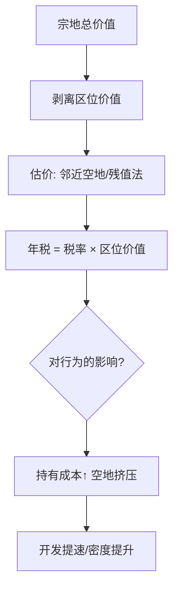
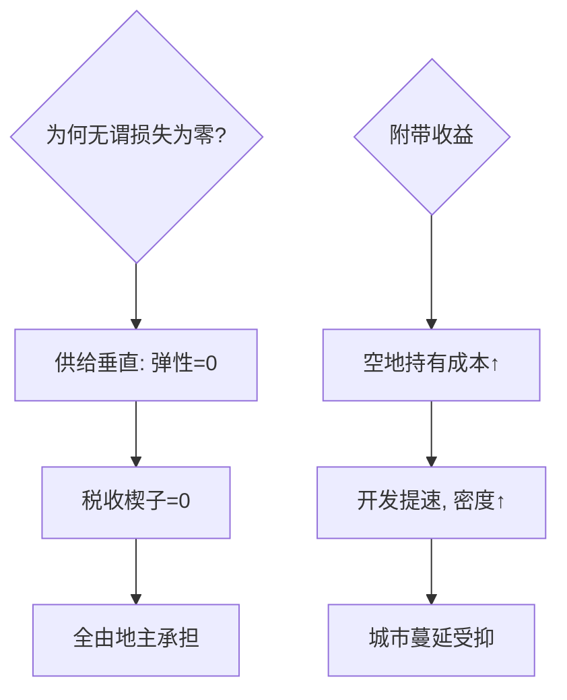

# land-value-tax

土地摆在那里不多不少：对它的纯地租征税，供给曲线一根竖线，超额负担为零——税收理论里少见的免费午餐。

<footer>—— 据 George《Progress and Poverty》(1879)；Vickrey 对土地税的现代辩护</footer>

[Tiebout 用脚投票](/econ/tiebout-sorting)说居民对「税收-服务包」敏感，对什么税不敏感？对**纯土地价值税**（LVT）：地不能搬家、不能增产。缺口是讲清为何土地税在超额负担意义上近乎完美，以及它为何仍难落地。本课不涉土地财政的制度史。

## 问题

一般税都扭曲行为：劳动税抑制工作、资本税赶走投资。李嘉图租金的特殊性——供给完全无弹性——使对地租征税不改变任何边际决策。问题拆解：纯地租怎么从「土地价格」里剥离？改良部分（建筑）怎么办？谁在承担？

术语翻译：纯地租（pure rent）= 土地在最优用途上的回报超出其次优用途的部分；location value（区位价值）= 不依赖土地上任何建筑的那部分地价，LVT 只对它征。

数字实例：评估地价 100 万（区位价值）+ 建筑 300 万。1% LVT 只对前者征，年税 1 万。同一块地盖仓库还是盖楼，税单不变——改良不被惩罚。对照：对 400 万征 1% 财产税，等于对建筑收了 3 万「惩罚改良税」。

## 方法

操作三步：**估价**——用周边空地成交价或残值法（总价减建筑重置成本折旧）分出区位价值；**课税**——按区位价值年征固定比率；**过渡**——存量业主的财富缩水需要 grandfathering 或分期。技术上全靠评估系统，这也是为什么丹麦、爱沙尼亚、宾州诸城能局部做，而全国推广卡在评估政治。

直觉类比：土地像剧院里固定的座位——座位票钱涨跌都不改变座位数量，对座位收「占座费」不会让座位消失，只会让占着不坐的人让出来；对「座位上搭的台子」（建筑）收费才会让人少搭台子。

## 机制

零超额负担的证明一笔带过：税收楔子 $=$ 供给弹性乘需求反应，供给弹性为零则楔子为零——税完全落在地主（按收税时点持有土地的人）头上，租户与开发者不受影响。第二重效率收益：持有空地等待升值的策略被持有成本打断，土地被迫流向出价最高的用途，城市密度提高、蔓延受抑。第三重：LVT 不资本化进未来税负——税基是**年流量**而非存量，未来加税不会预先砸房价，这与财产税的「自我资本化陷阱」相反。

常见误区：把 LVT 与财产税混同——财产税对建筑征的部分就是资本税，会减少住房供给；另一误区是「LVT 会推高房价」：税负落在地主身上使土地价格**下降**约税流的现值，自住购房者反而受益。

## 边界

难点全在执行端：区位价值剥离的评估误差、农地与生态地的估值、流动性差的市场的过渡公平。政治经济学的死结：税负集中在持有大量土地者身上，而他们是天然的否决联盟。适用性分级：城市核心区最佳（区位价值占比高），农区与资源区要特殊处理（宅基地与矿权另算）。与现代城市财政的接口：LVT 提供「不扭曲的增长融资」，与 [Tiebout](/econ/tiebout-sorting) 的辖区竞争互补——竞争压税率的压力对 LVT 较弱，因为税基搬不走。

直觉类比：征 LVT 像收「风水费」——地段风水是政府修路、建地铁、规划学区带来的，把风水增值的一部分收回来补贴财政，既不惩罚盖楼也不惩罚勤劳，只回收「位置红利」。

## 小结

- 供给零弹性 ⇒ 超额负担为零，税负全部落在征税时点的地主。
- 只对区位价值征、不对改良征，是 LVT 与财产税的分界线。
- 持有成本粉碎囤地策略，密度与产出双升。
- 出处：George《Progress and Poverty》1879；Vickrey「The Urban Crisis」演讲集；Oates–Schwab 1997。
