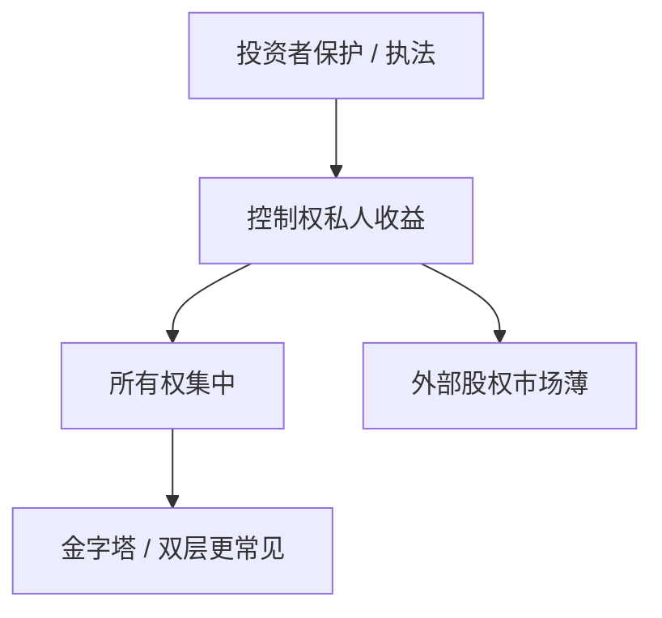

# 法与金融 LLSV

    
法律如何保护外部投资者，决定股权为何能分散、市场为何能长成；法系与执法把控制权私人收益的边界写成国别差异。

    <footer>—— La Porta, Lopez-de-Silanes, Shleifer and Vishny, Law and Finance, Journal of Political Economy 1998</footer>

[上一课](/econ/dual-class-shares)的楔子在投资者保护弱时更值钱。本课缺口是 LLSV（1998）：公司法、证券法与执法质量解释金融发展与所有权集中，而不是把治理写成企业自己选的合同那么简单。不重写双层代数，不把制度课做成经济增长综述——只接到公司金融的外部融资。

## 问题

MM 与优序假设存在一个能执行合同的市场。外部股东若怕被掏空，只愿付低价，股权柠檬更重，企业更依赖内部资金与银行，所有权更集中——因为只有大股东能自我保护。LLSV 用法系（普通法 vs 法国民法传统等）与股东/债权人权利指数做截面。缺口是：治理进阶必须把「合同环境」当作参数，否则双层、金字塔、董事会独立性在各国不是同一物品。

批评：法系内生于更早的政治与移植，指数测量误差，回归不是结构。本课取机制：保护弱 → 私人收益高 → 外部股权贵 → 集中所有权。量化识别在最后一课。

## 方法

股东权利：一股一权、抗董事、强制披露、集体诉讼。债权人权利：重整中谁控制、能否抓抵押。执法：司法效率使条款与第 11 章式规则从纸面变成 $V_B$。比较：保护弱的经济体，Leland 的税盾仍在，但外部股权 $r_E$ 含治理溢价，WACC 与 IPO 折价都变。银行关系更重要，公开债市场更薄——接上银行 vs 公开债。

与宏观课序的制度与增长：本课不重写 Acemoglu，只把同一执法参数接到融资合同。资本预算的国家风险溢价有一块是征收与法院，与 CRP 课的 $\lambda$ 重叠，应避免双重计算。

## 机制

机制是外部投资者的参与约束。保护低，参与约束要求更高份额或更低价格，于是控制权留在内部人手中自我保护。这是逆向选择加执行失败。普通法模板被 LLSV 读成更保护外部人；即使不同意指数，机制仍是执行。Tirole 教科书把法律当合同的补全：写不尽的部分靠法院。

与空壳、CDS：衍生品与破产法互动也是法律参数。美国第 11 章不是全球默认，$V_B$ 与 APR 偏离因国而异，动态资本结构参数不可直接搬运。

### 不是「改成普通法就有市场」

移植法条而不移植执法，指数上升、行为不变。政治经济决定谁怕被保护的外部投资者稀释——后课家族金字塔往往嵌入政治。LLSV 是相关事实的组织框架，不是政策魔术。

La Porta et al., *JPE* 106(6), 1998。后续作者对因果的争论很多；课程最后一课把「法系工具变量」写成识别案例。

## 边界

不要把本课写成四大法系历史。下一课内部人交易：即使法律禁止，信息仍流入价格；理论要问效率与公平哪一句。ESG 与家族则是目标函数与所有权形态的延伸。

后课默认：投资者保护进入外部股权成本与所有权集中；楔子的代价随法律而变。国家风险里的法律执行与本课同源，资本预算不要加两次。

## 小结

- LLSV：保护与执法决定私人收益、所有权集中与市场深度。
- 治理工具（双层、董事会、债）在不同法律下不是同一合同。
- 机制是外部人参与约束，不是法系标签本身有魔力。
- 出处：La Porta, Lopez-de-Silanes, Shleifer and Vishny, *JPE* 1998。
