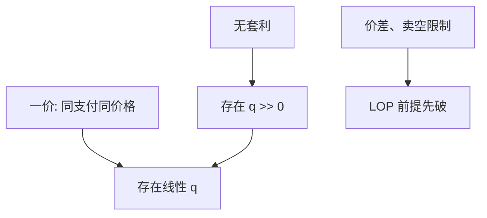

# 一价定律与无套利

同一支付两套价格，是线性定价失败；能用非正投入做出正支付，才是套利。前者弱于后者。

<footer>—— 据 Ross, A Simple Approach to the Valuation of Risky Streams, Journal of Business, 1978；对照 Magill–Quinzii 的教科书分层</footer>

[上一课](/econ/microstructure-asset-pricing-interface)把价差与 $\lambda$ 留在接口上，并声明后文先关掉摩擦。本课缺口是定价骨架的第一刀：**一价定律**（LOP）与**无套利**（NA）不是同一句话。摩擦世界里 $a\neq b$，LOP 对「同一 $x$」已经失败；本课在可自由买卖、零成本复制的菜单上重钉定义。不重写 Glosten–Milgrom。

## 问题

资产菜单给出收益矩阵 $A$。组合 $\phi$ 的价格是 $p\cdot\phi$，支付是 $A\phi$。LOP：若 $A\phi=A\phi'$ 则 $p\cdot\phi=p\cdot\phi'$——同一或有支付不能有两个价格。这等价于存在某个线性定价泛函 $q$，使 $p=A^\top q$（$q$ 不必为正）。NA：不存在 $\phi$ 使 $p\cdot\phi\le 0$、$A\phi\ge 0$ 且至少一处严格——不能用非正的钱换来非负且不恒零的支付。NA 要求存在 $q\gg 0$（严格为正的状态价格）。

缺口是分层。LOP 失败是会计丑闻或同步摩擦（同一股票两地报价、买卖价差把一张票切成两张）。NA 失败是免费午餐。有 LOP 而无 NA：存在定价，但有的状态价格非正，某个状态的正支付不值钱或值钱为负——弱套利。主干 [状态价格](/econ/state-prices) 已经用过 $p=A^\top q$；本课把「$q$ 为正」从「线性」里拆出来。

卖空限制、交易成本把可行 $\phi$ 砍成锥，LOP 对「账本上的同一 $x$」可以失败而不出现教科书套利。那是接口留给摩擦的缝；本课先在无约束 $\phi\in\mathbb{R}^J$ 上说话。

## 方法

有限状态、一期。检验 LOP：看 $\ker(A)$ 上 $p$ 是否为零。检验 NA：看是否存在 $q\gg 0$ 解 $A^\top q=p$（Stiemke 引理）。完全市场时 $A$ 满行秩，$q$ 在 LOP 下唯一，NA 再要求这个 $q$ 为正。不完全时 LOP 只在 $\mathrm{span}(A)$ 上定价，$q$ 是一个仿射空间，NA 要求其中有严格正的向量。

与上一单元对照：买卖两点 $a,b$ 意味着「买 $x$」与「卖 $x$」不是同一张票，LOP 的前提「同一支付」在交易上不成立。理论上可以仍对中间价谈 NA，那是近似，不是定义。

下一课把 NA ⇔ 正线性定价写成**资产定价基本定理**的有限状态版，并指向无穷维的版本。本课只分层。

## 机制

LOP 的机制是复制：两套组合若支付相同，需求会冲向便宜的那套，直到价格对齐——前提是两套都能自由交易。NA 的机制更强：即便不能精确复制，只要能做出「只赚不赔」的方向，需求无穷，价格撑不住。$q$ 为正保证每个状态都还值钱，没有「灾难状态被标成零或负」的免费保险。

[SDF](/econ/stochastic-discount-factor) 把 $q$ 除以概率写成 $m$。LOP 对应存在（可变号的）$m$ 使 $p=\mathrm{E}[m x]$；NA 对应存在 $m>0$。主干 SDF 课已经用过 NA 这一端；本课补的是弱的那一端，以免后文 FTAP 听起来像从天上掉下来。

Law of one price 在国际金融里还指汇率与商品，那是另一课的 PPP。这里的 LOP 是或有支付空间上的线性。

## 边界

连续时间、无穷状态，NA 要分「无免费午餐」（NFLVR）等更细的层级，后课等价鞅测度才需要。本课停在有限 $S$。也不要把 LOP 写成「ETF 从未偏离 NAV」的实证——那是量化栏对摩擦的测量。

后课默认：LOP ⇔ 线性定价（$q$ 可变号）；NA ⇔ 严格正的状态价格。价差世界先承认两张票。下一课：FTAP 把 NA 接到定价核的存在。

## 小结

- 一价定律是线性定价，状态价格可非正。
- 无套利要求状态价格严格为正，排除免费午餐。
- 价差破坏的是「同一张票」，不是先破坏 FTAP 的结论。
- 出处：Ross, *Journal of Business* 1978；有限状态的分离定理。
