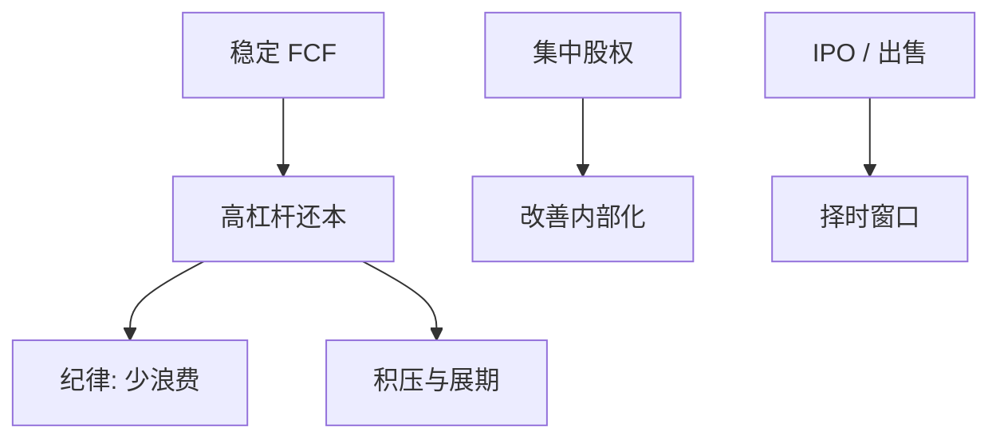

# 杠杆收购与私募股权

    
杠杆收购把自由现金流押成还本付息，把股权集中到发起人手中，使 Grossman–Hart 的免费搭车和 Jensen 的现金浪费同时被合同关掉。

    <footer>—— Jensen, Eclipse of the Public Corporation, Harvard Business Review 1989；Kaplan, Journal of Finance 1989；Kaplan and Strömberg, Journal of Economic Perspectives 2009</footer>

[上一课](/econ/ma-synergy-payment)的战略并购常付股票、协同含糊。本课缺口是另一类控制权交易：LBO/PE 用高杠杆现金买下公众公司或分部，治理改善来自债务纪律与集中股权，而不是行业协同叙事。不重做 Travlos 的支付信号，不写 PE 基金的募资条款全文。

## 问题

公众公司股权分散、董事会弱、FCF 高时，内部监督不足，全面要约又遇免费搭车。LBO：发起人与管理层持股大，$\alpha$ 内部化改善；银行与高收益债把未来现金锁死。Kaplan（1989）：经营变化与税、价值在样本中上升。Jensen（1989）预言公众公司在成熟行业被私募形式替代。缺口是把前几课装置装进一套合同：债务容量来自稳定 FCF，期限与契约来自银行，退出（IPO 或再出售）把择时再引进来。

PE 不限于敌意 LBO：也包括成长股权与困境债。本课主线是杠杆买下控制权。困境债接到第 11 章与 APR 偏离。

## 方法

资本结构：初始杠杆极高，目标不是静态 $D^\ast$ 的舒适带，而是用债逼出效率，再随还本降杠杆（反向动态权衡）。失败态是积压与展期墙——高收益债与银行短债的组合正是期限课的压力测试。治理：董事会由 PE 控制，监督不再内生于 CEO 选独董。薪酬：管理层股权比例高，敏感度远高于 Jensen–Murphy 的公众 CEO。

退出：改善实现后，公开市场窗口决定是否 IPO——Baker–Wurgler 在 PE 退出上再现。资本预算：对 PE 而言 IRR 是基金报表语言；对企业仍应看 NPV 与债的风险转移。上一单元 IRR 陷阱：基金 IRR 依赖时间加权与再投资假设，不是项目接受规则。

与银行 vs 公募：LBO 融资是银行 + 高收益公募的混合，条款紧，再谈判靠主银行。证券化有时出现在资产侧。

## 机制

机制是把代理成本转化成违约风险。纪律的收益与财务困境的成本是同一杠杆的两面。成功样本活过还本期；失败样本进第 11 章，APR 偏离与 DIP 决定 PE 股权是否归零。事前定价应含 Andrade–Kaplan 的财务困境成本。

免费搭车：现金强制挤出公众股东，法律允许合并，Grossman–Hart 的补丁被用满。防御：毒丸可被董事会（若尚未被换）挡住敌意 LBO；友好 LBO 由现任参与，降落伞与管理层持股对齐。

### 不是「杠杆创造价值」

价值来自资产现金流改善与税盾，减去困境。杠杆是实施工具。把 LBO 溢价当成杠杆本身的魔力，违反 MM：无改善则只是切片加税再加破产概率。

Kaplan–Strömberg（2009）综述 PE 的经营与治理证据。机制课取合同结构，不把基金回报当成无风险 alpha。

## 边界

不要把本课写成买卖价差与基金流水。下一课 VC：另一端——少债、多分阶段股权、高不确定性，实物期权与合同权利替代 LBO 的还本纪律。

后课默认：LBO 用集中股权解决免费搭车，用债解决 FCF；失败态是本单元写过的困境与展期。IRR 是基金语言，不是资本预算的接受规则。

## 小结

- LBO/PE：高 $\alpha$ 内部化改善，高杠杆锁 FCF，现金挤出公众股东。
- 纪律与困境是同一杠杆；退出再引入股权择时。
- 协同主要是治理，不是行业故事；MM 仍约束「纯切片」。
- 出处：Jensen, *HBR* 1989；Kaplan, *JF* 1989；Kaplan and Strömberg, *JEP* 2009。
