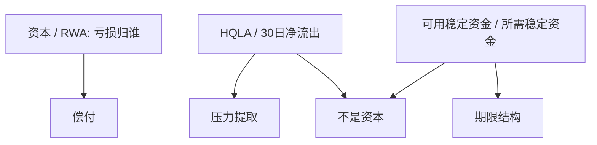

# LCR 与 NSFR

资本回答亏损归谁；流动性覆盖回答三十日内谁能付现。把两个比率写成同一个约束，窗口与股本会再次被混用。

<footer>—— Basel Committee on Banking Supervision, Basel III: The Liquidity Coverage Ratio, 2013；The Net Stable Funding Ratio, 2014</footer>

定位：[上一课](/econ/basel-capital)。风险加权资本与杠杆率已经把损失吸收顺序写成可审计的分子分母。本课缺口是流动性的两道数量阀：覆盖比率（LCR）与净稳定融资比率（NSFR）。不是把 RWA 再讲一遍，也不把 LCR 叫成资本充足。

## 问题

Diamond–Dybvig 的提取与 Bagehot 的窗口，都发生在资本可能仍为正的时候：资产按持有到期值覆盖负债，但无法在不火灾出售的前提下变成结算资产。巴塞尔资本管的是亏损顺序；若只靠资本，银行仍可以把稳定资金换成隔夜批发，等挤兑来了再去窗口。危机后的流动性标准要把「能撑过压力提取」和「资产与负债的期限别错太远」写成事前比率。

缺口是两道不同频率的约束。三十日压力对应挤兑的短期腿；一年稳定融资对应持续的期限转换。BCBS 把它们分开写，正是为了不让一个数字同时充当股本与库存现金。

高流动性资产（HQLA）是压力中仍能按窄折价变现或向央行抵押的资产。它是 Bagehot「好抵押」的事前库存，不是普通股，也不能吸收已经实现的信贷亏损。

## 方法

LCR：合格 HQLA 的存量，除以指定压力情景下三十日净现金流出，最低为 100%。流出系数按负债类型设定——零售存款低、无保险批发高——把 Diamond–Dybvig 的提取写成监管权重，而不是再解一遍博弈。流入有上限，防止用「假想的贷款回收」把分母做小。

NSFR：可用稳定资金（资本、长期负债、稳定零售）除以所需稳定资金（按资产流动性与表外加权），最低为 100%，地平线约一年。它惩罚用短批发去持有长而难变现的资产，即使 LCR 在三十日窗口里刚好踩线。

与内生货币的衔接：盯利率时准备金仍可再供给，HQLA 库存却要求银行在平时持有低收益的结算邻近资产。流动性规则是数量阀，利率规则是价格阀，两者叠在同一张表上。

## 机制

机制是把挤兑与期限错配从「事后窗口」改成「事前持有成本」。LCR 提高持有 HQLA 的机会成本，降低对最后贷款人的日常依赖；NSFR 提高短稳长的成本，使期限转换必须由稳定负债来做。两者都不改损失吸收顺序：HQLA 可以按市值波动，亏损仍先记普通股。

监管套利的方向换了。资本套利是把风险赶到低权重暴露；流动性套利是把流出赶到低系数负债、把资产赶到被承认为 HQLA 的券。影子银行下一课要问：期限转换能否整体搬出并表银行，从而两比率都管不到。本课先钉：在并表银行内部，流动性与资本是两套会计。

### 流出系数不是挤兑概率

零售存款的低流出系数，已经把[存款保险](/econ/deposit-insurance)写进 LCR：被保、稳定的存款被当成较少跑。无保险批发的高系数，已经把 TBTF 信念**没有**写成「批发也不会跑」。系数是规则，不是估计出来的挤兑均衡概率。用某次危机的事后提取去反推「LCR 没用」，混淆了规则与模型。

NSFR 的「所需稳定资金」对贷款给高权重、对 HQLA 给低权重。它不是风险加权资产：对象是融资期限，不是意外损失。不要把 NSFR 当分母拿去和 CET1 比。

## 边界

不要把流动性覆盖叫成资本充足，也不要把资本缓冲叫成三十日库存。窗口在 LCR 之后仍有位置：比率是事前，Bagehot 是压力中的弹性。也不要用 HQLA 的法定名单当 SDF：名单是委员会选择，不是资产定价核。

本课不写 Pozsar 的实体图谱。下一课[影子银行](/econ/shadow-banking)处理跑到两比率外面的期限转换；这里只完成巴塞尔流动性腿。

后课默认：LCR 管压力提取的库存，NSFR 管稳定融资结构，都不是资本。资本课已经说过这句话，本课把它做成两道可写的比率。套利会把转换推出并表银行。

三十日与一年是两个频率。踩线 LCR 仍可以靠隔夜批发续一年，所以需要 NSFR。

HQLA 不能核销贷款亏损。先亏的仍是普通股。

## 小结

- 资本是损失吸收；LCR / NSFR 是流动性与期限的数量阀。
- LCR：HQLA 对三十日压力净流出；NSFR：稳定资金对所需稳定资金。
- 流出系数是规则，不是挤兑博弈的解。
- 出处：BCBS, LCR 2013；NSFR 2014；对照 Basel III 框架。
