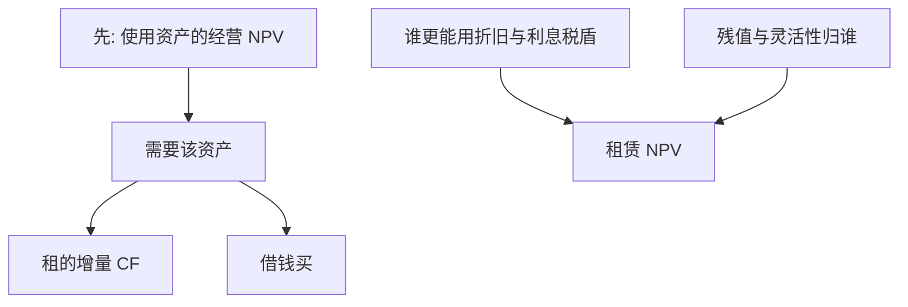

# 租赁对购买

    
租赁是用一组租金现金流去换资产的使用权；比较的是税、残值与谁承担资产风险，不是「租赁不占用资本所以更便宜」。

    <footer>—— Myers, Dill and Bautista, Valuation of Financial Lease Contracts, Journal of Finance 1976；Brealey, Myers and Allen</footer>

[上一课](/econ/real-options-valuation)把资产上的灵活性写成期权。本课缺口是合同替代：租入还是借钱买入，等价于把残值与税盾在出租人与承租人之间重切。不重做实物期权的阈值公式，不把经营租赁的会计分类当成经济学。

## 问题

MM 无摩擦时，自制租赁（借钱买）与出租人融资无差别，租赁不创造价值。有公司税、不同折旧与利息抵扣能力、以及残值风险分担时，租赁可以有正 NPV——来自税的转移或来自比较劣势的风险分担，不是来自「表外」。Myers–Dill–Bautista（1976）把融资租赁的增量现金流折现：省下的购入流出、失去的折旧税盾、付出的税后租金、可能失去的利息税盾。缺口是：资本预算把租赁当成替代债务的融资，用税后债务成本折增量，而不是用 WACC 去折「节省的 capex」却忘记负债等价。

「租赁不占用资本」是配额语言。租赁合同是债务等价：承诺租金与还本一样硬。用公司 WACC 去折租金节省，会把融资当成经营项目，高估租赁。

## 方法

增量现金流（承租人）：+ 否则要付的资产价格（或机会成本）；− 税后租金；− 失去的折旧税盾；债务容量被租赁占用，失去的利息税盾要进（或用税后 $r_D$ 折现来近似）。残值：若租约结束资产归出租人，承租人失去残值与残值风险——这一块正是上一课关停/残值期权的售出。NPV>0 则租优于买（在「必须使用该资产」的前提下）。

若资产根本不该用，租赁 NPV 为正也不能让项目过关：先做使用资产的经营 NPV，再比较租与买。两步不能并成「租金比折旧低所以做」。

出租人若税率更高、更能承担残值，租金可以让双方分享税盾。这是 Miller 税客户在资产层面的版本，后课个人税均衡会再出现。

## 机制

机制是复制：购买加贷款复制使用权与债务；租赁把同一复制拆给两家企业。复制失败来自税码不对称、破产时租赁与抵押的优先级不同、以及残值信息不对称（出租人更会卖二手）。Brealey–Myers：把租赁当债务替代，折现率靠近税后 $r_D$，因为增量现金流的风险接近债务服务，不是经营资产的 $\beta_A$。

灵活性：短租保留关停期权，租金里含出租人出售的期权费。长租加固定残值把灵活性卖掉。与实物期权课衔接：比较租与买时，要把灵活性写进残值，而不是只比较会计上的费用发生时间。

### 表外不是价值

会计把某些租赁留在表外，不改变承诺现金。资本预算按现金与债务等价处理。治理上，表外可能降低表面杠杆、误导契约；那是后课契约条款，本课只禁止把表外当成 WACC 下降。

MDB 1976 的公式在债务替代假设下给出封闭形式。经营租赁若真可取消，债务等价减弱，灵活性价值上升，折现率与期权两边都要改。

## 边界

不要把本课写成 IFRS 16 的科目对照。对象是税、残值、债务替代。也不要把汽车经营租赁的广告利率当成 $r_D$。下一课营运资本：垫付的现金与租赁一样，是项目不可少的「准债务」，但风险更靠近经营。

后课默认：先判断是否使用资产，再比较租与买；租赁是债务替代加税与残值重切。不要用 WACC 折「省下的购价」来证明租赁便宜。

## 小结

- 无摩擦时租与借钱买等价；价值来自税、残值风险与灵活性谁持有。
- 融资租赁按债务替代、税后 $r_D$ 折增量；先有经营 NPV，再比租买。
- 表外不是资本成本下降。
- 出处：Myers, Dill and Bautista, *JF* 1976；Brealey, Myers and Allen。
