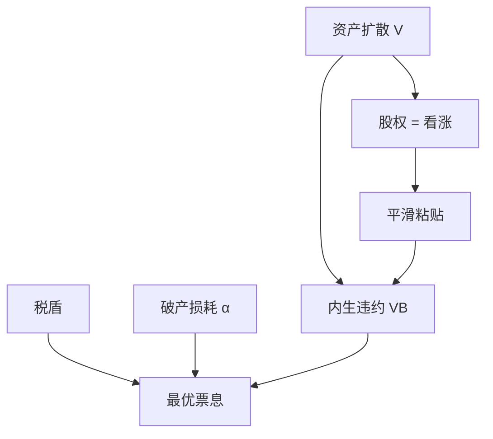

# Leland 动态资本结构

    
把企业资产写成扩散，违约写成内生边界，税盾与破产成本的权衡就变成期权定价：股权是资产的看涨，最优杠杆与最优违约点一起解出。

    <footer>—— Leland, Corporate Debt Value, Bond Covenants, and Optimal Capital Structure, Journal of Finance 1994</footer>

[上一课](/econ/country-risk-premium)收束了项目贴现。主干上的[权衡](/econ/tradeoff-capital)给出静态 $V_L=V_U+\mathrm{PV}(\text{税盾})-\mathrm{PV}(\text{困境})$，但债务是一次给定的面值。本课缺口是 Leland（1994）：资产 $V$ 连续变动，股东选择何时把看涨期权交出，税盾与破产成本在同一或有要求权里定价。不重做 Kraus–Litzenberger 的状态表，不把资本预算的 WACC 再推一遍。

## 问题

静态权衡的 $D^\ast$ 不回答：资产跌了以后，是立即违约、再注资，还是继续付息？Merton（1974）已把股权写成资产看涨、违约边界等于面值（零息债到期）。Leland 换成永久债（或指数化票息）、违约边界由股东内生选择：当注资付息的边际成本高于维持期权的价值，放弃。缺口是把权衡从「选一个 $D$」升级为「选票息与违约政策」，使杠杆随 $V$ 内生变动。

内生违约：有限责任下股东的平滑粘贴（smooth-pasting）决定边界 $V_B$。外生边界（契约、流动性）会改变债值与最优票息。后课展期与契约会把外生约束加回来。

## 方法

资产 $V$ 服从带漂移的几何布朗。无杠杆价值按 $r_U$ 或风险中性下的资产回报来。杠杆企业：股权 $E(V)$ 满足常微分方程，在 $V_B$ 处为零，平滑粘贴决定 $V_B$；债务价值 = 承诺票息的现值 − 违约时损失。税盾在 $V\gt V_B$ 时流入，破产成本在 $V_B$ 按 $\alpha V_B$ 损耗。最优票息最大化 $E+D=V_U+\mathrm{PV}(\text{税盾})-\mathrm{PV}(\text{破产})$。

比较静态：破产成本 $\alpha$ 上升、税率下降，最优杠杆下降；波动上升既提高税盾的期权价值也提高违约概率，净效应要拆。这与静态「波动高则债少」同方向，但定量来自期权，不是来自一个外生违约概率。

与 APV：Leland 是连续时间、内生杠杆路径的 APV。资本预算若假设常数 $D/V$，对应的是 Goldstein–Ju–Leland 一类再平衡扩展，不是 1994 年一次性永久债。本课先钉一次性债的内生违约。

## 机制

机制是有限责任加连续交易的期权。股东付息等于买继续赌的权利；边界上，再付一单位的成本等于期权增量。债权人在边界上接手 $(1-\alpha)V_B$。税盾是政府在存活路径上的转移，家庭仍不能自制，故切片有关——与 MM 1963 同一块摩擦，只是动态化。

宏观课序里的 Kiyotaki–Moore 把抵押边界写进总量；Leland 是单个企业的内生边界。本栏不把信贷周期加总，只把权衡变成可计算的或有要求权。

### 不是把公司债当可交易的 Black–Scholes 产品来做市

Leland 用 BS 技术，对象是资本结构。信用利差来自违约边界与损耗，不是限价簿上的买卖价差。流动性与展期在后课；本课债是永久、无展期危机。

Leland 1994 还比较保护性条款（资产出售限制等）如何改变 $V_B$ 与债值。契约课再展开 Smith–Warner；这里只要：条款改变期权边界，从而改变最优杠杆。

## 边界

不要把 1994 年模型写成已经解释了调整速度：债务是一次选好的永久票息，没有发行成本下的调整带。下一课动态权衡才加固定调整成本与区间。也不要把 Leland 的利差直接当 WACC 的 $r_D$ 输入而不看边界假设。

后课默认：权衡可以写成资产扩散上的内生违约；股权是看涨，最优票息与 $V_B$ 联立。再平衡、择时、发行成本尚未进入。

## 小结

- Leland：税盾与破产在扩散资产上用或有要求权定价，违约边界内生。
- 最优杠杆是期权问题，不是静态的 $\tau_c D$ 减去一个外生概率。
- 永久债、无调整成本；调整带与择时是下一课的缺口。
- 出处：Leland, *Journal of Finance* 1994；对照 Merton, *JF* 1974。
