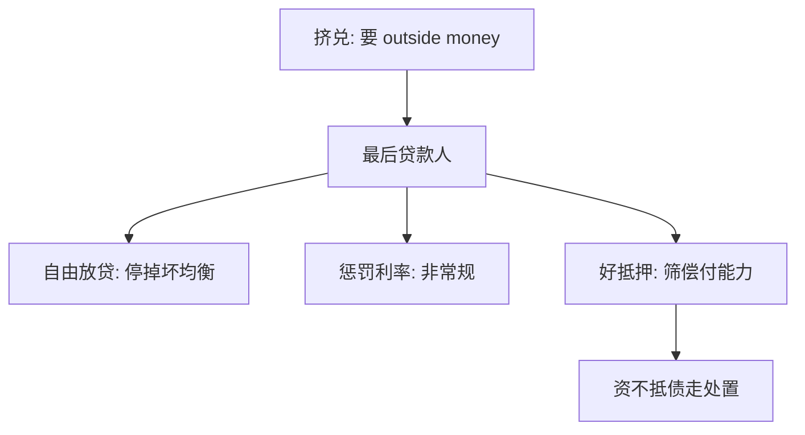

# 最后贷款人

恐慌时，中央银行应对好抵押品自由放贷，并收取惩罚性利率。

<footer>—— 据 Bagehot, Lombard Street, 1873 整理</footer>

定位：[准备金、乘数与内生货币](/econ/reserve-endogenous-money)。平时准备金迁就结算，存款由贷款创造；本课缺口是恐慌：人人要把 inside money 换成 outside money 时，谁按什么规则提供那笔高能货币。不重推 [Diamond–Dybvig](/econ/diamond-dybvig) 的双均衡，只把它当作需要被停掉的坏均衡。

## 问题

序贯兑付一旦进入挤兑，有偿付能力的银行也会因为资产无法在 $t=1$ 按面值变现而耗尽准备金。若央行袖手，清算折扣把流动性问题做成破产，坏均衡实现。若央行无条件给所有负债保兑，又把偿付能力缺口社会化，激励在平时加杠杆。缺口因此不是「要不要救银行」，而是：最后贷款（liquidity）与资本注入（solvency）必须分开写，规则要让耐心存款人愿意等到 $t=2$，同时不把资不抵债的机构当流动性问题处理。

Bagehot 的市场是十九世纪的伦敦汇票市场，不是当代的准备金走廊，但问题同构：货币市场的弹性在恐慌中消失，唯一还能创造 outside money 的机构必须充当弹性本身。

有偿付能力：按持有到期的价值，资产覆盖负债。流动性不足：无法在不承受火灾出售折扣的前提下，立即支付到期或可提取负债。挤兑把第二项变成对第一项的检验。

## 方法

Bagehot 规则三句，对应三个激励。第一，自由放贷：数量上满足需求，使耐心者相信队列会停。这是对 Diamond–Dybvig 坏均衡的删除，类似存款保险，但抵押在央行而不是财政的名义担保。第二，惩罚性利率：让不慌的机构不愿把央行当便宜的常规融资，减少平时对最后贷款人的依赖。第三，好抵押：把窗口限制在有偿付能力的借款人，迫使真正资不抵债的机构走处置而不是贴现。

当代操作把「好抵押」写成合格抵押品清单与估值折扣（haircut），把「惩罚利率」写成相对政策利率的罚息或 stigma。走廊体制下，最后贷款人往往是贴现窗口或紧急流动性便利；数量宽松是另一套工具，属于[零下限](/econ/zlb-unconventional)，本课不把 QE 写成 Bagehot。

与内生货币的衔接：恐慌中乘数的因果暂时反转——不是 $H$ 决定 $D$，而是 $D$ 要兑换 $H$，若 $H$ 不增加，系统收缩。最后贷款人恢复平时的弹性，使准备金再次迁就结算。

## 机制

机制是信念与抵押的同时操作。自由放贷改变耐心者对 $t=2$ 偿付的信念，提取的战略互补被削弱。抵押与估值折扣则是筛选：银行愿意按折扣抵押的资产，透露它认为自己过得了到期。惩罚利率提高使用窗口的机会成本，使便利成为偏离均衡路径上的工具，而不是日常的廉价资本替代——资本替代正是下一课 [巴塞尔](/econ/basel-capital) 要禁止用流动性解决的问题。

时间不一致在这里已经露头：危机中「自由」的压力极大，事后把坏资产也收进抵押品的诱惑对应[承诺](/econ/time-inconsistency)。Bagehot 把规则写在事前，正是为了限制这种权变。Kydland–Prescott 的附录对照不在本课展开。

### 窗口、保险与暂停的分工

存款保险改变耐心者的支付，使其不必跑到央行窗口。暂停兑付直接关掉序贯服务。最后贷款人介于两者之间：银行仍营业、仍兑付，但资产暂时换成央行负债。三者都可以删坏均衡，激励不同。保险把信用风险转给保险基金；暂停把流动性风险丢回存款人的等待；窗口把流动性风险转给央行，信用风险仍应由资本与抵押挡住。混用三者——例如用窗口给资不抵债的机构无限额、无抵押——等于把 LOLR 做成隐蔽的资本注入。

Bagehot 的「惩罚利率」在利率已经接近零时不好用。罚息相对的是当时的市场利率，不是一个永恒的百分数。ZLB 下的紧急便利是主干非常规政策的对象。

## 边界

最后贷款人不是资本监管，也不是对股东的救助。把股权价值保全写成「流动性支持」，会破坏好抵押这一句。跨境银行使抵押品与最终贷款人的币种可能错配：不可能三角下，本币 LOLR 不能无限制提供外币流动性，外汇互换是另一套安排。本课不写巴塞尔风险权重，不写 MM 对银行股本成本的含义。

也不要把 2008 年之后的一切非常规工具都贴上 Bagehot：购买长期证券、对资不抵债机构的注资，超出「好抵押上的短期贷款」。那些是财政与货币政策的交界，分别在非常规政策与财政课。

本课默认央行能发行被挤兑者接受的 outside money。若挤兑的是外币负债，本币窗口不够，要回到[不可能三角](/econ/impossible-trinity)下的储备与互换。那不是 Bagehot 原文的伦敦英镑市场，不要把一句「自由放贷」跨币种滥用。

## 小结

- 挤兑要把 inside money 换成 outside money；弹性必须由能发行后者的机构提供。
- Bagehot：自由、惩罚利率、好抵押——删坏均衡、限道德风险、分清偿付。
- 流动性支持不是资本；下一课才把股本写成硬约束。
- 出处：Bagehot, *Lombard Street*；Diamond and Dybvig 1983 的政策含义。
