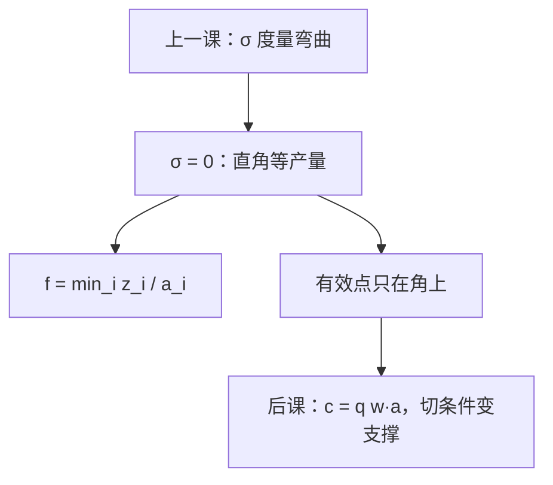

# 列昂惕夫技术

投入必须按固定配方走：少一种，其余再多也变不成产出；等产量是直角，替代弹性为零。

<footer>—— 据 Leontief, The Structure of American Economy, 1919–1939, 1941；对照 Hicks 的 $\sigma$ 极点整理</footer>

[上一课](/econ/elasticity-of-substitution)（替代弹性）。把 $\sigma$ 写成等产量弯曲，并点名 $\sigma\to 0$ 是 CES 的列昂惕夫极限。本课不重写 Hicks 的对数导数，也不把一次齐次再证一遍。缺口是这个极点本身：固定比例技术长什么样，有效投入怎样决定 $q$，后课成本最小化在折拐处会碰到什么。

## 问题

配方 $(a_1,\ldots,a_n)\gg 0$。可行产出

$$
q\le f(z)=\min_i\frac{z_i}{a_i}.
$$

要生产 $q$，每种要素至少 $a_i q$。多出来的投入是浪费——[自由处置](/econ/free-disposal-inada)允许，但有效计划不会留。等产量是直角：只在角点 $z=aq$ 上两种要素同时卡紧；沿一条边，一种要素多余，TRS 是 $0$ 或 $\infty$，中间没有光滑切线。缺口不是再定义一次 $\sigma$，而是：**$\sigma=0$ 时「替代」这句话空了，后课的切条件 TRS $=w$ 比没有内点可切。**

投入产出表把部门间的 $a_{ij}$ 排成矩阵，列昂惕夫逆给出「最终需求一单位要多少总产出」。那是同一配方在多部门上的展开；本课先钉单产出 $f$。

### 直角不是不可分

不可分是 $z$ 不能连续调。列昂惕夫可以连续放大配方，$f$ 一次齐次，欧拉分尽在有效射线 $z=aq$ 上仍可读——只是边际产出是单侧的：卡紧要素的边际为正，多余要素的边际为零。不要把直角等产量写成整数机器。

CES 里 $\rho\to-\infty$ 时，$(\sum a_i z_i^{\rho})^{1/\rho}$ 一致收敛到 $\min_i z_i/a_i$。$\sigma=0$ 不是另一种技术家族，是弯曲参数的边界值。

## 方法

有效计划必在角上：$z_i=a_i q$ 对所有 $i$。成本一旦有 $w$，最小成本直接是 $c(w,q)=q\,w\cdot a$，条件需求钉死在配方上，对 $w$ 无反应——这正是 $\sigma=0$ 的对偶面。本课仍不解规划，只把几何交给下一课：支撑超平面可以是一整族，只要 $w\ge 0$，角点都被支撑。

投入产出：中间品按 $A$ 消耗，$(I-A)^{-1}$ 存在当谱半径小于一（霍金斯–西蒙）。那是一般均衡生产课的多部门语言；这里只需知道「固定配方」可以从一个 $f$ 长成一张表。

不要把 $a_i$ 写成偏好参数。配方是物质定额，不是 $u$ 的互补。消费者 Leontief 偏好是对偶故事，本课是技术。

## 机制

为什么 $\sigma=0$：沿等产量想用 $j$ 换 $k$，立刻有一种要素松弛、产出掉下来——要维持 $q$ 必须把另一种也按比例加回，投入比被锁死。对数导数的分子为零。

边际产出的机制是短边：$\partial f/\partial z_i$ 在 $z_i>a_i q$ 时为零，在刚好卡紧时为 $1/a_i$（另一要素不松）。竞争按边际付酬时，多余要素得零，卡紧要素分尽——仍是[欧拉](/econ/homothetic-production)，只是梯度换成超梯度。

列昂惕夫 1941 的表是经验构造，不是从 CES 取极限推出来的。教学上把 $\sigma=0$ 与投入产出配方当成同一几何的两种写法：一种强调等产量，一种强调部门定额。

## 边界

配方随 $q$ 变（非线性列昂惕夫）时一次齐次丢掉，角点仍在，只是 $a(q)$ 要重估。联合生产、副产品让「一种产出一个 min」不够，要回到集合 $Y$。短期某些要素固定，直角变成「短边更短」，那是沉没课的固定要素，不是本课改 $\sigma$。

后课[成本最小化](/econ/cost-minimization)在光滑点写 TRS $=w$ 比；碰到本课的角，改成要素价格落在超微分里，条件需求可以对 $w$ 一段不变。

后课默认：列昂惕夫是 $\sigma=0$ 的固定比例技术；有效投入在角上；成本对 $w$ 的反应要等对偶课用支撑来写。

## 小结

- $f=\min_i z_i/a_i$ 给出直角等产量，有效计划锁在配方射线上。
- $\sigma=0$ 是弯曲的极点，不是不可分，也不是规模报酬的另一种说法。
- 无内点切线，后课成本最小化用支撑超平面，不靠 TRS 等式。
- 投入产出表是同一配方的多部门展开。
- 出处：Leontief, 1941；Hicks $\sigma$ 的 $\rho\to-\infty$ 极限见 Varian。
