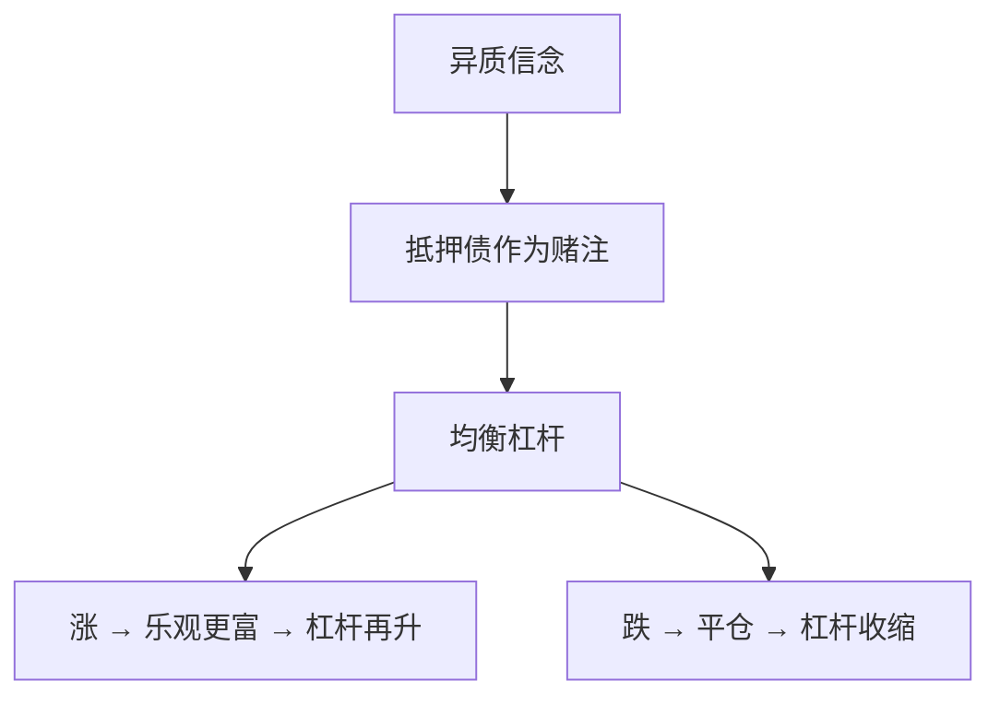

# 杠杆周期 Geanakoplos

杠杆是内生证券：乐观者用多少抵押买风险，由谁的信念在边际上决定；繁荣时杠杆升，崩溃时 haircut 跳。

<footer>—— Geanakoplos, The Leverage Cycle, NBER Macroeconomics Annual, 2010</footer>

[上一课](/econ/market-funding-liquidity)把保证金写成波动的函数，规则可以外生。本课缺口是**保证金本身由均衡决定**：异质信念或异质估值下，抵押合同是被交易的对象，杠杆周期可以在没有新信息的波动规则下出现。不重画流动性螺旋的流程图。

## 问题

Geanakoplos：同一风险资产，悲观者不想持有，乐观者想加杠杆买。无摩擦完全市场会用 Arrow 证券把意见差异变成赌注；缺列时，抵押债是可用的赌注形式——违约时交割资产。均衡杠杆（或 haircut）由边际上的信念分布决定：越乐观的人越愿意出更低保证金来持有。好消息使资产涨、乐观者变富、杠杆再升；坏消息使抵押品跌、强制平仓、杠杆收缩，价格跌过基本面信念更新本身。缺口是把 BP 的保证金从「VaR 规则」换成「抵押市场出清」。

与 [不完全市场 GEI](/econ/incomplete-markets-gei) 一脉：缺列时合同的形式（抵押、违约）改变实际张成。本课特化到杠杆作为内生列。

Geanakoplos, *NBER Macro Annual* 2010；更早的 Cowles 与 2003 文已经写抵押均衡。Fostel–Geanakoplos 把抵押一般均衡（CCE）写成系统。

## 方法

两期或有限树，异质先验。可交易：资产、无风险债、以资产为抵押的债（违约时收回抵押）。出清同时决定资产价格、利率与保证金。乐观者在抵押约束上，悲观者持有债。比较静态：信念或财富再分配改变均衡杠杆，反馈进价格。不必有中介机构——家庭之间的抵押已经够用；有中介时，专家是最乐观或最能估值的那一层。

不要把内生 haircut 写成交易所保证金的制度史。制度可以钉住规则；理论说即便没有制度钉住，缺列加异质信念也会内生出周期。实证的保证金时间序列是测量。

## 机制

机制是财富再分配与缺列。完全市场里倒霉的乐观者已经事先对冲，崩溃不必伴随杠杆跳。缺抵押这一列时，乐观者的损失不能被 Arrow 支付补回，他们的风险承担能力与他们的财富绑死——与 He–Krishnamurthy 同族，但约束来自抵押合同而不是激励合同。信息对称（大家都看见同一公共冲击）仍可以有周期：异质的是解释冲击的信念，或是估值。

与美人竞赛：高阶可以放大公共噪声；杠杆周期放大的是资产负债表。两者都能让价格相对股利更抖，通道不同。

「杠杆比利率更重要」是 Geanakoplos 的口号：有时利率几乎不变，保证金已经让有效融资成本跳了。这是对只盯 $r_f$ 的宏观的批评，本课点到为止。

## 边界

本课不写 CDO 的结构图。下一课把资金约束接到 CAPM 的切点加总：谁不能持有市场时，beta 定价哪一段还成立。杠杆周期提供「约束谁、何时紧」；CAPM 偏离提供「截面上谁的期望回报被扭曲」。

后课默认：杠杆可以是均衡内生的抵押条款；繁荣加杠杆、崩溃去杠杆，价格反馈超过信念更新。与 BP 的 VaR 保证金互补，不是互相否证。

## 小结

- 抵押债在缺列时充当赌注，均衡决定 haircut。
- 财富向乐观者集中时杠杆升，反向则强制去杠杆。
- 通道是资产负债表，不是高阶信念，也不是限价簿撤单。
- 出处：Geanakoplos, *NBER Macro Annual* 2010；Fostel and Geanakoplos。
