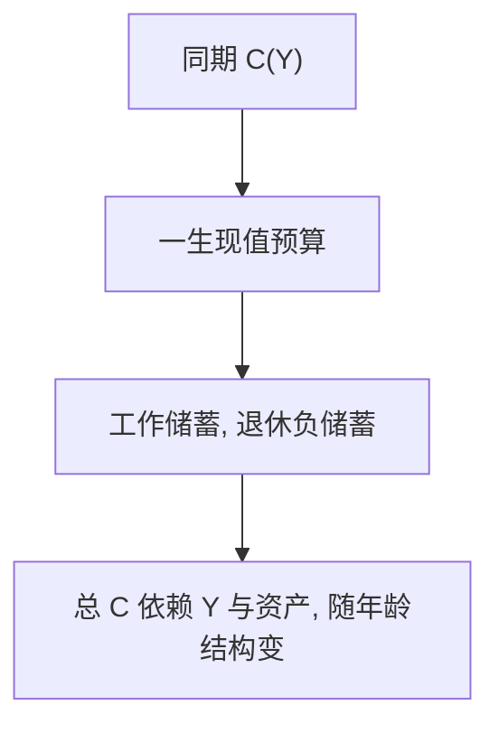

# 生命周期假说

储蓄不是收入的固定比例，而是把一生资源摊到工作期与退休期的计划；年龄、寿命和退休，比当期 $Y$ 更先进入问题。

<footer>—— Modigliani and Brumberg, Utility Analysis and the Consumption Function, 1954；Ando and Modigliani, AER 1963</footer>

[上一课](/econ/commitment-devices)处理自我之间的锁。本课回到**时间一致**的主干偏好，问另一缺口：有限寿命下，收入在工作期、消费要覆盖退休，储蓄率随年龄走。不重写指数贴现，不把承诺装置再推导一遍。

## 问题

Keynes 的 $C=cY$ 与 IS 会计把储蓄当成当期收入的残差。[欧拉](/econ/consumption-euler)已经说可预测收入不应驱动 $\Delta c$，但还没有年龄结构。Modigliani 与 Brumberg（1954）的生命周期假说（LCH）：人最大化一生效用，受一生劳动收入加初始资产的现值约束；典型路径是工作期储蓄、退休期负储蓄，财富在生命中段隆起。Ando 与 Modigliani（1963）把它写成可加总的消费函数：总消费依赖劳动收入与资产存量，边际消费倾向随人口年龄结构变。

缺口是把「跨期切点」从两期教室搬到有限寿命的日历上。遗赠暂时关掉，下一课才打开永久收入的无限期对照。

LCH 的资源是人力财富加非人力财富。利率改斜率也改现值，符号不定——与[两期](/econ/two-period-micro)同一分解，不重写斯勒茨基矩阵。

## 方法

有限 $T$、确定寿命、完全借贷、指数 $\beta$。内部解仍是欧拉沿年龄写下去；约束是一生现值。若 $r$ 与时间偏好接近且 $u$ 使消费平滑，则 $c$ 大致平坦，储蓄 $=y_t-c$ 随 $y_t$ 的年龄剖面符号变化。加总时，增长经济里年轻人更多，总储蓄可以为正，即使每人退休时把财富吃完。

本课确定环境。收入风险与缓冲存量后课再加。也不把住房、年金提前写成谜。

## 机制

机制是日历约束：劳动收入有起点和终点，偏好要的是跨期平滑。没有资本市场，人被锁在各年的 $y_t$ 上，退休消费掉到零。有债券，人把高峰收入转移到低谷。这与承诺装置正交：LCH 用指数贴现，不需要锁自己；若再引入准双曲，金蛋可以解释「为何强制养老金被需求」，那是叠层，不是 LCH 原文。

宏观含义：战争、婴儿潮改变年龄结构，改变总储蓄与资产需求。本课只保留这条加总逻辑，不估计人口。

与[欧拉](/econ/consumption-euler)的接缝：年龄剖面是把同一条切点沿寿命写下去，再叠上劳动收入的日历形状。没有退休这一刀，LCH 就退回无限期平滑，与下一课 Friedman 更难分。本课故意把寿命有限、退休确定当作最小结构，收入风险与遗赠先关着。也不把年龄储蓄写成限价簿上的生命阶段订单——这里没有协议。

## 边界

经验上老年人仍持有大量财富，纯 LCH 的终点负储蓄过强——遗赠与长寿风险是后课。流动性约束使年轻人无法按永久资源借，年龄剖面变形。不确定收入让预防性储蓄抬高中年资产。这些是对 LCH 的补，不是把它退回 $C=cY$。

后课默认：说到生命周期，指有限寿命平滑；说到永久收入，指无限期或随机永久成分。两者近亲，下一课拆开 Friedman 的那一支。

有限寿命把退休写成确定的零劳动收入段；没有这一刀，模型退回无限期平滑。

加总储蓄随人口年龄结构变，这是 LCH 对 Keynes 同期消费函数的另一条拒绝。

## 小结

- LCH 把储蓄写成一生资源在工作与退休之间的配置，不是固定 $s=sY$。
- 财富随年龄隆起；加总消费依赖收入、资产和人口结构。
- 确定、完全市场、无遗赠是本课边界，后课逐项打开。
- 年龄隆起是日历约束，不是固定储蓄率。
- 遗赠与长寿风险是终点条件的后课缺口。
- 出处：Modigliani and Brumberg, 1954；Ando and Modigliani, *AER* 1963。
