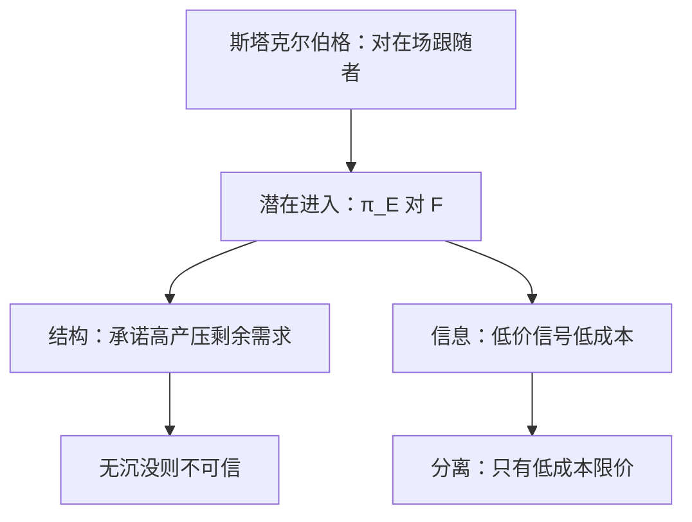

# 限制进入定价

在位者把产量或价格钉在使进入无利的位置上；若成本是私有信息，限价还可能是信号，而不只是多产本身。

<footer>—— 据 Bain, Barriers to New Competition, 1956；Milgrom and Roberts, Limit Pricing and Entry under Incomplete Information, Econometrica, 1982 整理</footer>

定位：[上一课](/econ/stackelberg)。产量领导在**已在场**的跟随者反应曲线上选切点。本课不重讲 $R(q_L)$ 的切。缺口是第三家还没进来：在位者面对的是潜在进入者的进入决策，不是跟随者的产量。Bain 的结构主义用低价/高产把剩余需求压到进入后利润为负；芝加哥式批评说进入一旦发生限价就无用。Milgrom–Roberts 用私有成本把限价救成信号。

## 问题

进入者支付沉没 $F$，进入后与在位者玩古诺或伯川德，得到 $\pi_E$。进入当且仅当 $\pi_E\ge F$。在位者若能在进入**前**改变进入者对 $\pi_E$ 的信念或改变进入后的竞争环境，就可以把进入挡在门外。缺口不是再写一次先动优势，而是：**事前的价格/产量如何进入 $\pi_E$ 的计算。**

Bain–Sylos 传统：在位者承诺进入后仍维持高产（Sylos 公设），进入者面对剩余需求 $D(p)-q_I$，限价是使 $\pi_E=F$ 的那个 $p_L$。承诺若不可信——进入发生后在位者想收缩到双寡最优——限价只是廉价交谈。上一课刚强调承诺必须沉没；这里同一把刀：没有不可逆产能，Bain 的限价不是子博弈完美。

### 信号限价不是结构限价

Milgrom–Roberts：在位成本 $c_L\in\{c_H,c_L\}$ 私有，进入者进入后才（或仍不）完全知情。低成本类型在进入前选一个高成本学不起的低价，分离均衡里进入者推断 $c_L$ 从而留下；高成本类型只好要较高的垄断价并被进入。限价的成本是进入前产量偏离垄断点；收益是改变信念。完全信息下这套信号无用，回到「只有沉没产能才能阻挠」。

Bain 1956 的进入壁垒是结构清单：规模经济、绝对成本优势、产品差异。限价是在位行为，不是壁垒本身。不要把有效规模相对于市场的大小直接叫成限价。

## 方法

完全信息、可观察产能：在位者先选 $K$，进入者看见 $K$ 再决定进不进；若进，价格阶段或产量阶段在既定产能上打。这是斯塔克尔伯格对「进入者产量为零」这一角点的延伸：选 $K$ 使进入后 $\pi_E\lt F$，在位者比较「容忍进入的双寡利润」与「为阻挠而过量安装的利润」，不一定总阻挠。

不完全信息：进入前价格是信号。分离、混同都可能。混同时高成本也被迫限价，社会福利可以更差。本课钉对照：结构路径靠承诺，信息路径靠信念，不要合成一个「低价」口头禅。

进入成本 $F$ 越大，阻挠越便宜；市场需求越大，容忍进入往往更划算——不一定总限价。

不要把限价写成限价簿上的保护买/卖；那是微观结构的指令类型，这里是产品市场的进入前价格。

## 机制

结构阻挠的机制是剩余需求：在位者把 $q_I$ 沉没得足够大，进入者即使打满自己的产能也赚不回 $F$。与[长期进入](/econ/long-run-entry)对照：完全竞争里人人价格接受，没有谁能单独把 $n$ 挡在门外；这里 $n=1$ 对 $n=2$ 的跳跃足够大，在位者内部化进入对自己利润的损害。

信号机制是直觉准则一类精炼：高成本模仿低价的损失更大（同样的低价对高 MC 更亏），于是低价成为低成本的昂贵信号。进入者要的不是「看见低价」本身，而是推断进入后的竞争会更狠。

与卡特尔对照：合谋是在位者之间的重复惩罚；限价是在位者对尚未进来的人。两者都可以表现为「低价」，但一阶条件不同——一个压住偏离，一个改进入者的 $\pi_E$ 或信念。把限价读成合谋的触发策略，会把潜在竞争与实际竞争焊死。

Milgrom–Roberts 1982 是不完全信息的进入阻挠，不是把 Bain 的公设博弈论化。引用时分开：一个靠产能承诺，一个靠信念。

## 边界

多期声誉、掠夺性定价（把进入者打出去）与限价（不让进来）时序不同，本课不把二者写成同一个一阶条件。规制价格上限可以碰巧看起来像限价。差异产品、多市场交叉补贴会改信号成本。进入者若也有私有成本，信号变成双向，分离更脆。

芝加哥式「限价不可信」只打中无承诺的 Bain 路径，打不中分离均衡里的信号。

后课[霍特林](/econ/hotelling)把产品差异做成位置；限价若靠品牌与广告，那是差异而不只是 $p$。后课默认：完全信息限价需要沉没承诺；私有成本时限价可以是信号。

## 小结

- 限价对付潜在进入，不是斯塔克尔伯格对在场跟随者的切点。
- Bain 路径靠不可逆产量/产能；无承诺则不可信。
- Milgrom–Roberts 路径靠分离信号；完全信息下用不上。
- 下一课用线性城市把产品差异做成位置，不再挡进入。
- 出处：Bain, 1956；Milgrom and Roberts, *Econometrica*, 1982。
