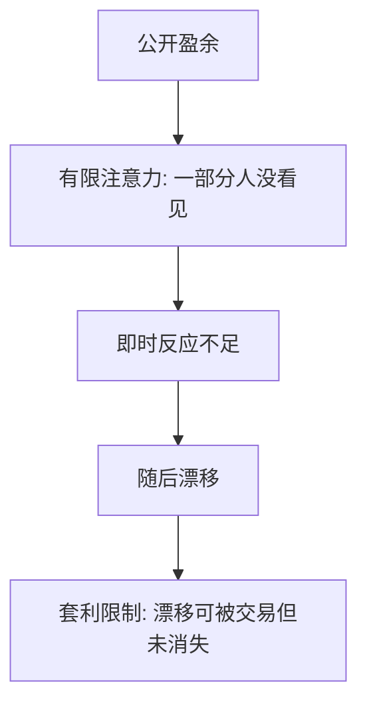

# 有限注意力与公告漂移

盈余已经公开，不等于已经进入每个人的信息集；没被注意到的公告，价格会在随后的日子里慢慢走完该走的路。

<footer>—— Bernard and Thomas 的盈余公告后漂移；DellaVigna and Pollet, JF 2009；Hirshleifer, Lim and Teoh 的注意力约束</footer>

[上一课](/econ/herding-cascades)让人看见行动却扔掉信号。本课缺口是看见本身：有限注意力使公开信息延迟进入价格，PEAD 成为半强式的候选拒绝。本课程最后一课；下一课程贸易从[李嘉图](/econ/ricardian-comparative-advantage)起。不重写 BHW 的级联阈值，不进入限价簿。

## 问题

Bernard 与 Thomas 记录：盈余未预期在公告后仍预测漂移，符号与标准化意外一致。半强式 [EMH](/econ/emh) 要求公开盈余立刻被写入；联合假说仍在，但注意力给出具体机制。Hirshleifer、Lim 与 Teoh：同一天公告太多，每个公告的即时反应变弱、漂移变强。DellaVigna 与 Pollet（2009）：周五公告即时反应更弱、漂移更强——投资者注意力在周五下降。Barber 与 Odean（2008）：散户买注意力抓取的股票（新闻、涨停、高搜索），卖的一侧不受同样驱动。

缺口是把[显著性](/econ/salience-attention)接到公开信息的加总，而不是再写 BSV 的体制切换——二者可叠加：看见了仍可更新不足。

PEAD 不是微观结构买卖价差能单独解释的量级。本课对象是信息集何时真正变成 Fama 意义上的「可用」。簿的几何仍归量化栏。

## 方法

事件研究按注意力代理分组：周五、同一日公告数量、媒体覆盖、散户搜索。预测：低注意力组即时 $\beta$ 小、随后漂移大。对照 Hong–Stein：HS 是信息在人群中扩散；本课强调日历与竞争性刺激对同一公开文本的忽略。套利限制解释为何漂移不被即时吃掉：SV 的资本、卖空成本、噪声交易者风险都可后台待命。

主干在限价簿交接处停；本课仍是补层的价格理论，用的是公告后的收益路径，不是档位与队列。

## 机制

机制是信息集的实际到达。Fama 的「可用」在操作上被注意力改写：文本在新闻稿上，不在决策者的 $v$ 里。价格由注意到的人移动一块，未注意到的人稍后读到再移动一块——看起来像滞后，其实是分批到达，近乎 HS 的日历版。概率加权与前景理论可以再扭曲已注意到的人的反应；本课主效应是「有没有看见」。

家庭金融闭环：素养与默认决定谁参与；参与者仍受注意力约束，于是公开信息对家庭组合的写入也是慢的。行为单元的零件在此全部接到一条可交易的预测：低注意力公告后的漂移。

Fama 半强式的「可用」在操作上被注意力改写。周五、拥挤日把同一篇新闻稿变成更少人的 $\mathcal{F}_t$。即时反应弱、随后漂移，是分批到达，近乎 Hong–Stein 的日历版；BSV 的保守可以叠加在已看见的人身上。套利限制解释为何 alpha 不被立刻吃掉。本课程补层从跨期偏好走到此处，仍不重写簿：收益路径是事件，档位是协议。

## 边界

风险补偿（公告后风险变）与会计应计异象会污染 PEAD。注意力代理（周五）可能相关于发布公司的类型。本课不估计年化 alpha，不把策略写成可执行清单。量化栏若做事件研究，用本课当理论对照，用簿当成交定义。

后课不在本课程。补层到此：跨期偏好 → 行为零件 → 市场加总。仍不重写簿。

公开不等于进入每个人的 $\mathcal{F}_t$。周五与拥挤日即时弱、漂移强。

补层从跨期偏好走到此处，收益路径仍是事件不是档位。套利限制解释 alpha 为何还在。

## 小结

- 有限注意力让公开公告延迟进入价格，PEAD 是半强式的机制候选。
- 周五、拥挤的公告日，即时弱、漂移强。
- 与 HS/BSV 可叠加；存活仍靠套利限制。
- 与 HS 的日历版近亲，与 BSV 的保守可叠加。
- 本课程后课不在此；不重写簿。
- 出处：Bernard and Thomas；DellaVigna and Pollet, *JF* 2009；Hirshleifer, Lim and Teoh；Barber and Odean, *RFS* 2008。
