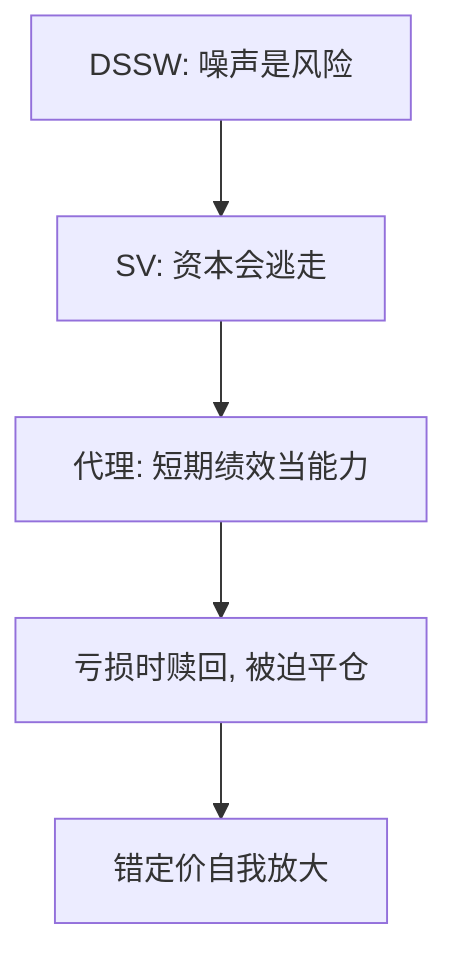

# 套利限制 Shleifer–Vishny

专业套利用的是别人的钱；短期亏损看起来像无能，资本在最该加仓的时候逃走。

<footer>—— Shleifer and Vishny, The Limits of Arbitrage, Journal of Finance, 1997</footer>

[上一课](/econ/noise-trader-risk)给出噪声交易者风险。本课缺口是资本结构：现实里的套利者是基金经理，绩效按短期收益评估，委托资本在错定价恶化时赎回。不重解 DSSW 的重叠世代。

## 问题

教科书套利是自有资金、无限期限、无绩效评估。Shleifer 与 Vishny（1997）把套利写成三方：投资者、套利者、市场。套利者比投资者更懂基本面，但资金来自投资者。若价格进一步偏离，基金净值下跌，投资者推断经理没有能力，赎回。套利者被迫平仓，价格更偏离——与「越偏离越该加仓」相反。缺口是给 DSSW 的风险加上**代理与融资**，而不是再定义情绪。

卖空限制、寻找替代证券的成本、噪声交易者风险，是同一家族的摩擦。本课以委托资本为主。

最有吸引力的交易往往最难看懂，因此最容易在短期亏损时被赎回。错定价可以在专业资金聚集的市场里仍然大。

## 方法

简约模型：套利者的资源依赖过去收益。错定价随机游走或含噪声。最优仓位在「期望收敛」与「被赎回的概率」之间权衡。比较静态：波动越大、越难向投资者解释，均衡错定价越大。经验动机：对冲基金在 1998、封闭式基金折价、股票与债券的近似替代仍长期偏离。本课不写价差分解。

## 机制

机制是融资约束与学习混淆。投资者分不清「模型暂时错」与「经理无能」。理性的赎回规则在加总后变成价格的正反馈。这与家庭流动性约束同构但对象是中介：欧拉在基金层面变成不等式。主干公司金融的代理问题在此换成套利中介，不重写资本结构课。

不进入限价簿的保证金逐日盯市细节。SV 的逻辑是委托，不是 tick 规则；量化栏会把融资与保证金写成协议。

教科书套利假设自有资本、能等到收敛。基金合同把「等到」变成投资者的赎回权。短期亏损的似然，在投资者眼里是能力的似然，理性赎回加总后成为价格的正反馈。这与家庭[流动性约束](/econ/liquidity-constraints-excess-sensitivity)同构：欧拉在最该借（加仓）时变成不等式。方向仍要另给——SV 只解释为何偏离不被立刻抹平。封闭式基金折价是原文动机：同一资产两张索取权，价差可长期存在。

## 边界

套利限制解释错定价的持续，不单独解释错定价的方向——方向来自噪声、启发式或卖空约束下的异质信念。后课 BSV/DHS/Hong–Stein 给方向。完全透明、长期锁定期的资本削弱机制（与承诺装置同构）。

后课默认：说到套利限制，指委托资本与强制平仓，不只是「有人非理性」。

专业套利用别人的钱；短期亏损被读成无能，资本在最该加仓时逃走。

SV 解释持续，不解释方向。封闭式基金折价是原文动机：同一资产两张索取权。

## 小结

- 专业套利是代理：短期亏损触发赎回，最该加仓时被迫减仓。
- 与 DSSW 叠：噪声提供风险，委托把风险变成融资约束。
- 不解释方向，只解释为何不被立刻消灭。
- 与家庭流动性约束同构，对象换成中介。
- 锁定期资本削弱机制，类似承诺装置。
- 出处：Shleifer and Vishny, *JF* 1997。
