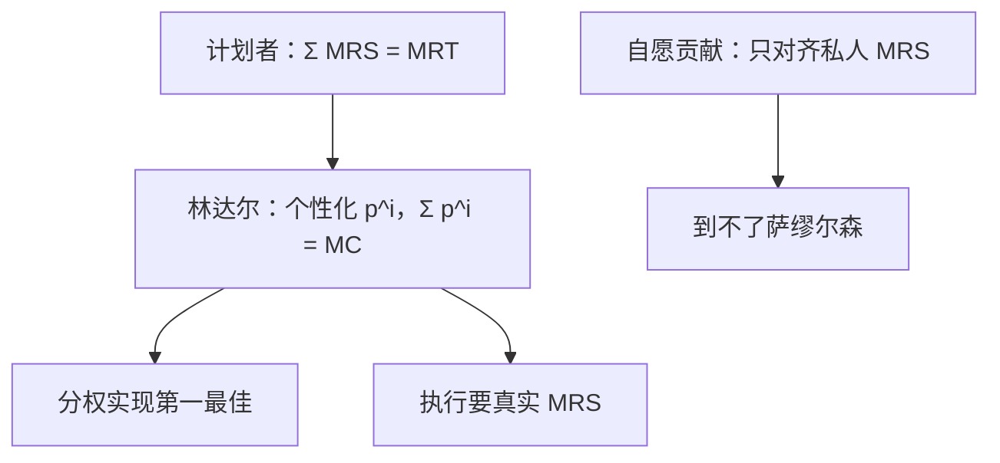

# 林达尔与萨缪尔森条件

公共支出的最优规模，由所有人边际替代率之和等于边际转换率给出；林达尔份额则把这一加总拆成个性化价格。

<footer>—— Samuelson, The Pure Theory of Public Expenditure, Review of Economics and Statistics, 1954；Lindahl, Just Taxation, 1919</footer>

[上一课](/econ/common-pool)（公地悲剧）。已经写出纯公共品的标尺 $\sum_i\mathrm{MRS}^i=\mathrm{MRT}$，以及自愿贡献只对齐私人 MRS。缺口是分权：计划者的切条件，能否像[第二定理](/econ/welfare-theorems)那样用价格而不是数量指令去实现？林达尔均衡是公共品上的那组价格。本课钉这对偶，不重写免费搭车博弈。

## 问题

私人品的有效性是各人 MRS 分别等于 MRT，同一价格就够。公共品 $G$ 同时进入每人的 $u^i$，资源约束是 $c(G)+\sum x^i=w$。计划者在保留效用约束下取最优，一阶条件正是萨缪尔森加总——上一课当标尺用过，这里把它认作**分权要去对准的对象**。

Lindahl 价：每人面对自己的 $p^i$，生产者面对 $p=\sum_i p^i=\mathrm{MC}(G)$。消费者把 $G$ 当私人品来买，但必须买同一数量。均衡时各人的需求 $G^i(p^i)$ 重合为同一个 $G^*$，且 $p^i=\mathrm{MRS}^i$。于是 $\sum p^i=\sum\mathrm{MRS}^i=\mathrm{MC}$，萨缪尔森条件被价格实现。

### 林达尔不是统一税率

统一税融资是「同一 $t$、同一 $G$」，一般对不齐各人 MRS。林达尔是对人报价：评价高的人 $p^i$ 高。看起来像公正份额，执行却要知道偏好。上一课的自愿贡献失败，不能用「改成林达尔税表」自动救回——税表本身要真实 MRS。

几何：私人品需求横加（同一价格、数量相加）；公共品若要有效，应竖加（同一数量、价格相加）。林达尔价正是竖加的那一组纵轴截距。Samuelson 1955 的图把这条竖加画成社会边际收益。

## 方法

对象：纯公共品、凸偏好、凸技术。结论：林达尔均衡配置是帕累托有效的；凸性下，任一有效配置可经总额转移成为林达尔均衡——第二定理的公共品版。存在性与瓦尔拉斯同类，价格向量换成 $(p^1,\ldots,p^n)$ 且加总等于生产者价格。

显示问题单列：每人若被问「你的 MRS 是多少」，低报可压低 $p^i$、仍享受同一 $G$。林达尔作为机制不是激励相容的。Green–Laffont 等后来把这句话写成公共品显示的不可能；本课只钉价格对偶，不进入机制设计。

## 机制

为什么必须竖着加：一单位 $G$ 同时服务所有人，社会边际收益是各人边际评价相加，不是「找一个代表消费者的 MRS」。私人品市场把横比做成同一价格；公共品没有「每人一份」，除非人为拆开价格。林达尔就是那次拆开。

总额转移仍必要。林达尔均衡相对于初始禀赋，可能有效但不公平；要到达指定的有效点，先改购买力，再开个性化价——与第二定理同一结构，只是价格按人而不是按商品分叉。

个性化价格加总必须等于生产者价格，否则公共品生产的收支对不上。这是预算平衡，不是又一条偏好假设。谎报会同时弄乱加总与需求重合，林达尔作为机制从两边一起垮。

### 标尺、分权、机制是三句话

萨缪尔森条件是完全信息计划者的切条件。林达尔是它的价格翻译。自愿贡献、投票、统一税是另一些机制，一般到不了切条件。上一课把机制失败讲完；本课把「失败相对什么」钉成可分权的第一最佳。后课用税融资时，统一楔子会再改写这条切条件，那是次优，不是把萨缪尔森作废。

Bowen–Lindahl–Samuelson 有时用来称呼同一加总条件。Bowen 从投票中位谈公共支出；Lindahl 从份额；Samuelson 从帕累托规划。本课用后两者的对偶，不引入中位选民。

## 边界

非凸、拥挤、地方公共品，加总条件要改：拥挤使 $G$ 部分竞争，有效性加拥挤的边际损害。Tiebout 用脚投票是另一套分权，不在本课。林达尔价也不是可操作税制：税务局看不见 MRS。统一税加公共提供可以逼近某个 $G$，但对不齐各人 $p^i$，一般不是林达尔均衡。

存在性与瓦尔拉斯平行：价格单纯形换成「份额单纯形」$\sum_i p^i=p$，超额需求是各人想要的 $G$ 之差。凸性保证不动点；非凸（门槛、不可分项目）可以没有林达尔均衡，计划者仍可能有萨缪尔森意义上的最优数量——分权失败不等于切条件没定义。

后课默认：纯公共品第一最佳由萨缪尔森条件刻画，林达尔价是其分权；自愿供给与统一税都不是这组价格。激励相容另说。

## 小结

- 萨缪尔森条件是计划者切条件：MRS 之和等于 MRT。
- 林达尔用个性化价格分权实现同一条件，对应公共品版第二定理。
- 竖加总，不是私人品的横加总。
- 作为机制，林达尔要真实偏好，谎报有利。
- 出处：Lindahl, 1919；Samuelson, *REStat*, 1954、1955。
