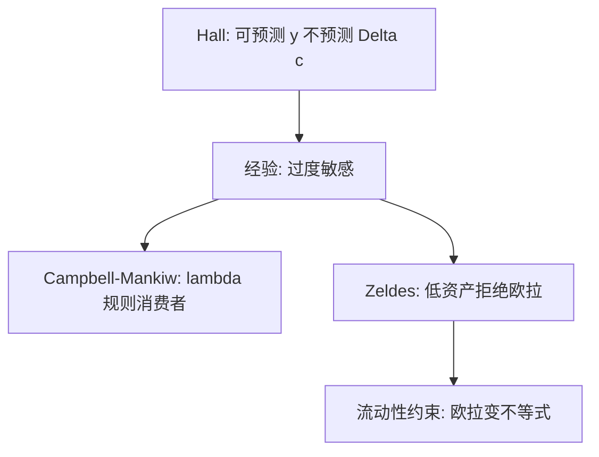

# 流动性约束与过度敏感

欧拉在能借的人那里是等式；在借不到的人那里是不等式——可预测的收入又开始预测消费。

<footer>—— Zeldes, Consumption and Liquidity Constraints: An Empirical Investigation, JPE 1989；对照 Hall and Mishkin, 1982；Campbell and Mankiw, 1989–90</footer>

[上一课](/econ/precautionary-buffer-stock)已经让约束附近的 MPC 升高。本课缺口是把这句话写成可检验的**过度敏感**：消费变化被可预测收入预测，幅度大于完全市场 PIH。不重导谨慎系数。

## 问题

Hall 的随机游走说：已有信息不应预测 $\Delta c$。Flavin（1981）以及 Hall 与 Mishkin（1982）发现消费对收入创新的反应过大或对可预测部分仍有加载。Campbell 与 Mankiw（1989, 1990）用 $\lambda$ 混合：一部分人按永久收入，一部分人按当期收入规则 $c=y$。结构解释不必是「非理性」，可以是借贷下限：年轻人、低收入、无抵押者欧拉不成等式，$c_t$ 被 $y_t$ 钉住。

Zeldes（1989）按资产分组：低资产家庭拒绝欧拉，高资产家庭更接近。缺口是识别约束，而不是把 $C=cY$ 请回当代表主体。

过度平滑是孪生现象：对永久冲击反应不足。缓冲存量与习惯都能造出平滑；本课主攻敏感，平滑只作为对照。

## 方法

把家庭分成可能受约束与不受约束。检验：工具变量预测的收入增长，是否进入 $\Delta c$；或欧拉残差是否与滞后收入相关。自然实验（退税支票、信贷放松）看 MPC。Jappelli（1990）用调查中的被拒贷记录当约束代理。

量化栏的价差与保证金不是本课的约束。本课的约束是家庭信贷市场：不能以国债利率对人力财富抵押贷款。

## 机制

机制是角点。想把高 $y^P$ 提前消费却借不到时，当期资源就是当期 $c$ 的上界。可预测的加薪一旦实现，消费跳一次，看起来像规则消费者。这与现时偏差可观测等价：准双曲也会提高短期 MPC。区分靠承诺需求、信贷评分、资产分组，本课只标明两种理论都能产生敏感，不做赛马。

宏观：受约束家庭比例上升时，财政一次性转移的乘数变大。李嘉图等价在这些人身上失败。主干宏观已经用过这条摩擦；补层把它接回家庭金融。

操作上，「可预测收入」要用滞后信息或工具，不能把当期 $y$ 的相关直接叫敏感——那会把永久冲击的水平调整误判成规则消费。Zeldes 的分组是对欧拉残差做，不是对 $C=cY$ 做。量化栏的保证金约束是交易者融资，本课是家庭对人力财富贷不到款；词都叫约束，市场不是同一个。

## 边界

过度敏感也可以来自短视、习惯或测量误差（耐用品、家庭内部保险）。约束不是唯一解释。本课不估计 $\lambda$。也不把「信用卡利率高」写成限价簿微观结构。

后课默认：LCH/PIH 的完全市场版本是基准；经验偏离先按约束与谨慎读，再决定要不要上行为。遗赠是下一缺口：为何终点仍有正财富。

可预测收入进入 $\Delta c$，欧拉在低资产组被拒绝，这是角点而不是把 $C=cY$ 请回代表主体。

与现时偏差可观测相似，要用信贷记录或承诺需求另做识别。

## 小结

- 借贷下限使欧拉不等式化，可预测收入重新进入 $c$。
- Zeldes 的资产分组、Campbell–Mankiw 的 $\lambda$，是同一缺口的两种写法。
- 与现时偏差可观测等价，识别要另找承诺或信贷证据。
- Campbell–Mankiw 的 $\lambda$ 是简约写法，结构故事是借贷下限。
- 财政一次性转移的乘数在受约束家庭上变大。
- 出处：Hall and Mishkin 1982；Zeldes, *JPE* 1989；Campbell and Mankiw, 1989–90。
